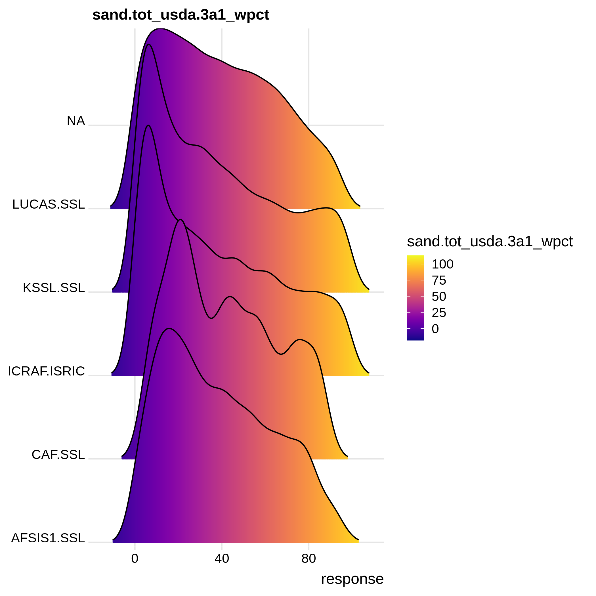
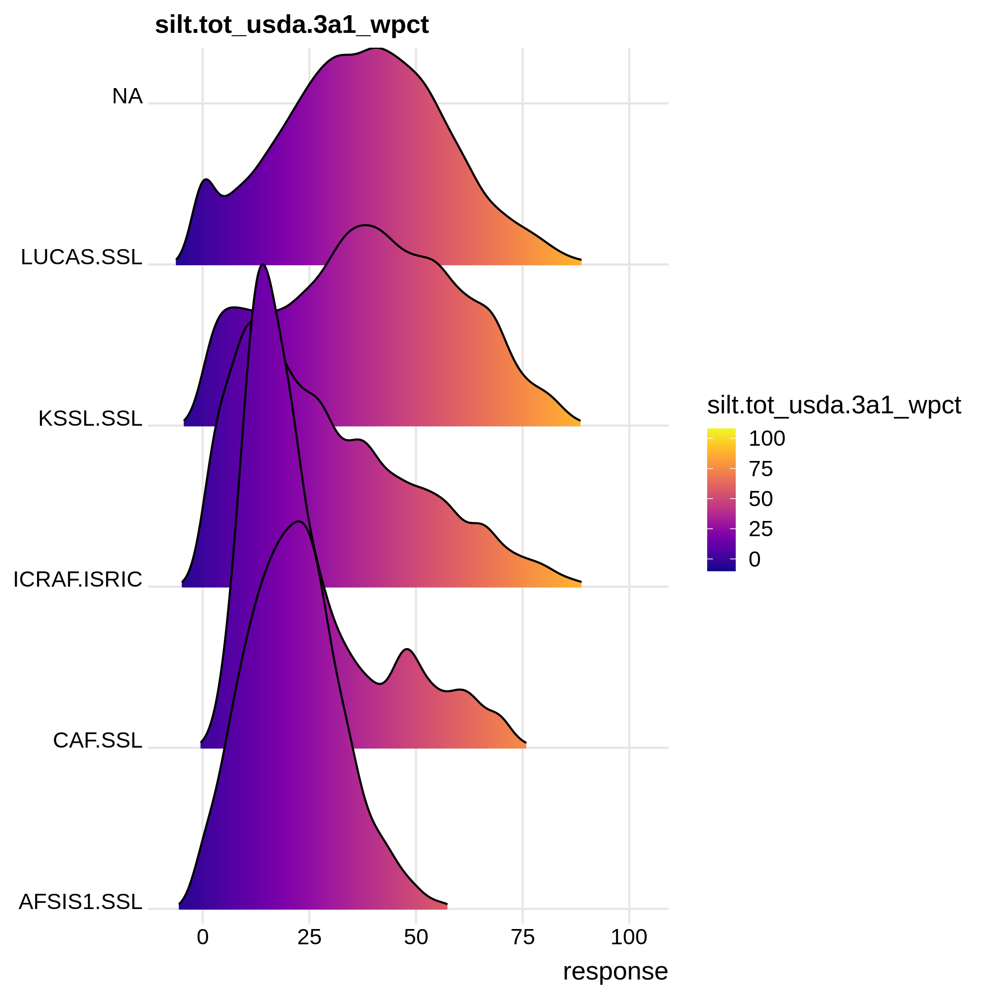
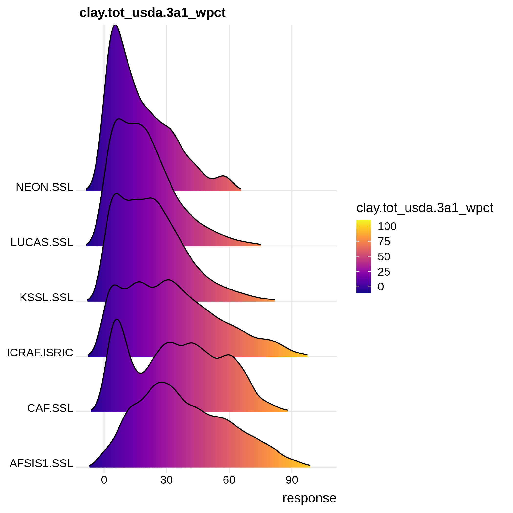
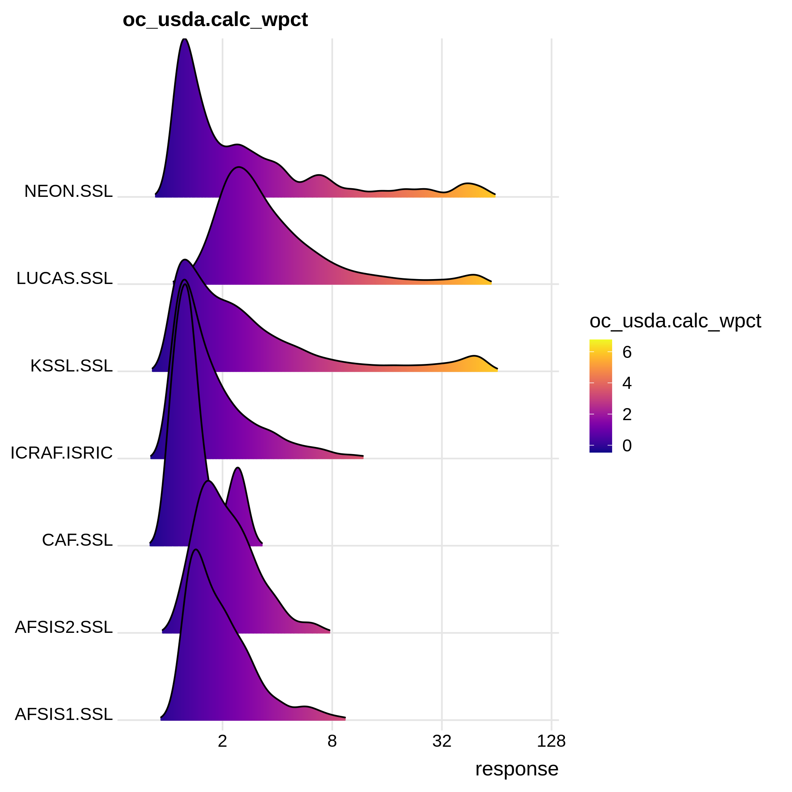
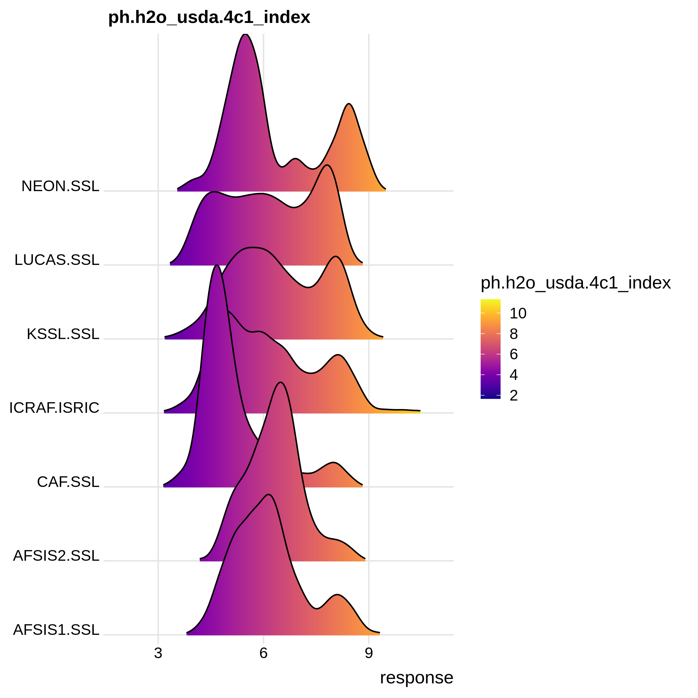

# Database

```{r, include=FALSE}
library(captioner)
library(openair)
fig_nums <- captioner(prefix = "Fig.")
source("R/ossl_functions.R")
kssl.yw = readRDS(url("http://s3.us-east-1.wasabisys.com/soilspectroscopy/ossl_import/ossl_soillab_v1.rds", "rb"))
kssl.sitef = readRDS(url("http://s3.us-east-1.wasabisys.com/soilspectroscopy/ossl_import/ossl_soilsite_v1.rds", "rb"))
kssl.yw$layer.upper.depth_usda_cm = plyr::join(kssl.yw["id.sample_uuid_c"], kssl.sitef, match="first")$layer.upper.depth_usda_cm
kssl.yw$layer.lower.depth_usda_cm = plyr::join(kssl.yw["id.sample_uuid_c"], kssl.sitef, match="first")$layer.lower.depth_usda_cm
kssl.yw$depth = kssl.yw$layer.upper.depth_usda_cm + (kssl.yw$layer.lower.depth_usda_cm - kssl.yw$layer.upper.depth_usda_cm)/2
kssl.yw$dataset.code_ascii_c = plyr::join(kssl.yw["id.layer_local_c"], kssl.sitef, match="first")$dataset.code_ascii_c
```

```{r, include=FALSE}
library(ggplot2)
library(viridis)
library(ggridges)
## log-normal variables
for(j in c("wpg2_usda.3a2_wpct", "ecec_usda.4b4_cmolkg", "ec.w_usda.4f1_dsm", "oc_usda.calc_wpct",
           "ca.ext_usda.4b1_cmolkg", "c.tot_usda.4h2_wpct", "caco3_usda.4e1_wpct", "cec.ext_usda.4b1_cmolkg",
           "sum.bases_4b4b2a_cmolkg", "mg.ext_usda.4b1_cmolkg", "n.tot_usda.4h2_wpct",
           "al.kcl_usda.4b3_cmolkg", "p.meh3_usda.4d6_mgkg", "k.meh3_usda.4d6_mgkg", 
           "na.meh3_usda.4d6_mgkg", "mg.meh3_usda.4d6_mgkg", "fe.meh3_usda.4d6_mgkg")){
  out.png = paste0("./hist/", j, "_hist.png")
  if(!file.exists(out.png)){
    sel.df = kssl.yw[,c("dataset.code_ascii_c", j)]
    sel.df$response = sel.df[,2]+1
    ggplot(sel.df, aes(x = response, y = dataset.code_ascii_c, fill = ..x..)) +
      geom_density_ridges_gradient(scale = 3, rel_min_height = 0.01, gradient_lwd = 1.) +
      scale_x_continuous(expand = c(0.01, 0)) +
      scale_x_continuous(trans='log2') +
      scale_y_discrete(expand = c(0.01, 0)) +
      scale_fill_viridis(name = j, option = "C") +
      labs(
        title = j
      ) +
      theme_ridges(font_size = 13, grid = TRUE) + theme(axis.title.y = element_blank())
    ggsave(out.png, width = 7, height = 7)
  }
}
## without log-transform
for(j in c("sand.tot_usda.3a1_wpct", "silt.tot_usda.3a1_wpct", "clay.tot_usda.3a1_wpct", 
           "bd.od_usda.3b2_gcm3", "ph.kcl_usda.4c1_index", "ph.h2o_usda.4c1_index", 
           "ph.cacl2_usda.4c1_index", "wr.33kbar_usda.3c1_wpct", "wr.1500kbar_usda.3c2_wpct")){
  out.png = paste0("./hist/", j, "_hist.png")
  if(!file.exists(out.png)){
    sel.df = kssl.yw[,c("dataset.code_ascii_c", j)]
    sel.df$response = sel.df[,2]
    ggplot(sel.df, aes(x = response, y = dataset.code_ascii_c, fill = ..x..)) +
      geom_density_ridges_gradient(scale = 3, rel_min_height = 0.01, gradient_lwd = 1.) +
      scale_x_continuous(expand = c(0.01, 0)) +
      scale_y_discrete(expand = c(0.01, 0)) +
      scale_fill_viridis(name = j, option = "C") +
      labs(
        title = j
      ) +
      theme_ridges(font_size = 13, grid = TRUE) + theme(axis.title.y = element_blank())
    ggsave(out.png, width = 7, height = 7)
  }
}
```

## Sites table {#sites-table}

Observations and measurements at site. For the **site** table please use (at least) the following columns.

### id.site_uuid_c

**Unique site ID**: Should be best generated using some [UUID generator tool](https://cran.r-project.org/package=uuid); example: `id.site_uuid_c = '672d1fd6-b186-11eb-8a61-7446a0925130'`\

### id.location_olc_c

Unique [Open Location Codes](https://opensource.google/projects/open-location-code): ID which identifies the site location; example: `id.location_olc_c = '84MVX5FH+PJ'`\
We recommend rounding the latitude and longitude coordinates to 6 decimal places.

### observation.ogc.schema.title_ogc_txt

[Observation OGC](https://www.ogc.org/standards/om) schema title; example: `observation.ogc.schema.title_ogc_txt = 'Open Soil Spectral Library Schema'`\

### observation.ogc.schema_idn_url

[Observation OGC](https://www.ogc.org/standards/om) schema URL; example: `observation.ogc.schema_idn_url = 'https://github.com/soilspectroscopy/ossl-schema'`\

### observation.date.begin_iso.8601_yyyy.mm.dd

Observation date begin ([ISO8601](https://en.wikipedia.org/wiki/ISO_8601)); example: `observation.date.begin_iso.8601_yyyy.mm.dd = '2000.02.10'`\

### observation.date.end_iso.8601_yyyy.mm.dd

Observation date end ([ISO8601](https://en.wikipedia.org/wiki/ISO_8601)); example: `observation.date.end_iso.8601_yyyy.mm.dd = '2000.02.10'`\

### location.address_utf8_txt

Location address as Street and number, Local postcode, Town, County, State; example: `location.address_utf8_txt = ''`\

### location.country_iso.3166_c

Country(ies) the data was/were collected ([ISO3166](https://en.wikipedia.org/wiki/ISO_3166-1)); example: `location.country_iso.3166_c = 'USA'`\

### location.method_any_c

Location method e.g. [GPS](https://www.gps.gov/); example: `location.method_any_c = 'GPS'`\

### surveyor.title_utf8_txt

Field surveyor title or organization; example: `surveyor.title_utf8_txt = 'USDA Natural Resource Conservation Service (NRCS) staff'`\

### surveyor.contact_ietf_email

Field surveyor contact email; example: `surveyor.contact_ietf_email = 'support@usda.gov'`\

### surveyor.address_utf8_txt

Field surveyor address as Street and number, Local postcode, Town, County, State; example: `surveyor.address_utf8_txt = 'USDA-NRCS-NSSC, Federal Building, Room 152, Mail Stop, 100 Centennial Mall North, Lincoln, NE'`\

### longitude_wgs84_dd

Site [WGS84 longitude](https://spatialreference.org/ref/epsg/wgs-84/) coordinate; example: `longitude_wgs84_dd = '-122.8208847'`\

### latitude_wgs84_dd

Site [WGS84 latitude](https://spatialreference.org/ref/epsg/wgs-84/) coordinate; example: `latitude_wgs84_dd = '43.9742584'`\

### location.error_any_m

Approximate location error (for [GPS coordinates](https://www.gps.gov/systems/gps/performance/accuracy/) use 30 m); example: `location.error_any_m = '30'`\

### dataset.title_utf8_txt

Title of the dataset; example: `dataset.title_utf8_txt = 'Kellog's lab SSL'`\

### dataset.owner_utf8_txt

Name of organization that is the dataset owner;\

### dataset.code_ascii_txt

Code identification of the dataset; example: `dataset.code_ascii_txt = 'KSSL'`\

### dataset.address_idn_url

The URL address of the dataset web page; example: `dataset.address_idn_url = 'https://ncsslabdatamart.sc.egov.usda.gov/'`\

### dataset.license.title_ascii_txt

Data license title for the dataset; example: `dataset.license.title_ascii_txt = 'CC-0'`\

### dataset.license.address_idn_url

Data license URL for the dataset; example: `dataset.license.address_idn_url = 'https://creativecommons.org/share-your-work/public-domain/cc0/'`\

### dataset.doi_idf_c

[International DOI foundation](https://en.wikipedia.org/wiki/Digital_object_identifier) code for the corresponding dataset version; example: `dataset.doi_idf_c = '10.2136/sssaj2019.06.0205'`\

### dataset.contact.name_utf8_txt

Person responsible for the dataset; example: `dataset.contact.name_utf8_txt = 'Firstname Lastname'`

### dataset.contact.email_ietf_email

Email contact of the person responsible for the dataset; example: `dataset.contact.email_ietf_email = 'support@usda.gov'`\

### id.dataset.site_ascii_c

Local dataset ID of the site; example: `id.dataset.site_ascii_c = '603'`\

### id.user.site_ascii_c

Local user assigned ID of the site; example: `id.user.site_ascii_c = '01-DRJ-01'`\

### id.project_ascii_c

Unique project code; example: `id.project_ascii_c = 'TEX18'`\

## Soillab table {#soillab-table}

### id.site_uuid_c

Unique site ID generated using some [UUID generator tool](https://cran.r-project.org/package=uuid); example: `id.site_uuid_c = '672d1fd6-b186-11eb-8a61-7446a0925130'`\
This ID links with the [Sites table](#sites-table).

### id.sample_uuid_c

Unique sample ID generated using some [UUID generator tool](https://cran.r-project.org/package=uuid); example: `id.sample_uuid_c = '31d454be-b1ac-11eb-8a61-7446a0925130'`\

### layer.sequence_usda_uint16

Layer sequence number [based on the USDA system](https://www.nrcs.usda.gov/wps/portal/nrcs/detail/soils/research/guide/?cid=nrcs142p2_054184); example: `layer.sequence_usda_uint16 = '1'`\

### layer.type_usda_c

Layer type [based on the USDA system](https://www.nrcs.usda.gov/wps/portal/nrcs/detail/soils/research/guide/?cid=nrcs142p2_054184); example: `layer.type_usda_c = 'horizon'`\

### layer.field.label_any_c

Layer field label used e.g. for soil samples; example: `layer.field.label_any_c = 'S00OR-039-001-2'`\

### layer.upper.depth_usda_cm

Layer upper depth in cm; example: `layer.upper.depth_usda_cm = '13'`\

### layer.lower.depth_usda_cm

Layer lower depth in cm; example: `layer.lower.depth_usda_cm = '36'`\

### horizon.designation_usda_c

Layer horizon designation [based on the USDA system](https://www.nrcs.usda.gov/wps/portal/nrcs/detail/soils/research/guide/?cid=nrcs142p2_054184); example: `horizon.designation_usda_c = 'A2'`\

### horizon.designation.discontinuity_usda_c

Layer horizon designation discontinuity [based on the USDA system](https://www.nrcs.usda.gov/wps/portal/nrcs/detail/soils/research/guide/?cid=nrcs142p2_054184); example: `horizon.designation.discontinuity_usda_c = ''`\

### layer.structure.type_usda_c

Layer horizon structure type [based on the USDA system](https://www.nrcs.usda.gov/wps/portal/nrcs/detail/soils/research/guide/?cid=nrcs142p2_054184); example: `layer.structure.type_usda_c = ''`\

### layer.structure.grade_usda_c

Layers horizon structure grade [based on the USDA system](https://www.nrcs.usda.gov/wps/portal/nrcs/detail/soils/research/guide/?cid=nrcs142p2_054184); example: `layer.structure.grade_usda_c = ''`\

### layer.texture_usda_c

Layer field-estimated texture-by-hand class [based on the USDA system](https://www.nrcs.usda.gov/wps/portal/nrcs/detail/soils/survey/?cid=nrcs142p2_054167); example: `layer.texture_usda_c = 'Gravelly Clay'`\
To estimate the field texture-by-hand please follow [these guidelines](https://www.nrcs.usda.gov/wps/portal/nrcs/detail/soils/edu/?cid=nrcs142p2_054311).\

### sand.tot_usda.3a1_wpct

Total sand content; [description](https://www.nrcs.usda.gov/Internet/FSE_DOCUMENTS/stelprdb1253872.pdf#page=76): `sand.tot_usda.3a1_wpct` = Total sand is the soil separate with 0.05 to 2.0 mm particle diameter. It is reported a gravimetric percent on a <2 mm base. H prep.\

```{r hist-sand, echo=FALSE, fig.cap="Total sand content histograms.", out.width="70%"}

```

### sand.tot_iso.11277.2020_wpct

Total laboratory-estimated sand (0.05 to 2.0 mm particle diameter) based on [ISO 11277:2020(en)](https://www.iso.org/obp/ui/#iso:std:iso:11277:ed-3:v1:en)
Soil quality — Determination of particle size distribution in mineral soil material — Method by sieving and sedimentation.\

### silt.tot_usda.3a1_wpct

Total silt content; [description](https://www.nrcs.usda.gov/Internet/FSE_DOCUMENTS/stelprdb1253872.pdf#page=76): `silt.tot_usda.3a1_wpct` = Total silt is the soil separate with 0.002 to 0.05 mm particle size. It is reported as a gravimetric percent on a <2 mm base.\

```{r hist-silt, echo=FALSE, fig.cap="Total silt content histograms.", out.width="70%"}

```

### silt.tot_iso.11277.2020_wpct

Total laboratory-estimated silt (0.002 to 0.05 mm particle size) based on [ISO 11277:2020(en)](https://www.iso.org/obp/ui/#iso:std:iso:11277:ed-3:v1:en)
Soil quality — Determination of particle size distribution in mineral soil material — Method by sieving and sedimentation.\

### clay.tot_usda.3a1_wpct

Total clay content; [description](https://www.nrcs.usda.gov/Internet/FSE_DOCUMENTS/stelprdb1253872.pdf#page=76): `clay.tot_usda.3a1_wpct` = Total clay is the soil separate with <0.002 mm particle diameter. Clay size carbonate is included. Total clay is reported as a weight percent of the <2 mm fraction.\

```{r hist-clay, echo=FALSE, fig.cap="Total clay content histograms.", out.width="70%"}

```

### clay.tot_iso.11277.2020_wpct

Total clay (<0.002 mm particle diameter) based on [ISO 11277:2020(en)](https://www.iso.org/obp/ui/#iso:std:iso:11277:ed-3:v1:en)
Soil quality — Determination of particle size distribution in mineral soil material — Method by sieving and sedimentation.\

### wpg2_usda.3a2_wpct

Coarse Fragments, Greater than 2mm; [description](https://www.nrcs.usda.gov/Internet/FSE_DOCUMENTS/stelprdb1253872.pdf#page=119): `wpg2_usda.3a2_wpct` = The gravimetric percentage of greater than 2 mm diameter particles reported on a whole soil base.\

### wpg2_iso.11277.2020_wpct

The gravimetric percentage of coarse fragments greater than 2 mm diameter particles reported on a whole soil base based on [ISO 11277:2020(en)](https://www.iso.org/obp/ui/#iso:std:iso:11277:ed-3:v1:en)
Soil quality — Determination of particle size distribution in mineral soil material — Method by sieving and sedimentation.\

### wr.1500kbar_usda.3c2_wpct

Water Retention, 15 Bar, <2mm,  Air-dry; [description](https://www.nrcs.usda.gov/Internet/FSE_DOCUMENTS/stelprdb1253872.pdf#page=205): `wr.1500kbar_usda.3c2_wpct` = 15 bar water on air dry soil is the gravimetric water content of <2 mm air dry samples after equilibration at 15 bars water tension. It is reported on a <2 mm base. The value is influenced by clay %, mineralogy, and organic carbon %.\

### wr.33kbar_usda.3c1_wpct

Water Retention, 1/3 Bar, <2mm Clod; [description](https://www.nrcs.usda.gov/Internet/FSE_DOCUMENTS/stelprdb1253872.pdf#page=205): `wr.33kbar_usda.3c1_wpct` = 1/3 bar water, clods is the gravimetric percent water in natural fabric (clods) after equilibration at 1/3 bar water tension. It is reported on a <2 mm base.\

### agg.stb_usda.1b1_wpct

Aggregate stability; [description](https://www.nrcs.usda.gov/Internet/FSE_DOCUMENTS/stelprdb1253872.pdf#page=119): `aggstb_usda.1b1_wpct` = Aggregate stability is the weight percent of 0.5mm - 2mm aggregates remaining after wet sieving.

### bd.clod_usda.3b1_gcm3

Bulk density clod, <2 mm fraction, 1/3 bar; [description](https://www.nrcs.usda.gov/Internet/FSE_DOCUMENTS/stelprdb1253872.pdf#page=130): `bd.clod_usda.3b1_gcm3` = Bulk density, <2 mm fraction, 1/3 bar is the weight per unit volume of the <2 mm fraction, with volume being measured after equilibration at 1/3 bar water tension. It is reported as grams per cubic centimeter on a <2 mm base.\

### bd.core_usda.3b4_gcm3

Bulk density, core, <2 mm fraction; [description](https://www.nrcs.usda.gov/Internet/FSE_DOCUMENTS/stelprdb1253872.pdf#page=161): `bd.core_usda.3b4_gcm3` = Bulk density, <2mm fraction, field moist is the weight per unit volume of the <2 mm fraction, with volume measured at field (sampling) moisture. Measurements are made on known volume cores. It is reported as grams per cubic centimeter, <2 mm base.\

### bd.core_iso.11272.2017_gcm3

Dry bulk density based on [ISO 11272:2017(en)](https://www.iso.org/obp/ui/#iso:std:iso:11272:ed-2:v1:en)
Soil quality — Determination of dry bulk density.\

### c.tot_usda.4h2_wpct

Total carbon; [description](https://www.nrcs.usda.gov/Internet/FSE_DOCUMENTS/stelprdb1253872.pdf#page=492): `c.tot_usda.4h2_wpct` = Total carbon is a measure of all organic and inorganic carbon, including that found in carbonate minerals.\

### c.tot_iso.10694.1995_wpct

Total soil carbon based on [ISO 10694:1995(en)](https://www.iso.org/obp/ui/#iso:std:iso:10694:ed-1:v1:en)
Soil quality — Determination of organic and total carbon after dry combustion (elementary analysis).

### n.tot_usda.4h2_wpct

Total nitrogen; [description](https://www.nrcs.usda.gov/Internet/FSE_DOCUMENTS/stelprdb1253872.pdf#page=492): `n.tot_usda.4h2_wpct` = Total nitrogen is a measure of all organic and inorganic nitrogen, including that found in nitrogen minerals.\

### n.tot_iso.13878.1998_wpct

Total nitrogen based on [ISO 13878:1998(en)](https://www.iso.org/obp/ui/#iso:std:iso:13878:ed-1:v1:en)
Soil quality — Determination of total nitrogen content by dry combustion ("elemental analysis").\

### s.tot_usda.4h2_wpct

Total sulfur; [description](https://www.nrcs.usda.gov/Internet/FSE_DOCUMENTS/stelprdb1253872.pdf#page=492): `s.tot_usda.4h2_wpct` = Total sulfur is a measure of all organic and inorganic sulfur, including that found in sulfide minerals.\

### oc_usda.calc_wpct

Organic carbon in weight percent (dag/kg); [description](https://www.nrcs.usda.gov/Internet/FSE_DOCUMENTS/stelprdb1253872.pdf#page=492): `oc_usda.calc_wpct` = Estimated Organic Carbon based on Total C minus the inorganic carbon, GP prep.\

```{r, plot-oc, fig.width=6, out.width="70%", fig.cap="Soil-depth histogram for soil organic carbon in wpct."}
openair::scatterPlot(kssl.yw, x = "depth", y = "oc_usda.calc_wpct", method = "hexbin", 
                     col = "increment", log.x = TRUE, log.y=TRUE, ylab="SOC wprm", xlab="depth in cm")
```


```{r hist-oc1, echo=FALSE, fig.cap="Organic carbon in weight percent histograms.", out.width="70%"}

```


### oc_usda.4h2_wpct

Organic carbon based on dry combustion in weight percent (dag/kg); [description](https://www.nrcs.usda.gov/Internet/FSE_DOCUMENTS/stelprdb1253872.pdf#page=492): `oc_usda.4h2_wpct` = CMS analyte equivalent to the Walkley-Black organic C method. Organic carbon is a measure of all organic forms of carbon in the soil, including organic carbon within minerals.\

### oc_iso.10694.1995_wpct

Organic carbon based on [ISO 10694:1995(en)](https://www.iso.org/obp/ui/#iso:std:iso:10694:ed-1:v1:en) Soil quality — Determination of organic and total carbon after dry combustion (elementary analysis).\

### oc_iso.17184.2014_wpct

Organic carbon based on [ISO 17184:2014(en)](https://www.iso.org/obp/ui/#iso:std:iso:17184:ed-1:v1:en)
Soil quality — Determination of carbon and nitrogen by near-infrared spectrometry (NIRS).\

### humus_usda.4h2_wpct

Organic matter or humus content; [description](https://www.nrcs.usda.gov/Internet/FSE_DOCUMENTS/stelprdb1253872.pdf#page=492): `humus_usda.4h2_wpct` = Total organic matter in weight percent (dag/kg) lost on ignition (400 °C) (LOI). Values for organic C can be determined by using the “Van Bemmelen factor” (1/1.724 = 0.58) to calculate organic carbon.\

### caco3.pres_usda.1b1_c

Effervescence, 1N HCl; [description](https://www.nrcs.usda.gov/Internet/FSE_DOCUMENTS/stelprdb1253872.pdf#page=63): `caco3.pres_usda.1b1_c` = The visual effervescence of the prepared sample when treated with 1N HCl.\

### caco3_usda.4e1_wpct

Calcium carbonate content; [description](https://www.nrcs.usda.gov/Internet/FSE_DOCUMENTS/stelprdb1253872.pdf#page=398): `caco3_usda.4e1_wpct` = Carbonate in the < 2mm fraction is measured by CO2 evolution after acid treatment. It is reported as gravimetric percent CaCO3 on a <2 mm base, even though carbonates of Mg, Na, K, and Fe may be present and react with the acid.\

### caco3_iso.10693.1995_vpct

Total carbonate in the < 2mm fraction (measured by CO2 evolution after acid treatment) based on [ISO 10693:1995](https://www.iso.org/obp/ui/#iso:std:iso:10693:ed-1:v1:en)
Soil quality — Determination of carbonate content — Volumetric method.\

### ca.ext_usda.4b1_cmolkg

Calcium, NH4OAc Extractable, 2M KCl displacement; [description](https://www.nrcs.usda.gov/Internet/FSE_DOCUMENTS/stelprdb1253872.pdf#page=269): `ca.ext_usda.4b1_cmolkg` = NH4OAC extractable calcium is the fraction removed by pH 7.0 NH4OAC. It is assumed to represent the exchangeable Ca. It is reported as meq per 100 grams on a <2 mm base. It is not reported for samples containing carbonates or soluble salts.\

### cec.ext_usda.4b1_cmolkg

CEC, NH4OAc, pH 7.0, 2M KCl displacement; [description](https://www.nrcs.usda.gov/Internet/FSE_DOCUMENTS/stelprdb1253872.pdf#page=258): `cec.ext_usda.4b1_cmolkg` = CEC by NH4OAC is the Cation Exchange Capacity of the sample, determined by 1N NH4OAC in a system highly buffered at pH 7.0 The NH4 is displaced by 2M KCl to obtain a solution without solids. It is reported as meq per 100 grams sample, on a <2 mm base.\

### cec.ext_iso.13536.1995_cmolkg

Cation Exchange Capacity based on [ISO 13536:1995(en)](https://www.iso.org/obp/ui/#iso:std:iso:13536:ed-1:v1:en)
Soil quality — Determination of the potential cation exchange capacity and exchangeable cations using barium chloride solution buffered at pH = 8.1.\

### ecec_usda.4b4_cmolkg

Effective Effective Cation Exchange Capacity; [description](https://www.nrcs.usda.gov/Internet/FSE_DOCUMENTS/stelprdb1253872.pdf#page=258): `ecec_usda.4b4_cmolkg` = Sum of bases + AL_KCL 	 the effective cation exchange capacity is calculated by BASE_SUM+AL_KCL. It is not calculated if soluble salts are present. It is reported as meq per 100 grams on a <2 mm base.\

### mg.ext_usda.4b1_cmolkg

Magnesium, NH4OAc Extractable, 2M KCl displacement; [description](https://www.nrcs.usda.gov/Internet/FSE_DOCUMENTS/stelprdb1253872.pdf#page=269): `mg.ext_usda.4b1_cmolkg` = NH4OAC extractable magnesium is the fraction removed by pH 7.0 NH4OAC. It is assumed to represent the exchangeable Mg if MgCO3 is not present. It is reported as meq per 100 grams on a <2 mm base.\

### k.ext_usda.4b1_cmolkg

Potassium, NH4OAc Extractable, 2M KCl displacement; [description](https://www.nrcs.usda.gov/Internet/FSE_DOCUMENTS/stelprdb1253872.pdf#page=269): `k.ext_usda.4b1_cmolkg` = NH4OAC extractable potassium is the fraction removed by pH 7.0 NH4OAC. It is assumed to represent the exchangeable K. It is reported as meq per 100 grams on a <2 mm base.\

### na.ext_usda.4b1_cmolkg

Sodium, NH4OAc Extractable, 2M KCl displacement; [description](https://www.nrcs.usda.gov/Internet/FSE_DOCUMENTS/stelprdb1253872.pdf#page=269): `na.ext_usda.4b1_cmolkg` = NH4OAC extractable sodium is the fraction removed by pH 7.0 NH4OAC. It is assumed to represent the exchangeable Na. It is reported as meq per 100 grams on a <2 mm base.\

### fe.ox_usda.4g2_wpct

Iron, ammonium oxalate extractable; [description](https://www.nrcs.usda.gov/Internet/FSE_DOCUMENTS/stelprdb1253872.pdf#page=460): `fe.ox_usda.4g2_wpct` = Ammonium oxalate extractable iron is considered a measure of the noncrystalline Fe in soils. It provides some inferences of the amount of Fe in various forms. It is reported as gravimetric % on a <2mm base.\

### fe.dith_usda.4g1_wpct

Iron, dithinoite-citrate extractable; [description](https://www.nrcs.usda.gov/Internet/FSE_DOCUMENTS/stelprdb1253872.pdf#page=454): `fe.dith_usda.4g1_wpct` = Dithionite citrate extractable iron is considered a general measure of total pedogenic iron. It provides inferences on the amount of iron in various forms, P fixing potential, aggregate stability, and degree of weathering. Reported as grav % on <2mm.\

### fe.pyp_usda.4g3_wpct

Iron, sodium pyrophosphate extractable; [description](https://www.nrcs.usda.gov/Internet/FSE_DOCUMENTS/stelprdb1253872.pdf#page=468): `fe.pyp_usda.4g3_wpct` = Sodium pyrophosphate extractable iron is assumed to be the fraction associated with organic complexes. It is reported as gravimetric percent on a <2 mm base.\

### al.ox_usda.4g2_wpct

Aluminum, ammonium oxalate extractable; [description](https://www.nrcs.usda.gov/Internet/FSE_DOCUMENTS/stelprdb1253872.pdf#page=460): `al.ox_usda.4g2_wpct` = Ammonium oxalate extractable aluminum is an estimate of the total pedogenic Al, much of which may be in noncrystalline materials or complexed by organic matter. It is reported as gravimetric percent on a <2 mm base.\

### al.dith_usda.4g1_wpct

Aluminum, dithinoite-citrate extractable; [description](https://www.nrcs.usda.gov/Internet/FSE_DOCUMENTS/stelprdb1253872.pdf#page=460): `al.dith_usda.4g1_wpct` = Dithionite citrate extractable aluminum is an indicator of the amount of aluminum substituted for iron in iron oxides. It does not necessarily represent total pedogenic Al.\

### al.pyp_usda.4g3_wpct

Aluminum, sodium pyrophosphate extractable; [description](https://www.nrcs.usda.gov/Internet/FSE_DOCUMENTS/stelprdb1253872.pdf#page=468): `al.pyp_usda.4g3_wpct` = Sodium pyrophosphate extractable aluminum is the fraction extracted by 0.1M sodium pyrophosphate. It was originally considered the portion associated with organic compounds, although subsequent evidence indicates other forms are also removed.\

### al.kcl_usda.4b3_cmolkg

Aluminum, KCl extractable; [description](https://www.nrcs.usda.gov/Internet/FSE_DOCUMENTS/stelprdb1253872.pdf#page=282): `al.kcl_usda.4b3_cmolkg` = KCl extractable aluminum approximates the exchangeable Al, and is a measure of the active acidity present in soils with a 1:1 water pH less than 5.5. It relates to the immediate lime requirement and the CEC of the soil.\

### bsat_usda.4b4_wpct

Base saturation, NH4OAc, pH7; [description](https://www.nrcs.usda.gov/Internet/FSE_DOCUMENTS/stelprdb1253872.pdf#page=290): `bsat_usda.4b4_wpct` = NH4OAC base saturation (pH 7.0) is calculated by (BASE_SUM/CEC_NH4)*100.\

### alsat_usda.4b4_wpct

Aluminum saturation; [description](https://www.nrcs.usda.gov/Internet/FSE_DOCUMENTS/stelprdb1253872.pdf#page=292): `alsat_usda.4b4_wpct` = Aluminum saturation is calculated by (AL_KCL/(Sum of bases))*100. It provides some inference of potential Al toxicity problems, although many other factors influence Al toxicity.\

### ph.h2o_usda.4c1_index

Soil pH 1:1 water; [description](https://www.nrcs.usda.gov/Internet/FSE_DOCUMENTS/stelprdb1253872.pdf#page=304): `ph.h2o_usda.4c1_index` = The pH, 1:1 soil-water suspension is the pH of a sample measured in distilled water at a 1:1 soil:solution ratio. If wider ratios increase the pH, salts are indicated.\

```{r, plot-phh2o, fig.width=6, out.width="70%", fig.cap="Soil-depth histogram for soil pH."}
openair::scatterPlot(kssl.yw, x = "depth", y = "ph.h2o_usda.4c1_index", method = "hexbin", 
                     col = "increment", log.x = TRUE, ylab="Soil pH", xlab="depth in cm")
```

```{r hist-phh2o, echo=FALSE, fig.cap="Soil pH 1:1 water histograms.", out.width="70%"}

```


### ph.cacl2_usda.4c1_index

Soil pH 1:2 0.01-M calcium choride; [description](https://www.nrcs.usda.gov/Internet/FSE_DOCUMENTS/stelprdb1253872.pdf#page=304): `ph.cacl2_usda.4c1_index` = The pH, 1:2 soil-CaCl2 is the pH of a sample measured in 0.01M CaCl2 at a 1:2 soil:solution ratio.\

### ph.cacl2_iso.10390.1994_index

Soil pH 1:2 0.01-M calcium choride based on [ISO 10390:1994](https://www.iso.org/obp/ui/#iso:std:iso:10390:ed-1:en) Soil quality — Determination of pH.\

### ec.w_usda.4f1_dsm

Electrical Conductivity, Predict, 1:2 (w/w); [description](https://www.nrcs.usda.gov/Internet/FSE_DOCUMENTS/stelprdb1253872.pdf#page=425): `ec.w_usda.4f1_dsm` = The salt predict electrical conductivity is used to determine whether additional salt analyses are needed, and to estimate appropriate dilution ratios for additional tests. It is reported as mmhos per centimeter of a 1:2 soil:water mixture by weight.\

### ec.ext.sat_usda.4f2_dsm

Electrical Conductivity, Saturation Extract; [description](https://www.nrcs.usda.gov/Internet/FSE_DOCUMENTS/stelprdb1253872.pdf#page=425): `ec.ext.sat_usda.4f2_dsm` = Electrical Conductivity, Saturation Extract 

### sodium.ads.ratio_usda.4f3_index

Sodium adsorption ratio; description: `sodium.ads.ratio_usda.4f3_index` = The sodium absorption ratio is calculated by NA_SATX/sqrt((CA_SATX+MG_SATX)/2). It is approximately equal to the exchangeable sodium percentage.\

### na.exch_usda.4f3_wpct

Exchangeable sodium percentage saturated; [description](https://www.nrcs.usda.gov/Internet/FSE_DOCUMENTS/stelprdb1253872.pdf#page=446): `na.exch_usda.4f3_wpct` = This is the exchangeable sodium percentage (ESP), reported on a <2 mm base. If salts are present, ESP has been corrected for the water soluble Na.\

### gyp_usda.4e2_wpct

Corrected Gypsum, < 2mm; [description](https://www.nrcs.usda.gov/Internet/FSE_DOCUMENTS/stelprdb1253872.pdf#page=408): `gyp_usda.4e2_wpct` = Corrected Gypsum (Uncorrected Gypsum * Factor)\

### p.ext_usda.4d6_mgkg

Phosphorus, Mehlich3 extractable; [description](https://www.nrcs.usda.gov/Internet/FSE_DOCUMENTS/stelprdb1253872.pdf#page=364): `p.ext_usda.4d6_mgkg` = The phosphorus extracted by the Mehlich III solution.\

### p.olsn_usda.4d5_mgkg

Phosphorus, Olsen extractable; [description](https://www.nrcs.usda.gov/Internet/FSE_DOCUMENTS/stelprdb1253872.pdf#page=364): `p.olsn_usda.4d5_mgkg` = The Olsen extractable phosphorus is used as an indicator of available phosphorus in calcareous soil materials (pH >6).\

## Harmonization rules

The following text includes harmonization / conversion rules recommended in this project.
For each conversion rule, a reference and an example are provided to prevent from 
misusing the rules. The following principle of harmonization are highly recommended:

1. Document (R code) any harmonization / conversion steps.\
2. Where possible provide propagated measure of uncertainty. This can further used 
as weights in the Machine Learning / model building.\
3. Any conversion that leads to inducting significant bias (over-/under-estimation 
of values) should we avoided.\
4. Add to the produced dataset metadata that part of data has been harmonized and 
specify exact method.\

Disclaimer: use at own risk. See also our general disclaimer.

### pH

From `ph.kcl_usda.4c1_index` to `ph.h2o_usda.4c1_index` based on @bohner2008saga:

```{r}
ph.kcl = 6.5
ph.h2o = ph.kcl / 0.87
ph.h2o
```

From `ph.cacl2_usda.4c1_index` to `ph.h2o_usda.4c1_index` based on @miller2010comparison:

```{r}
ph.cacl2 = 6.5
ph.h2o = (ph.cacl2 + 0.973 ) / 1.08
ph.h2o
```


### Carbon

From `humus_usda.4h2_wpct` to `oc_usda.4h2_wpct` based on @nelson1983total:

```{r}
humus = 4
oc = humus / 1.724
oc
```

From `humus_usda.4h2_wpct` to `oc_usda.4h2_wpct` based on @jensen2018converting:

```{r}
humus = 4; clay = 10
oc1 = 0.513 * humus - (0.047 * clay - 0.00025 * clay^2)
oc1
humus = 4; clay = 20
oc2 = 0.513 * humus - (0.047 * clay - 0.00025 * clay^2)
oc2
```

### Phosphorous

### Potassium

### Nitrogen

### Exchangeable cations and CEC

From `k.ext` extracted by Mehlich-3 (cmol/kg) to `ecec.ext_usda.4b1_cmolkg` based on @helling1964contribution:

```{r}
ph.h2o = 6.5
k.ext = 2
ca.ext = 12
na.ext = 2
mg.ext = 1
ecec.ext = ifelse(ph.h2o < 7.5 & ph.h2o>4, (k.ext + ca.ext + na.ext + mg.ext), NA)
ecec.ext
```

From `oc_usda.4h2_wpct` to `ecec.ext_usda.4b1_cmolkg` based on @helling1964contribution:

```{r}
clay.tot = 28
ph.h2o = 6.5
oc = 2
ecec.ext = ((clay.tot*10/100*(30+4.4*ph.h2o))+(oc/100*(-59+51*ph.h2o)))/10
ecec.ext
```

### Texture fractions

### Bulk density

### Soil biological variables

### Soil contaminants

