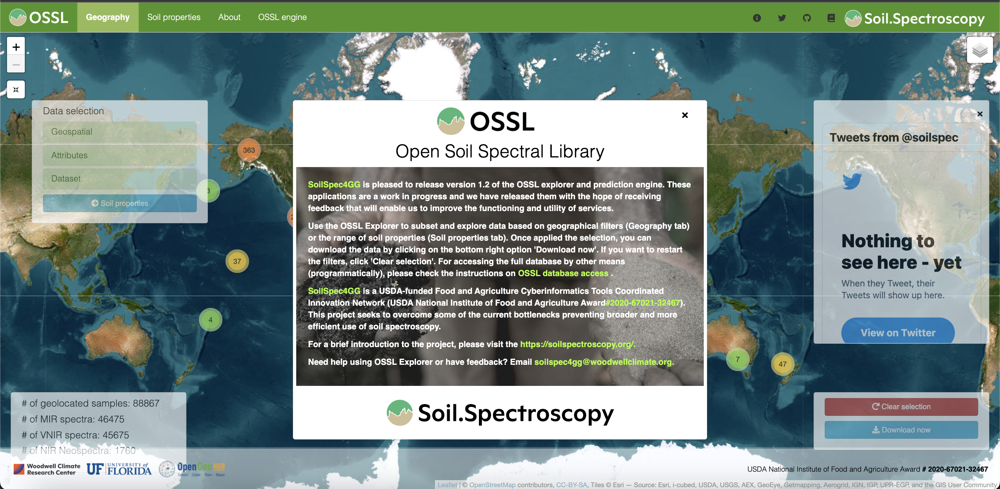
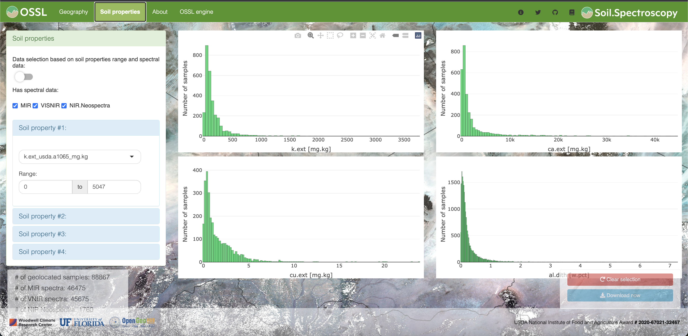
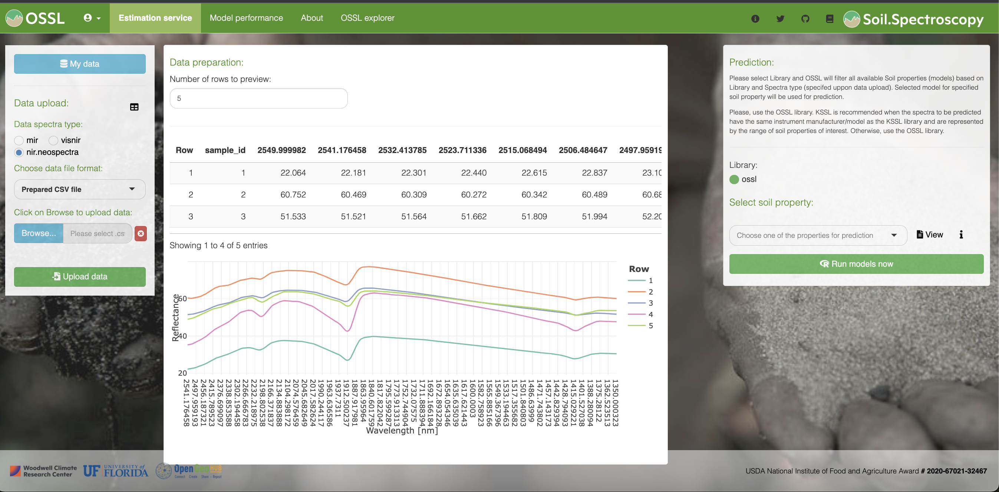
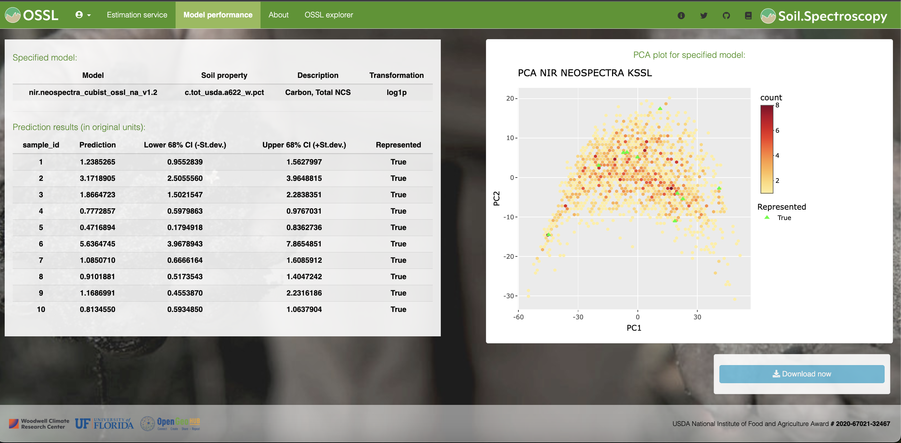

# Web applications and API

```{r, results = "asis", echo = FALSE}
status("drafting")
```

## [OSSL Explorer](https://explorer.soilspectroscopy.org/)

The [OSSL Explorer](https://explorer.soilspectroscopy.org/) is a web platform where the user can explore the OSSL database. Use it to subset and explore data based on geographical filters (Geography tab) or based on the range of soil properties (Soil properties tab). Once applied the selection, you can download the data by clicking on the bottom right option 'Download now'. If you want to restart the filters, click 'Clear selection'. For accessing the full database by other means (programmatically) or just download it as `csv` or `qs` format, please check the instructions on **[OSSL database access](https://soilspectroscopy.github.io/ossl-manual/ossl-database-access.html)**.

```{r explorer1, echo=FALSE, fig.cap="OSSL Explorer initial page that allows filtering OSSL samples based on geographical distribution.", out.width="100%"}

```

```{r explorer2, echo=FALSE, fig.cap="OSSL Explorer page that allows filtering OSSL samples based on range of soil properties.", out.width="100%"}

```

## [OSSL Engine](https://engine.soilspectroscopy.org/)

The [OSSL Engine](https://engine.soilspectroscopy.org/) is a web platform where the user can upload spectra from the **VisNIR (400-2500 nm), NIR (1350-2550 nm), or MIR (600-4000 cm<sup>-1</sup>) ranges** and get predictions back with uncertainty estimation and representativeness flag. The modeling framework, cross-validation performance metrics, and further information can be checked over **[OSSL prediction models](https://soilspectroscopy.github.io/ossl-manual/ossl-prediction-models.html)**.

Please, check the **[example datasets](https://github.com/soilspectroscopy/ossl-manual/tree/main/sample-data)** for formatting your spectra to the minimum required level. You can provide either `csv` files or directly `asd` or opus (`.0`) for VisNIR and MIR scans, respectively.

>> We recommend using the OSSL model type when getting predictions. KSSL is recommended when the spectra to be predicted have the same instrument manufacturer/model as the KSSL library and are represented by the range of soil properties of interest. Otherwise, use the OSSL library.

```{r engine1, echo=FALSE, fig.cap="OSSL Engine initial page for uploading data, confirming spectra, and selecting model type.", out.width="100%"}

```

```{r engine2, echo=FALSE, fig.cap="OSSL Engine page with the outputs from model predictions, including response, uncertainty interval, and trustworthiness flag.", out.width="100%"}

```

## [OSSL API](https://api.soilspectroscopy.org/__docs__/#/)

The [OSSL API](https://api.soilspectroscopy.org/__docs__/#/) (Application Programming Interface) is also available and can be used to construct requests to fetch data, and models, and generate predictions. The outputs of predictions can be obtained as [JSON](https://www.json.org/json-en.html) or CSV files, making the system fully interoperable. The OSSL API is at the moment based on using the [plumber package](https://www.rplumber.io/) and is **provided for testing purposes only**. Users can make predictions with pre-trained models for 20 spectra per request, but these limits will be gradually extended.

```{r ossl-api, echo=FALSE, fig.cap="OSSL API is available for testing.", out.width="100%"}
knitr::include_graphics("img/preview_ossl_api_swagger.png")
```

