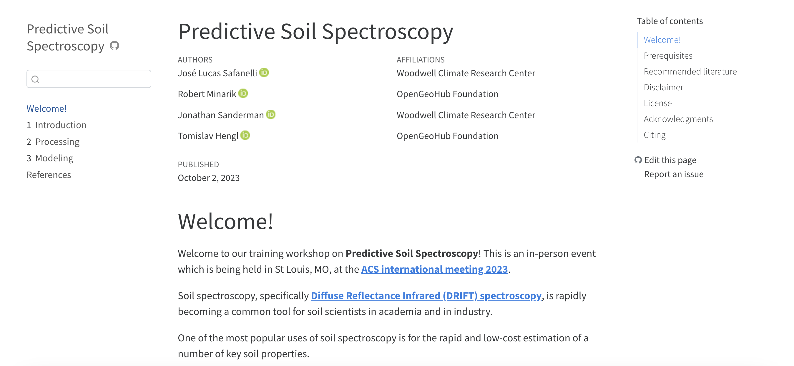

# Hands-on tutorial

After a series of events in 2023, which included a training
workshop on [**Predictive Soil Spectroscopy**](https://soilspectroscopy.github.io/soilspec-workshop/) at the ACS International Meeting 2023 in St Louis - MO, USA, we made available a guide on the topic with walk-through examples of processing and predictive modeling that are currently employed in the OSSL.

[{width=100%}](https://soilspectroscopy.github.io/soilspec-workshop/)

In this guide, you will find information on why soil spectroscopy should be a fit-for-purpose technology, why good predictions flow from good data, and what are the best practices for model building.

Further on, we walk through examples of data import, tabular operation, visualization, spectra resampling, preprocessing, and compression.

Lastly, we conclude the guide with an introduction the the MLR3 modeling framework, exploring aspects of data splitting and resampling, model optimization, benchmarking, and uncertainty estimation via conformal prediction.

We hope that this gives a good overview of predictive soil spectroscopy and helps new people get involved in the field.

