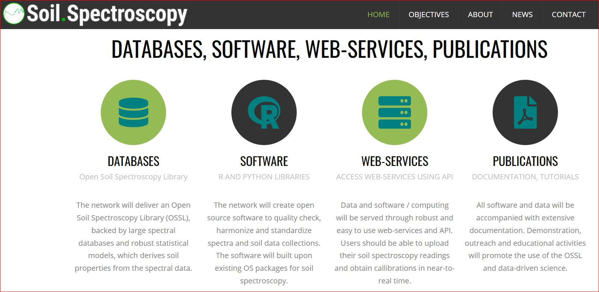

# Open Soil Spectral Library Manual

[**SoilSpec4GG**](https://soilspectroscopy.org/) is a USDA-funded [Food and Agriculture Cyberinformatics
Tools Coordinated Innovation Network NIFA Award #2020-67021-32467](https://nifa.usda.gov/press-release/nifa-invests-over-7-million-big-data-artificial-intelligence-and-other) project.

## Contributing

Please feel free to contribute datasets by using [pull requests](https://docs.github.com/en/github/collaborating-with-issues-and-pull-requests/creating-a-pull-request).

All datasets are welcome, however, not well documented, incomplete and duplicate 
datasets might be removed.

The format for adding bibliography entries is:

**\#\# [Name of the dataset]**

**[Brief description of the dataset]**

**Note: mention the data licenses and if there the use is restricted in any way** 

**[Publication / how to cite]**

**[Project] - link to project homepage / blog**

**[Unique locations] - number of unique spatial locations**

If you have an addition or correction, make changes to the Rmd's and make pull-request.

Ideally, all datasets including various versions should come with a DOI. 
Don't have a DOI yet, please upload and register your dataset via <https://zenodo.org> or 
similar.

Commercial datasets can be also listed, however promotional materials, commercial offers 
and similar will be removed.
