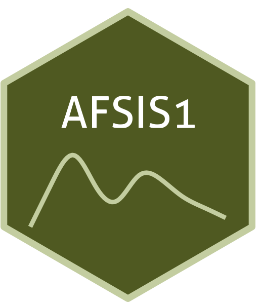

```{=html}
<div class="ossl-hero" style="background: #F2FDCF;">
  <div class="ossl-hero-logo">
    
  </div>
  <div class="ossl-hero-text">
    <h1 class="ossl-hero-title">AFSIS1</h1>
    <p class="ossl-hero-desc">Soil spectral library from Africa Soil Information Service Phase I (AFSIS1)</p>
    <div class="ossl-hero-meta">
      <div class="ossl-pill-row">
        <span class="ossl-pill ossl-pill-off">VNIR</span>
        <span class="ossl-pill ossl-pill-off">NIR</span>
        <span class="ossl-pill ossl-pill-on">MIR</span>
      </div>
      <span class="ossl-meta-divider"></span>
      <span class="ossl-meta-item"><i class="bi bi-globe-americas" aria-hidden="true"></i>Continental — Africa</span>
    </div>
  </div>
</div>
<div class="ossl-quick-stats">
  <span class="ossl-stat-item"><i class="bi bi-database" aria-hidden="true"></i><span class="ossl-stat-val">1,000+</span> samples</span>
  <span class="ossl-stat-item"><i class="bi bi-calendar3" aria-hidden="true"></i><span class="ossl-stat-val">first release (v1)</span></span>
  <span class="ossl-stat-item"><i class="bi bi-file-earmark-text" aria-hidden="true"></i><span class="ossl-stat-val">CC-BY</span></span>
</div>

```

## <i class="bi bi-cloud-download ossl-section-icon" aria-hidden="true"></i> Database access

Data originally provided by:

- **Contact:** Keith Shepherd
- **Email:** [afsis.info@africasoils.net](mailto:afsis.info@africasoils.net)
- **Original source:** <https://data.worldagroforestry.org/dataset.xhtml?persistentId=doi:10.34725/DVN/QXCWP1>

**Available files**

| Type | Filename | Link |
|------|----------|------|
| MIR spectra — CSV (gzip) | `ossl_mir_v1.3.csv.gz` | [Download](https://storage.googleapis.com/soilspec4gg-public/datasets/AFSIS1/ossl_mir_v1.3.csv.gz) |
| MIR spectra — Parquet | `ossl_mir_v1.3.parquet` | [Download](https://storage.googleapis.com/soilspec4gg-public/datasets/AFSIS1/ossl_mir_v1.3.parquet) |
| Soil lab measurements — CSV (gzip) | `ossl_soillab_v1.3.csv.gz` | [Download](https://storage.googleapis.com/soilspec4gg-public/datasets/AFSIS1/ossl_soillab_v1.3.csv.gz) |
| Soil lab measurements — Parquet | `ossl_soillab_v1.3.parquet` | [Download](https://storage.googleapis.com/soilspec4gg-public/datasets/AFSIS1/ossl_soillab_v1.3.parquet) |
| Soil site metadata — CSV (gzip) | `ossl_soilsite_v1.3.csv.gz` | [Download](https://storage.googleapis.com/soilspec4gg-public/datasets/AFSIS1/ossl_soilsite_v1.3.csv.gz) |
| Soil site metadata — Parquet | `ossl_soilsite_v1.3.parquet` | [Download](https://storage.googleapis.com/soilspec4gg-public/datasets/AFSIS1/ossl_soilsite_v1.3.parquet) |


## <i class="bi bi-clipboard-data ossl-section-icon" aria-hidden="true"></i> Soil laboratory information

Summary statistics for soil properties in this dataset, sourced from the [ossl-imports README](https://github.com/soilspectroscopy/ossl-imports/tree/main/dataset/AFSIS1).

| skim_variable | n_missing | mean | sd | p0 | p25 | p50 | p75 | p100 |
|:---|---:|---:|---:|---:|---:|---:|---:|---:|
| ec_usda.a364_ds.m | 0 | 0.13 | 0.39 | 0.01 | 0.03 | 0.06 | 0.11 | 8.73 |
| al.ext_usda.a1056_mg.kg | 0 | 821.58 | 466.22 | 1.67 | 457.00 | 733.00 | 1109.50 | 3041.00 |
| b.ext_mel3_mg.kg | 2 | 0.44 | 1.79 | 0.00 | 0.00 | 0.10 | 0.36 | 55.09 |
| ca.ext_usda.a1059_mg.kg | 0 | 1841.05 | 3438.81 | 0.00 | 290.00 | 634.00 | 1693.50 | 35200.00 |
| cu.ext_usda.a1063_mg.kg | 0 | 1.77 | 2.06 | 0.00 | 0.50 | 1.12 | 2.42 | 23.70 |
| fe.ext_usda.a1064_mg.kg | 0 | 112.11 | 81.46 | 1.26 | 60.05 | 91.90 | 139.10 | 981.00 |
| k.ext_usda.a1065_mg.kg | 0 | 173.99 | 289.98 | 0.00 | 51.48 | 91.41 | 177.85 | 5047.00 |
| mg.ext_usda.a1066_mg.kg | 0 | 311.58 | 416.64 | 0.00 | 79.15 | 159.00 | 383.95 | 4740.00 |
| mn.ext_usda.a1067_mg.kg | 0 | 98.93 | 100.63 | 0.57 | 24.00 | 69.40 | 139.00 | 686.60 |
| na.ext_usda.a1068_mg.kg | 6 | 140.34 | 1169.35 | 0.00 | 22.30 | 34.30 | 50.92 | 31800.00 |
| p.ext_usda.a652_mg.kg | 0 | 12.30 | 28.75 | 0.00 | 2.55 | 4.97 | 10.09 | 396.00 |
| s.ext_mel3_mg.kg | 2 | 24.87 | 165.80 | 0.62 | 5.00 | 7.62 | 12.40 | 3940.00 |
| zn.ext_usda.a1073_mg.kg | 0 | 1.53 | 1.77 | 0.00 | 0.71 | 1.10 | 1.75 | 36.51 |
| ph.h2o_usda.a268_index | 0 | 6.21 | 1.07 | 3.61 | 5.44 | 6.08 | 6.69 | 9.86 |
| n.tot_usda.a623_w.pct | 2 | 0.08 | 0.08 | 0.00 | 0.03 | 0.05 | 0.10 | 0.66 |
| c.tot_usda.a622_w.pct | 2 | 1.24 | 1.34 | 0.08 | 0.42 | 0.78 | 1.51 | 11.29 |
| oc_usda.c1059_w.pct | 2 | 1.18 | 1.28 | 0.07 | 0.39 | 0.73 | 1.46 | 10.93 |
| clay.tot_usda.a334_w.pct | 8 | 42.99 | 24.09 | 0.32 | 22.16 | 40.16 | 63.13 | 100.00 |
| silt.tot_usda.c62_w.pct | 14 | 17.73 | 10.05 | 0.34 | 10.00 | 16.48 | 23.42 | 57.27 |
| sand.tot_usda.c60_w.pct | 13 | 39.50 | 26.20 | 0.12 | 15.72 | 36.96 | 60.31 | 100.00 |

## <i class="bi bi-pin-map ossl-section-icon" aria-hidden="true"></i> Soil site information

- **coordinates precision:** precise, country
- **sampling depth:** various
- **geography:** soil taxonomy, landuse

## <i class="bi bi-geo-alt ossl-section-icon" aria-hidden="true"></i> Map


## <i class="bi bi-soundwave ossl-section-icon" aria-hidden="true"></i> MIR

- **Acquisition mode:** Not available
- **Intensity:** absorbance
- **Original range:** 602-4000
- **Standardized range:** 600-4000
- **Instrument:** Tensor 27 FT-IR & Alpha I ZnSe
- **Manufacturer:** Bruker Optics
- **Scan accessory:** Not available
- **Sample preparation:** Finely ground <0.1 mm
- **Additional info:** Not available

### MIR plot


## <i class="bi bi-journal-text ossl-section-icon" aria-hidden="true"></i> References

1. [Publication 1](https://doi.org/10.1016/j.geoderma.2015.06.023)
2. [Publication 2](https://doi.org/10.1016/j.geodrs.2015.06.002)

