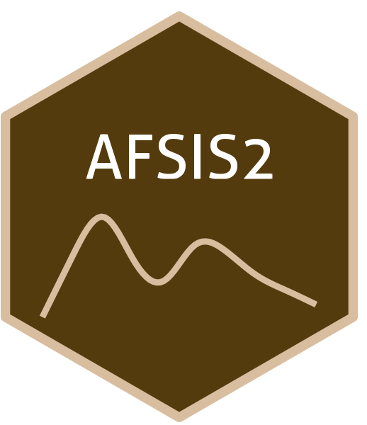

```{=html}
<div class="ossl-hero" style="background: #f1f3f5;">
  <div class="ossl-hero-logo">
    
  </div>
  <div class="ossl-hero-text">
    <h1 class="ossl-hero-title">AFSIS2</h1>
    <p class="ossl-hero-desc">Soil spectral library from Africa Soil Information Service Phase II (AFSIS2)</p>
    <div class="ossl-hero-meta">
      <div class="ossl-pill-row">
        <span class="ossl-pill ossl-pill-off">VNIR</span>
        <span class="ossl-pill ossl-pill-off">NIR</span>
        <span class="ossl-pill ossl-pill-on">MIR</span>
      </div>
      <span class="ossl-meta-divider"></span>
      <span class="ossl-meta-item"><i class="bi bi-globe-americas" aria-hidden="true"></i>Continental — Africa</span>
    </div>
  </div>
</div>
<div class="ossl-quick-stats">
  <span class="ossl-stat-item"><i class="bi bi-database" aria-hidden="true"></i><span class="ossl-stat-val"><1,000</span> samples</span>
  <span class="ossl-stat-item"><i class="bi bi-calendar3" aria-hidden="true"></i><span class="ossl-stat-val">first release (v1)</span></span>
  <span class="ossl-stat-item"><i class="bi bi-file-earmark-text" aria-hidden="true"></i><span class="ossl-stat-val">CC-BY</span></span>
</div>

```

## <i class="bi bi-geo-alt ossl-section-icon" aria-hidden="true"></i> Map


## <i class="bi bi-cloud-download ossl-section-icon" aria-hidden="true"></i> Database access

Data originally provided by:

- **Contact:** Leigh Ann Winowiecki
- **Email:** [L.A.WINOWIECKI@cifor-icraf.org](mailto:L.A.WINOWIECKI@cifor-icraf.org)
- **Original source:** <https://data.worldagroforestry.org/dataset.xhtml?persistentId=doi:10.34725/DVN/XUDGJY>

**Available files**

| Type | Filename | Link |
|------|----------|------|
| MIR spectra — CSV (gzip) | `ossl_mir_v1.3.csv.gz` | [Download](https://storage.googleapis.com/soilspec4gg-public/datasets/AFSIS2/ossl_mir_v1.3.csv.gz) |
| MIR spectra — Parquet | `ossl_mir_v1.3.parquet` | [Download](https://storage.googleapis.com/soilspec4gg-public/datasets/AFSIS2/ossl_mir_v1.3.parquet) |
| Soil lab measurements — CSV (gzip) | `ossl_soillab_v1.3.csv.gz` | [Download](https://storage.googleapis.com/soilspec4gg-public/datasets/AFSIS2/ossl_soillab_v1.3.csv.gz) |
| Soil lab measurements — Parquet | `ossl_soillab_v1.3.parquet` | [Download](https://storage.googleapis.com/soilspec4gg-public/datasets/AFSIS2/ossl_soillab_v1.3.parquet) |
| Soil site metadata — CSV (gzip) | `ossl_soilsite_v1.3.csv.gz` | [Download](https://storage.googleapis.com/soilspec4gg-public/datasets/AFSIS2/ossl_soilsite_v1.3.csv.gz) |
| Soil site metadata — Parquet | `ossl_soilsite_v1.3.parquet` | [Download](https://storage.googleapis.com/soilspec4gg-public/datasets/AFSIS2/ossl_soilsite_v1.3.parquet) |


## <i class="bi bi-clipboard-data ossl-section-icon" aria-hidden="true"></i> Soil laboratory information

Summary statistics for soil properties in this dataset, sourced from the [ossl-imports README](https://github.com/soilspectroscopy/ossl-imports/tree/main/dataset/AFSIS2).

| skim\_variable            | n\_missing |    mean |      sd |    p0 |    p25 |    p50 |     p75 |     p100 |
|:--------------------------|-----------:|--------:|--------:|------:|-------:|-------:|--------:|---------:|
| ph.h2o\_usda.a268\_index  |         11 |    6.31 |    0.80 |  4.10 |   5.80 |   6.34 |    6.76 |     8.72 |
| al.ext\_usda.a1056\_mg.kg |          1 |  766.22 |  321.64 | 18.00 | 521.25 | 769.50 |  956.00 |  1851.00 |
| b.ext\_mel3\_mg.kg        |        526 |    1.79 |    0.70 |  0.30 |   1.00 |   2.00 |    2.00 |     4.00 |
| ca.ext\_usda.a1059\_mg.kg |          1 | 1484.03 | 1801.00 | 12.00 | 404.00 | 858.50 | 1961.50 | 21565.00 |
| cu.ext\_usda.a1063\_mg.kg |         15 |    2.22 |    2.41 |  0.03 |   0.53 |   1.40 |    3.16 |    18.19 |
| fe.ext\_usda.a1064\_mg.kg |          1 |  123.62 |   77.15 | 13.20 |  78.10 | 103.05 |  145.65 |   578.00 |
| k.ext\_usda.a1065\_mg.kg  |          2 |  280.76 |  426.69 |  5.00 |  51.00 | 125.00 |  316.00 |  3600.00 |
| mg.ext\_usda.a1066\_mg.kg |          1 |  304.29 |  365.74 |  2.00 |  89.00 | 190.00 |  368.75 |  3241.00 |
| mn.ext\_usda.a1067\_mg.kg |          1 |  154.51 |  120.37 |  0.70 |  58.70 | 129.55 |  225.90 |   741.10 |
| s.ext\_mel3\_mg.kg        |          9 |    8.57 |   18.51 |  1.00 |   3.00 |   5.00 |    8.00 |   266.00 |
| zn.ext\_usda.a1073\_mg.kg |         29 |    1.79 |    3.17 |  0.06 |   0.40 |   0.90 |    2.10 |    48.79 |
| n.tot\_usda.a623\_w.pct   |          0 |    0.10 |    0.08 |  0.01 |   0.05 |   0.08 |    0.13 |     0.53 |
| c.tot\_usda.a622\_w.pct   |          0 |    1.28 |    1.04 |  0.10 |   0.58 |   0.99 |    1.66 |     7.15 |
| oc\_usda.c1059\_w.pct     |          0 |    1.26 |    1.01 |  0.10 |   0.58 |   0.99 |    1.62 |     7.09 |

## <i class="bi bi-pin-map ossl-section-icon" aria-hidden="true"></i> Soil site information

- **coordinates precision:** precise, country
- **sampling depth:** various
- **geography:** soil taxonomy, landuse

## <i class="bi bi-soundwave ossl-section-icon" aria-hidden="true"></i> MIR

- **Acquisition mode:** Not available
- **Intensity:** absorbance
- **Original range:** 602-4000
- **Standardized range:** 600-4000
- **Instrument:** Tensor 27 & Alpha I ZnSe
- **Manufacturer:** Bruker Optics
- **Scan accessory:** Not available
- **Sample preparation:** Finely ground <0.1 mm
- **Additional info:** Not available

### MIR plot


## <i class="bi bi-journal-text ossl-section-icon" aria-hidden="true"></i> References

1. [Publication 1](https://doi.org/10.1038/s41598-021-85639-y)
2. [Publication 2](https://doi.org/10.5194/soil-4-259-2018)

