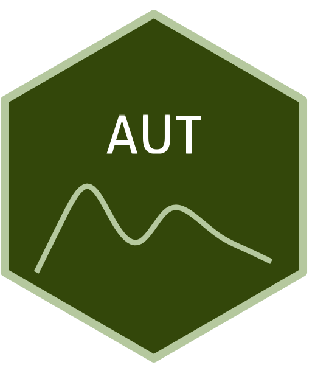

```{=html}
<div class="ossl-hero" style="background: #EAFDD3;">
  <div class="ossl-hero-logo">
    
  </div>
  <div class="ossl-hero-text">
    <h1 class="ossl-hero-title">AUT</h1>
    <p class="ossl-hero-desc">Austrian NIR soil spectral library for soil health assessments (AUT)</p>
    <div class="ossl-hero-meta">
      <div class="ossl-pill-row">
        <span class="ossl-pill ossl-pill-off">VNIR</span>
        <span class="ossl-pill ossl-pill-on">NIR</span>
        <span class="ossl-pill ossl-pill-off">MIR</span>
      </div>
      <span class="ossl-meta-divider"></span>
      <span class="ossl-meta-item"><i class="bi bi-globe-americas" aria-hidden="true"></i>National — Austria</span>
    </div>
  </div>
</div>
<div class="ossl-quick-stats">
  <span class="ossl-stat-item"><i class="bi bi-database" aria-hidden="true"></i><span class="ossl-stat-val">2,000+</span> samples</span>
  <span class="ossl-stat-item"><i class="bi bi-calendar3" aria-hidden="true"></i><span class="ossl-stat-val">version v4</span></span>
  <span class="ossl-stat-item"><i class="bi bi-file-earmark-text" aria-hidden="true"></i><span class="ossl-stat-val">CC-BY</span></span>
</div>

```

## <i class="bi bi-cloud-download ossl-section-icon" aria-hidden="true"></i> Database access

Data originally provided by:

- **Contact:** Julia Fohrafellner
- **Email:** [julia.fohrafellner@ages.at](mailto:julia.fohrafellner@ages.at)
- **Original source:** <https://zenodo.org/records/17941270>

**Available files**

| Type | Filename | Link |
|------|----------|------|
| NIR spectra — CSV (gzip) | `ossl_nir_v1.3.csv.gz` | [Download](https://storage.googleapis.com/soilspec4gg-public/datasets/AUT/ossl_nir_v1.3.csv.gz) |
| NIR spectra — Parquet | `ossl_nir_v1.3.parquet` | [Download](https://storage.googleapis.com/soilspec4gg-public/datasets/AUT/ossl_nir_v1.3.parquet) |
| Soil lab measurements — CSV (gzip) | `ossl_soillab_v1.3.csv.gz` | [Download](https://storage.googleapis.com/soilspec4gg-public/datasets/AUT/ossl_soillab_v1.3.csv.gz) |
| Soil lab measurements — Parquet | `ossl_soillab_v1.3.parquet` | [Download](https://storage.googleapis.com/soilspec4gg-public/datasets/AUT/ossl_soillab_v1.3.parquet) |
| Soil site metadata — CSV (gzip) | `ossl_soilsite_v1.3.csv.gz` | [Download](https://storage.googleapis.com/soilspec4gg-public/datasets/AUT/ossl_soilsite_v1.3.csv.gz) |
| Soil site metadata — Parquet | `ossl_soilsite_v1.3.parquet` | [Download](https://storage.googleapis.com/soilspec4gg-public/datasets/AUT/ossl_soilsite_v1.3.parquet) |


## <i class="bi bi-clipboard-data ossl-section-icon" aria-hidden="true"></i> Soil laboratory information

Summary statistics for soil properties in this dataset, sourced from the [ossl-imports README](https://github.com/soilspectroscopy/ossl-imports/tree/main/dataset/AUT).

| skim_variable            | n_missing |   mean |     sd |   p0 |   p25 |   p50 |    p75 |    p100 |
|:-------------------------|----------:|-------:|-------:|-----:|------:|------:|-------:|--------:|
| oc_usda.c729_w.pct       |        19 |   2.76 |   3.20 | 0.02 |  1.53 |  1.96 |   2.71 |   44.82 |
| c.tot_usda.a622_w.pct    |      2039 |   6.54 |   6.23 | 1.00 |  2.63 |  4.90 |   6.66 |   39.08 |
| caco3_usda.a54_w.pct     |      1804 |  13.26 |  12.57 | 0.01 |  4.30 |  9.70 |  20.40 |   81.90 |
| n.tot_usda.a623_w.pct    |      1095 |   0.25 |   0.21 | 0.03 |  0.16 |  0.19 |   0.25 |    2.42 |
| p.ext_austria.cal_mg.kg  |       488 | 112.89 | 136.73 | 1.00 | 45.00 | 78.00 | 120.00 | 1623.53 |
| ph.cacl2_iso.10390_index |       214 |   6.92 |   0.85 | 3.18 |  6.60 |  7.26 |   7.51 |    7.93 |
| cec_iso.11260_cmolc.kg   |      1490 |  20.91 |   8.75 | 2.88 | 15.81 | 20.95 |  24.42 |   85.45 |
| sand.tot_iso.11277_w.pct |      1569 |  36.25 |  18.69 | 5.60 | 21.00 | 32.20 |  49.48 |   92.50 |
| silt.tot_iso.11277_w.pct |      1569 |  45.71 |  14.26 | 5.00 | 35.80 | 47.10 |  56.70 |   75.70 |
| clay.tot_iso.11277_w.pct |      1597 |  18.01 |   9.05 | 1.50 | 10.93 | 17.30 |  23.80 |   47.10 |

## <i class="bi bi-pin-map ossl-section-icon" aria-hidden="true"></i> Soil site information

- **coordinates precision:** county
- **sampling depth:** various
- **geography:** landuse, vegetation

## <i class="bi bi-geo-alt ossl-section-icon" aria-hidden="true"></i> Map


## <i class="bi bi-soundwave ossl-section-icon" aria-hidden="true"></i> NIR

- **Acquisition mode:** Not available
- **Intensity:** reflectance
- **Original range:** 680-2500
- **Instrument:** SpectraStar™ XL
- **Manufacturer:** Unity Scientific (Brookfield, CT, USA)
- **Instrument co-scans:** 24
- **Scan repeats:** 2
- **Scan accessory:** Not available
- **Original resolution:** 1 nm
- **Sample preparation:** Air-dried, Sieved < 2 mm
- **Additional info:** A mattesurface gold-plated metal reflector was used as an internal reference; The standard used was White Sand (Lucky Bay, Australia), which enables harmonizing results from different near-infrared spectrometers used within the ProbeField project.

### NIR plot


## <i class="bi bi-journal-text ossl-section-icon" aria-hidden="true"></i> References

1. [Publication 1](https://doi.org/10.5194/essd-18-219-2026)

