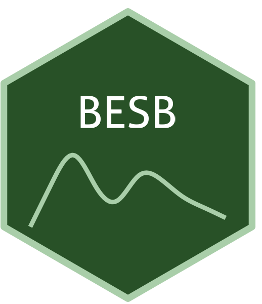

```{=html}
<div class="ossl-hero" style="background: #E0FFE0;">
  <div class="ossl-hero-logo">
    
  </div>
  <div class="ossl-hero-text">
    <h1 class="ossl-hero-title">BESB</h1>
    <p class="ossl-hero-desc">Brazilian Soil Spectral Library (BESB)</p>
    <div class="ossl-hero-meta">
      <div class="ossl-pill-row">
        <span class="ossl-pill ossl-pill-on">VNIR</span>
        <span class="ossl-pill ossl-pill-off">NIR</span>
        <span class="ossl-pill ossl-pill-on">MIR</span>
      </div>
      <span class="ossl-meta-divider"></span>
      <span class="ossl-meta-item"><i class="bi bi-globe-americas" aria-hidden="true"></i>National — Brazil</span>
    </div>
  </div>
</div>
<div class="ossl-quick-stats">
  <span class="ossl-stat-item"><i class="bi bi-database" aria-hidden="true"></i><span class="ossl-stat-val">15,000+</span> samples</span>
  <span class="ossl-stat-item"><i class="bi bi-calendar3" aria-hidden="true"></i><span class="ossl-stat-val">version v.002</span></span>
  <span class="ossl-stat-item"><i class="bi bi-file-earmark-text" aria-hidden="true"></i><span class="ossl-stat-val">CC-BY</span></span>
</div>

```

## <i class="bi bi-cloud-download ossl-section-icon" aria-hidden="true"></i> Database access

Data originally provided by:

- **Contact:** José A.M. Demattê
- **Email:** [jamdemat@usp.br](mailto:jamdemat@usp.br)
- **Original source:** <https://zenodo.org/records/8361419>

**Available files**

| Type | Filename | Link |
|------|----------|------|
| MIR spectra — CSV (gzip) | `ossl_mir_v1.3.csv.gz` | [Download](https://storage.googleapis.com/soilspec4gg-public/datasets/BESB/ossl_mir_v1.3.csv.gz) |
| MIR spectra — Parquet | `ossl_mir_v1.3.parquet` | [Download](https://storage.googleapis.com/soilspec4gg-public/datasets/BESB/ossl_mir_v1.3.parquet) |
| Soil lab measurements — CSV (gzip) | `ossl_soillab_v1.3.csv.gz` | [Download](https://storage.googleapis.com/soilspec4gg-public/datasets/BESB/ossl_soillab_v1.3.csv.gz) |
| Soil lab measurements — Parquet | `ossl_soillab_v1.3.parquet` | [Download](https://storage.googleapis.com/soilspec4gg-public/datasets/BESB/ossl_soillab_v1.3.parquet) |
| Soil site metadata — CSV (gzip) | `ossl_soilsite_v1.3.csv.gz` | [Download](https://storage.googleapis.com/soilspec4gg-public/datasets/BESB/ossl_soilsite_v1.3.csv.gz) |
| Soil site metadata — Parquet | `ossl_soilsite_v1.3.parquet` | [Download](https://storage.googleapis.com/soilspec4gg-public/datasets/BESB/ossl_soilsite_v1.3.parquet) |
| VisNIR spectra — CSV (gzip) | `ossl_visnir_v1.3.csv.gz` | [Download](https://storage.googleapis.com/soilspec4gg-public/datasets/BESB/ossl_visnir_v1.3.csv.gz) |
| VisNIR spectra — Parquet | `ossl_visnir_v1.3.parquet` | [Download](https://storage.googleapis.com/soilspec4gg-public/datasets/BESB/ossl_visnir_v1.3.parquet) |


## <i class="bi bi-geo-alt ossl-section-icon" aria-hidden="true"></i> Map


## <i class="bi bi-pin-map ossl-section-icon" aria-hidden="true"></i> Soil site information

- **Coordinates precision:** precise, state/province, region
- **Sampling depth:** top
- **Geography:** soil taxonomy, landuse, vegetation
- **Variables available (OSSL):** 15 out of 15 — see [Database description](../db-desc.html#panel-soilsite) for full schema
- **Populated columns:** `id.layer_uuid_txt`, `id.layer_local_c`, `dataset.contributor_src_code`, `layer.upper.depth_usda_cm`, `layer.lower.depth_usda_cm`, `observation.type_src_txt`, `latitude.point_wgs84_dd`, `longitude.point_wgs84_dd`, `loc.region_src_txt`, `loc.state_src_txt`, `loc.municipality_src_txt`, `site.biome_src_txt`, `site.vegetation_src_txt`, `site.geology_src_txt`, `layer.sequence_usda_uint16`

## <i class="bi bi-clipboard-data ossl-section-icon" aria-hidden="true"></i> Soil laboratory information

- **Total samples:** 16,084
- **Properties available (original):** 8
- **Properties standardized (OSSL):** 8 — summarized in **@tbl-soillab-besb** below
- **Categories:** physical, chemical, carbon & nutrients
- **Original source:** see [Database access](#database-access)

```{=html}
<p class="ossl-tt-hint"><i class="bi bi-info-circle" aria-hidden="true"></i> Hover over any OSSL code in the table below to see its full description.</p>
```

::: {#tbl-soillab-besb}

```{=html}
<table class="soil-lab-table"><thead><tr><th style="text-align:left">skim_variable</th><th style="text-align:right">n_missing</th><th style="text-align:right">mean</th><th style="text-align:right">sd</th><th style="text-align:right">p0</th><th style="text-align:right">p25</th><th style="text-align:right">p50</th><th style="text-align:right">p75</th><th style="text-align:right">p100</th></tr></thead><tbody><tr><td style="text-align:left"><span class="ossl-tt">sand.tot_usda.c405_w.pct<span class="ossl-tt-pop"><span class="tt-analyte">Sand, Total, N prep</span><span class="tt-desc">Method: <code>usda.c405</code></span><span class="tt-unit">Unit: <code>w.pct</code></span></span></span></td><td style="text-align:right">959</td><td style="text-align:right">54.17</td><td style="text-align:right">28.26</td><td style="text-align:right">0.47</td><td style="text-align:right">26.70</td><td style="text-align:right">61.40</td><td style="text-align:right">80.00</td><td style="text-align:right">95.40</td></tr><tr><td style="text-align:left"><span class="ossl-tt">clay.tot_usda.a334_w.pct<span class="ossl-tt-pop"><span class="tt-analyte">Clay</span><span class="tt-desc">Method: <code>usda.a334</code></span><span class="tt-unit">Unit: <code>w.pct</code></span></span></span></td><td style="text-align:right">977</td><td style="text-align:right">31.15</td><td style="text-align:right">21.58</td><td style="text-align:right">0.70</td><td style="text-align:right">13.00</td><td style="text-align:right">24.00</td><td style="text-align:right">48.00</td><td style="text-align:right">96.10</td></tr><tr><td style="text-align:left"><span class="ossl-tt">oc_iso.10694_w.pct<span class="ossl-tt-pop"><span class="tt-analyte">Organic Carbon, ISO 10694</span><span class="tt-desc">Method: <code>iso.10694</code></span><span class="tt-unit">Unit: <code>w.pct</code></span></span></span></td><td style="text-align:right">2737</td><td style="text-align:right">1.31</td><td style="text-align:right">0.89</td><td style="text-align:right">0.08</td><td style="text-align:right">0.70</td><td style="text-align:right">1.06</td><td style="text-align:right">1.68</td><td style="text-align:right">7.49</td></tr><tr><td style="text-align:left"><span class="ossl-tt">ph.h2o_usda.a268_index<span class="ossl-tt-pop"><span class="tt-analyte">pH, 1:1 Soil-Water Suspension</span><span class="tt-desc">Method: <code>usda.a268</code></span><span class="tt-unit">Unit: <code>index</code></span></span></span></td><td style="text-align:right">12601</td><td style="text-align:right">4.64</td><td style="text-align:right">0.61</td><td style="text-align:right">3.10</td><td style="text-align:right">4.10</td><td style="text-align:right">4.60</td><td style="text-align:right">5.10</td><td style="text-align:right">7.00</td></tr><tr><td style="text-align:left"><span class="ossl-tt">ca.ext_usda.a722_cmolc.kg<span class="ossl-tt-pop"><span class="tt-analyte">Calcium, Extractable, NH4OAc</span><span class="tt-desc">Method: <code>usda.a722</code></span><span class="tt-unit">Unit: <code>cmolc.kg</code></span></span></span></td><td style="text-align:right">3588</td><td style="text-align:right">1.95</td><td style="text-align:right">2.27</td><td style="text-align:right">0.00</td><td style="text-align:right">0.60</td><td style="text-align:right">1.30</td><td style="text-align:right">2.43</td><td style="text-align:right">25.20</td></tr><tr><td style="text-align:left"><span class="ossl-tt">mg.ext_usda.a724_cmolc.kg<span class="ossl-tt-pop"><span class="tt-analyte">Magnesium, Extractable, NH4OAc, 2M KCl displacement</span><span class="tt-desc">Method: <code>usda.a724</code></span><span class="tt-unit">Unit: <code>cmolc.kg</code></span></span></span></td><td style="text-align:right">3585</td><td style="text-align:right">0.84</td><td style="text-align:right">1.05</td><td style="text-align:right">0.01</td><td style="text-align:right">0.28</td><td style="text-align:right">0.60</td><td style="text-align:right">1.04</td><td style="text-align:right">18.62</td></tr><tr><td style="text-align:left"><span class="ossl-tt">na.ext_usda.a726_cmolc.kg<span class="ossl-tt-pop"><span class="tt-analyte">Sodium, Extractable, NH4OAc, 2M KCl displacement</span><span class="tt-desc">Method: <code>usda.a726</code></span><span class="tt-unit">Unit: <code>cmolc.kg</code></span></span></span></td><td style="text-align:right">15423</td><td style="text-align:right">0.73</td><td style="text-align:right">2.17</td><td style="text-align:right">0.00</td><td style="text-align:right">0.01</td><td style="text-align:right">0.04</td><td style="text-align:right">0.32</td><td style="text-align:right">18.90</td></tr><tr><td style="text-align:left"><span class="ossl-tt">cec_usda.a723_cmolc.kg<span class="ossl-tt-pop"><span class="tt-analyte">CEC, pH 7.0, NH4OAc, 2M KCl displacement</span><span class="tt-desc">Method: <code>usda.a723</code></span><span class="tt-unit">Unit: <code>cmolc.kg</code></span></span></span></td><td style="text-align:right">3588</td><td style="text-align:right">5.33</td><td style="text-align:right">3.34</td><td style="text-align:right">0.22</td><td style="text-align:right">3.06</td><td style="text-align:right">4.44</td><td style="text-align:right">6.86</td><td style="text-align:right">18.99</td></tr></tbody></table>
```

Summary statistics (mean, SD, percentiles) for OSSL-standardized soil properties.

:::

## <i class="bi bi-soundwave ossl-section-icon" aria-hidden="true"></i> MIR

- **Acquisition mode:** Not available
- **Intensity:** absorbance
- **Original range:** 600-4000
- **Standardized range:** 600-4000
- **Instrument:** Alpha Sample Compartment RTDLaTGS ZnSe
- **Manufacturer:** Bruker Optik GmbH, Ettlingen, Germany
- **Scan accessory:** Not available
- **Sample preparation:** Sieved<2mm, ground
- **Additional info:** The sensor has a HeNe laser; A gold reference plate was used as standard

### MIR plot


## <i class="bi bi-soundwave ossl-section-icon" aria-hidden="true"></i> VNIR

- **Acquisition mode:** Not available
- **Intensity:** reflectance
- **Original range:** 350-2500
- **Instrument:** FieldSpec 3 Spectroradiometer
- **Manufacturer:** Analytical Spectral Devices (ASD, Boulder, CO)
- **Instrument co-scans:** 100
- **Scan repeats:** 2
- **Scan accessory:** Not available
- **Original resolution:** 1
- **Sample preparation:** Air-dried, Sieved < 2 mm
- **Additional info:** The sensor is calibrated using a white Spectralon plate (Lab-sphere, North Sutton, NH, USA) representing a 100% reflectance standard

### VNIR plot


## <i class="bi bi-journal-text ossl-section-icon" aria-hidden="true"></i> References

1. [Publication 1](https://doi.org/10.1016/j.geoderma.2019.05.043)
2. [Publication 2](https://doi.org/10.1016/j.geoderma.2022.115776)
3. [Publication 3](https://doi.org/10.19047/0136-1694-2024-119-261-305)

