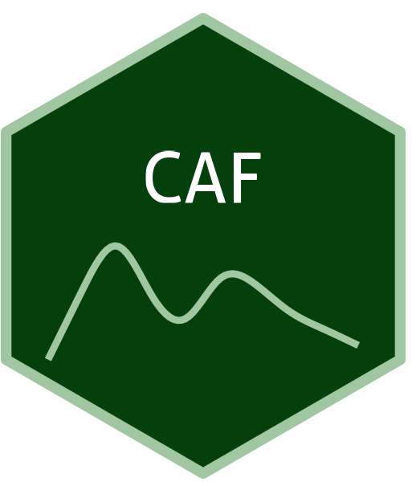

```{=html}
<div class="ossl-hero" style="background: #DCFFDE;">
  <div class="ossl-hero-logo">
    
  </div>
  <div class="ossl-hero-text">
    <h1 class="ossl-hero-title">CAF</h1>
    <p class="ossl-hero-desc">Soil spectral library for Central Africa (CAF)</p>
    <div class="ossl-hero-meta">
      <div class="ossl-pill-row">
        <span class="ossl-pill ossl-pill-off">VNIR</span>
        <span class="ossl-pill ossl-pill-off">NIR</span>
        <span class="ossl-pill ossl-pill-on">MIR</span>
      </div>
      <span class="ossl-meta-divider"></span>
      <span class="ossl-meta-item"><i class="bi bi-globe-americas" aria-hidden="true"></i>Regional — Africa</span>
    </div>
  </div>
</div>
<div class="ossl-quick-stats">
  <span class="ossl-stat-item"><i class="bi bi-database" aria-hidden="true"></i><span class="ossl-stat-val">1,000+</span> samples</span>
  <span class="ossl-stat-item"><i class="bi bi-calendar3" aria-hidden="true"></i><span class="ossl-stat-val">first release (v1)</span></span>
  <span class="ossl-stat-item"><i class="bi bi-file-earmark-text" aria-hidden="true"></i><span class="ossl-stat-val">CC-BY</span></span>
</div>

```

## <i class="bi bi-geo-alt ossl-section-icon" aria-hidden="true"></i> Map


## <i class="bi bi-cloud-download ossl-section-icon" aria-hidden="true"></i> Database access

Data originally provided by:

- **Contact:** Laura Summerauer
- **Email:** [laura.summerauer@usys.ethz.ch](mailto:laura.summerauer@usys.ethz.ch)
- **Original source:** <https://doi.org/10.5281/zenodo.6786666>

**Available files**

| Type | Filename | Link |
|------|----------|------|
| MIR spectra — CSV (gzip) | `ossl_mir_v1.3.csv.gz` | [Download](https://storage.googleapis.com/soilspec4gg-public/datasets/CAF/ossl_mir_v1.3.csv.gz) |
| MIR spectra — Parquet | `ossl_mir_v1.3.parquet` | [Download](https://storage.googleapis.com/soilspec4gg-public/datasets/CAF/ossl_mir_v1.3.parquet) |
| Soil lab measurements — CSV (gzip) | `ossl_soillab_v1.3.csv.gz` | [Download](https://storage.googleapis.com/soilspec4gg-public/datasets/CAF/ossl_soillab_v1.3.csv.gz) |
| Soil lab measurements — Parquet | `ossl_soillab_v1.3.parquet` | [Download](https://storage.googleapis.com/soilspec4gg-public/datasets/CAF/ossl_soillab_v1.3.parquet) |
| Soil site metadata — CSV (gzip) | `ossl_soilsite_v1.3.csv.gz` | [Download](https://storage.googleapis.com/soilspec4gg-public/datasets/CAF/ossl_soilsite_v1.3.csv.gz) |
| Soil site metadata — Parquet | `ossl_soilsite_v1.3.parquet` | [Download](https://storage.googleapis.com/soilspec4gg-public/datasets/CAF/ossl_soilsite_v1.3.parquet) |


## <i class="bi bi-clipboard-data ossl-section-icon" aria-hidden="true"></i> Soil laboratory information

Summary statistics for soil properties in this dataset, sourced from the [ossl-imports README](https://github.com/soilspectroscopy/ossl-imports/tree/main/dataset/CAF).

| skim_variable | n_missing | mean | sd | p0 | p25 | p50 | p75 | p100 |
|:---|---:|---:|---:|---:|---:|---:|---:|---:|
| c.tot_usda.a622_w.pct | 184 | 1.98 | 2.51 | 0.08 | 0.89 | 1.38 | 2.31 | 45.54 |
| n.tot_usda.a623_w.pct | 168 | 0.16 | 0.18 | 0.01 | 0.07 | 0.11 | 0.18 | 2.92 |
| ph.h2o_usda.a268_index | 1317 | 5.10 | 0.94 | 3.32 | 4.51 | 4.84 | 5.36 | 8.56 |
| clay.tot_usda.a334_w.pct | 1262 | 34.63 | 21.73 | 1.04 | 12.41 | 34.88 | 51.59 | 86.88 |
| silt.tot_usda.c62_w.pct | 1309 | 23.85 | 14.97 | 4.00 | 13.48 | 19.28 | 29.87 | 74.75 |
| sand.tot_usda.c60_w.pct | 1309 | 42.30 | 23.77 | 1.30 | 21.12 | 40.50 | 61.12 | 89.90 |
| al.ext_aquaregia_g.kg | 1128 | 25.20 | 24.69 | 0.16 | 7.94 | 12.37 | 36.24 | 121.32 |
| fe.ext_aquaregia_g.kg | 1128 | 38.84 | 39.55 | 0.34 | 10.15 | 20.13 | 59.62 | 352.66 |
| ca.ext_aquaregia_mg.kg | 1128 | 634.26 | 1352.25 | 0.00 | 52.50 | 186.94 | 589.29 | 19922.26 |
| mg.ext_aquaregia_mg.kg | 1128 | 800.40 | 1425.40 | 9.27 | 79.37 | 141.16 | 836.50 | 9500.41 |
| k.ext_aquaregia_mg.kg | 1128 | 616.41 | 1020.57 | 7.96 | 77.21 | 163.31 | 795.00 | 8073.54 |
| mn.ext_aquaregia_mg.kg | 1128 | 480.73 | 934.36 | 2.23 | 30.09 | 64.16 | 455.98 | 6468.45 |
| na.ext_aquaregia_mg.kg | 1128 | 69.57 | 128.62 | 0.00 | 4.99 | 13.99 | 71.72 | 1213.29 |
| p.ext_aquaregia_mg.kg | 1128 | 534.89 | 773.33 | 13.90 | 130.72 | 214.20 | 580.34 | 6679.17 |

## <i class="bi bi-pin-map ossl-section-icon" aria-hidden="true"></i> Soil site information

- **coordinates precision:** precise, region
- **sampling depth:** various
- **geography:** landuse

## <i class="bi bi-soundwave ossl-section-icon" aria-hidden="true"></i> MIR

- **Acquisition mode:** Not available
- **Intensity:** absorbance
- **Original range:** 600-7500
- **Standardized range:** 600-4000
- **Instrument:** VERTEX 70 FT-IR
- **Manufacturer:** Bruker Optics GmbH (Germany)
- **Scan accessory:** Not available
- **Sample preparation:** Ground < 50 μm
- **Additional info:** A gold coated reflectance standard (Infragold NIR-MIR Reflectance Coating, Labsphere) was used as a background material

### MIR plot


## <i class="bi bi-journal-text ossl-section-icon" aria-hidden="true"></i> References

1. [Publication 1](https://doi.org/10.5194/soil-7-693-2021)

