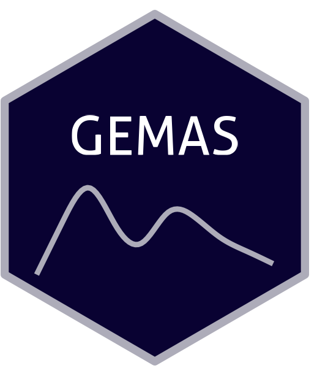

```{=html}
<div class="ossl-hero" style="background: #F4F3FE;">
  <div class="ossl-hero-logo">
    
  </div>
  <div class="ossl-hero-text">
    <h1 class="ossl-hero-title">GEMAS</h1>
    <p class="ossl-hero-desc">Soil spectral library from the Geochemical Mapping of Agricultural and Grazing Land Soil (GEMAS), Europe</p>
    <div class="ossl-hero-meta">
      <div class="ossl-pill-row">
        <span class="ossl-pill ossl-pill-off">VNIR</span>
        <span class="ossl-pill ossl-pill-off">NIR</span>
        <span class="ossl-pill ossl-pill-on">MIR</span>
      </div>
      <span class="ossl-meta-divider"></span>
      <span class="ossl-meta-item"><i class="bi bi-globe-americas" aria-hidden="true"></i>Continental — Europe</span>
    </div>
  </div>
</div>
<div class="ossl-quick-stats">
  <span class="ossl-stat-item"><i class="bi bi-database" aria-hidden="true"></i><span class="ossl-stat-val">4,000+</span> samples</span>
  <span class="ossl-stat-item"><i class="bi bi-calendar3" aria-hidden="true"></i><span class="ossl-stat-val">first release (v1)</span></span>
  <span class="ossl-stat-item"><i class="bi bi-file-earmark-text" aria-hidden="true"></i><span class="ossl-stat-val">Other (Custom)</span></span>
</div>

```

## <i class="bi bi-geo-alt ossl-section-icon" aria-hidden="true"></i> Map


## <i class="bi bi-cloud-download ossl-section-icon" aria-hidden="true"></i> Database access

Data originally provided by:

- **Contact:** Federal Institute for Geosciences and Natural Resources
- **Email:** [gemas@bgr.de](mailto:gemas@bgr.de)
- **Original source:** <https://gemas.eurogeosurveys.org/>

**Available files**

| Type | Filename | Link |
|------|----------|------|
| MIR spectra — CSV (gzip) | `ossl_mir_v1.3.csv.gz` | [Download](https://storage.googleapis.com/soilspec4gg-public/datasets/GEMAS/ossl_mir_v1.3.csv.gz) |
| MIR spectra — Parquet | `ossl_mir_v1.3.parquet` | [Download](https://storage.googleapis.com/soilspec4gg-public/datasets/GEMAS/ossl_mir_v1.3.parquet) |
| Soil lab measurements — CSV (gzip) | `ossl_soillab_v1.3.csv.gz` | [Download](https://storage.googleapis.com/soilspec4gg-public/datasets/GEMAS/ossl_soillab_v1.3.csv.gz) |
| Soil lab measurements — Parquet | `ossl_soillab_v1.3.parquet` | [Download](https://storage.googleapis.com/soilspec4gg-public/datasets/GEMAS/ossl_soillab_v1.3.parquet) |
| Soil site metadata — CSV (gzip) | `ossl_soilsite_v1.3.csv.gz` | [Download](https://storage.googleapis.com/soilspec4gg-public/datasets/GEMAS/ossl_soilsite_v1.3.csv.gz) |
| Soil site metadata — Parquet | `ossl_soilsite_v1.3.parquet` | [Download](https://storage.googleapis.com/soilspec4gg-public/datasets/GEMAS/ossl_soilsite_v1.3.parquet) |


## <i class="bi bi-clipboard-data ossl-section-icon" aria-hidden="true"></i> Soil laboratory information

Summary statistics for soil properties in this dataset, sourced from the [ossl-imports README](https://github.com/soilspectroscopy/ossl-imports/tree/main/dataset/GEMAS).

| skim_variable            | n_missing |  mean |   sd |  p0 |   p25 |   p50 |   p75 |  p100 |
|:-------------------------|----------:|------:|-----:|----:|------:|------:|------:|------:|
| c.tot_iso.10694_w.pct    |         0 |  3.91 | 4.94 |   0 |  1.64 |  2.68 |  4.34 | 50.10 |
| oc_iso.10694_w.pct       |         0 |  3.27 | 4.76 |   0 |  1.40 |  2.10 |  3.40 | 49.00 |
| cec_usda.a723_cmolc.kg   |         0 | 19.14 | 9.17 |   0 | 11.90 | 17.50 | 24.90 | 49.88 |
| ph.cacl2_iso.10390_index |         0 |  5.78 | 1.14 |   0 |  4.81 |  5.62 |  6.97 |  8.06 |

## <i class="bi bi-pin-map ossl-section-icon" aria-hidden="true"></i> Soil site information

- **coordinates precision:** precise, country
- **sampling depth:** top
- **geography:** soil taxonomy

## <i class="bi bi-soundwave ossl-section-icon" aria-hidden="true"></i> MIR

- **Acquisition mode:** Not available
- **Intensity:** absorbance
- **Original range:** 450-7800
- **Standardized range:** 600-4000
- **Instrument:** Spectrum-One™ FT-IR Spectrometer
- **Manufacturer:** PerkinElmer Inc. (MA, USA)
- **Scan accessory:** Not available
- **Sample preparation:** Oven dried, Sieved<2mm
- **Additional info:** extended range KBr beam-splitter, a high intensity ceramic source, a deuterium triglycine-sulphate (DTGS) Peltier-cooled detector; Background reference scans were carried out using silicon carbide discs (PerkinElmer Life and Analytical Sciences Pty Ltd., Australia)


## <i class="bi bi-journal-text ossl-section-icon" aria-hidden="true"></i> References

1. [Publication 1](https://doi.org/10.1016/j.apgeochem.2012.11.005)
2. [Publication 2](https://doi.org/10.1016/j.apgeochem.2013.09.015)

