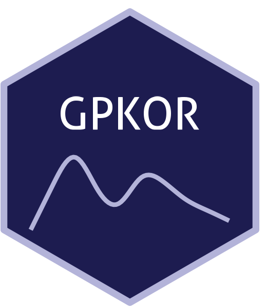

```{=html}
<div class="ossl-hero" style="background: #f1f3f5;">
  <div class="ossl-hero-logo">
    
  </div>
  <div class="ossl-hero-text">
    <h1 class="ossl-hero-title">GPKOR</h1>
    <p class="ossl-hero-desc">Near-infrared soil spectral library from Gyeonggi Province, South Korea (GPKOR)</p>
    <div class="ossl-hero-meta">
      <div class="ossl-pill-row">
        <span class="ossl-pill ossl-pill-off">VNIR</span>
        <span class="ossl-pill ossl-pill-on">NIR</span>
        <span class="ossl-pill ossl-pill-off">MIR</span>
      </div>
      <span class="ossl-meta-divider"></span>
      <span class="ossl-meta-item"><i class="bi bi-globe-americas" aria-hidden="true"></i>National — South Korea</span>
    </div>
  </div>
</div>
<div class="ossl-quick-stats">
  <span class="ossl-stat-item"><i class="bi bi-database" aria-hidden="true"></i><span class="ossl-stat-val">1,000+</span> samples</span>
  <span class="ossl-stat-item"><i class="bi bi-calendar3" aria-hidden="true"></i><span class="ossl-stat-val">version 3</span></span>
  <span class="ossl-stat-item"><i class="bi bi-file-earmark-text" aria-hidden="true"></i><span class="ossl-stat-val">CC-BY</span></span>
</div>

```

## <i class="bi bi-cloud-download ossl-section-icon" aria-hidden="true"></i> Database access

Data originally provided by:

- **Contact:** Gayoung Yoo
- **Email:** [gayoo@khu.ac.kr](mailto:gayoo@khu.ac.kr)
- **Original source:** <https://doi.org/10.6084/m9.figshare.29380574>

**Available files**

| Type | Filename | Link |
|------|----------|------|
| NIR spectra — CSV (gzip) | `ossl_nir_v1.3.csv.gz` | [Download](https://storage.googleapis.com/soilspec4gg-public/datasets/GPKOR/ossl_nir_v1.3.csv.gz) |
| NIR spectra — Parquet | `ossl_nir_v1.3.parquet` | [Download](https://storage.googleapis.com/soilspec4gg-public/datasets/GPKOR/ossl_nir_v1.3.parquet) |
| Soil lab measurements — CSV (gzip) | `ossl_soillab_v1.3.csv.gz` | [Download](https://storage.googleapis.com/soilspec4gg-public/datasets/GPKOR/ossl_soillab_v1.3.csv.gz) |
| Soil lab measurements — Parquet | `ossl_soillab_v1.3.parquet` | [Download](https://storage.googleapis.com/soilspec4gg-public/datasets/GPKOR/ossl_soillab_v1.3.parquet) |
| Soil site metadata — CSV (gzip) | `ossl_soilsite_v1.3.csv.gz` | [Download](https://storage.googleapis.com/soilspec4gg-public/datasets/GPKOR/ossl_soilsite_v1.3.csv.gz) |
| Soil site metadata — Parquet | `ossl_soilsite_v1.3.parquet` | [Download](https://storage.googleapis.com/soilspec4gg-public/datasets/GPKOR/ossl_soilsite_v1.3.parquet) |


## <i class="bi bi-geo-alt ossl-section-icon" aria-hidden="true"></i> Map


## <i class="bi bi-pin-map ossl-section-icon" aria-hidden="true"></i> Soil site information

- **Coordinates precision:** precise, region
- **Sampling depth:** top
- **Geography:** landuse
- **Variables available (OSSL):** 10 out of 10 — see [Database description](../db-desc.html#panel-soilsite) for full schema
- **Populated columns:** `id.layer_uuid_txt`, `id.layer_local_c`, `loc.region_src_txt`, `site.land.use_src_txt`, `site.elevation_src_m`, `observation.date_src_yyyy.mm.dd`, `latitude.point_wgs84_dd`, `longitude.point_wgs84_dd`, `layer.upper.depth_usda_cm`, `layer.lower.depth_usda_cm`

## <i class="bi bi-clipboard-data ossl-section-icon" aria-hidden="true"></i> Soil laboratory information

- **Total samples:** 1,500
- **Properties available (original):** 1
- **Properties standardized (OSSL):** 1 — summarized in **@tbl-soillab-gpkor** below
- **Categories:** carbon & nutrients
- **Original source:** see [Database access](#database-access)

```{=html}
<p class="ossl-tt-hint"><i class="bi bi-info-circle" aria-hidden="true"></i> Hover over any OSSL code in the table below to see its full description.</p>
```

::: {#tbl-soillab-gpkor}

```{=html}
<table class="soil-lab-table"><thead><tr><th style="text-align:left">skim_variable</th><th style="text-align:right">n_missing</th><th style="text-align:right">mean</th><th style="text-align:right">sd</th><th style="text-align:right">p0</th><th style="text-align:right">p25</th><th style="text-align:right">p50</th><th style="text-align:right">p75</th><th style="text-align:right">p100</th></tr></thead><tbody><tr><td style="text-align:left"><span class="ossl-tt">oc_iso.10694_w.pct<span class="ossl-tt-pop"><span class="tt-analyte">Organic Carbon, ISO 10694</span><span class="tt-desc">Method: <code>iso.10694</code></span><span class="tt-unit">Unit: <code>w.pct</code></span></span></span></td><td style="text-align:right">788</td><td style="text-align:right">2.78</td><td style="text-align:right">1.8</td><td style="text-align:right">0.1</td><td style="text-align:right">1.5</td><td style="text-align:right">2.5</td><td style="text-align:right">3.7</td><td style="text-align:right">10.5</td></tr></tbody></table>
```

Summary statistics (mean, SD, percentiles) for OSSL-standardized soil properties.

:::

## <i class="bi bi-soundwave ossl-section-icon" aria-hidden="true"></i> NIR

- **Acquisition mode:** Not available
- **Intensity:** reflectance
- **Original range:** 1400-2500
- **Instrument:** SpectraStar XT
- **Manufacturer:** Unity  Scientific, Westborough, MA, USA
- **Instrument co-scans:** 12
- **Scan repeats:** 12
- **Scan accessory:** Not available
- **Original resolution:** 1 nm
- **Sample preparation:** Air-dried, Sieved < 2 mm
- **Additional info:** Equipped with UCal calibration software

### NIR plot


## <i class="bi bi-journal-text ossl-section-icon" aria-hidden="true"></i> References

1. [Publication 1](https://doi.org/10.1038/s41597-026-06546-3)

