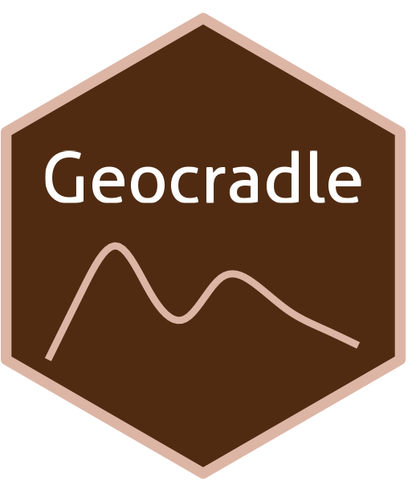

```{=html}
<div class="ossl-hero" style="background: #FFF4F0;">
  <div class="ossl-hero-logo">
    
  </div>
  <div class="ossl-hero-text">
    <h1 class="ossl-hero-title">Geocradle</h1>
    <p class="ossl-hero-desc">Soil spectral library from the Geocradle region (Balkans, Middle East, and North Africa)</p>
    <div class="ossl-hero-meta">
      <div class="ossl-pill-row">
        <span class="ossl-pill ossl-pill-on">VNIR</span>
        <span class="ossl-pill ossl-pill-off">NIR</span>
        <span class="ossl-pill ossl-pill-off">MIR</span>
      </div>
      <span class="ossl-meta-divider"></span>
      <span class="ossl-meta-item"><i class="bi bi-globe-americas" aria-hidden="true"></i>Regional — Balkans, Middle East, and North Africa</span>
    </div>
  </div>
</div>
<div class="ossl-quick-stats">
  <span class="ossl-stat-item"><i class="bi bi-database" aria-hidden="true"></i><span class="ossl-stat-val">1,000+</span> samples</span>
  <span class="ossl-stat-item"><i class="bi bi-calendar3" aria-hidden="true"></i><span class="ossl-stat-val">first release (v1)</span></span>
  <span class="ossl-stat-item"><i class="bi bi-file-earmark-text" aria-hidden="true"></i><span class="ossl-stat-val">ODbL</span></span>
</div>

```

## <i class="bi bi-geo-alt ossl-section-icon" aria-hidden="true"></i> Map


## <i class="bi bi-cloud-download ossl-section-icon" aria-hidden="true"></i> Database access

Data originally provided by:

- **Contact:** Nikos Tsakiridis
- **Email:** [tsakirin@auth.gr](mailto:tsakirin@auth.gr)
- **Original source:** <http://datahub.geocradle.eu/dataset/regional-soil-spectral-library>

**Available files**

| Type | Filename | Link |
|------|----------|------|
| Soil lab measurements — CSV (gzip) | `ossl_soillab_v1.3.csv.gz` | [Download](https://storage.googleapis.com/soilspec4gg-public/datasets/Geocradle/ossl_soillab_v1.3.csv.gz) |
| Soil lab measurements — Parquet | `ossl_soillab_v1.3.parquet` | [Download](https://storage.googleapis.com/soilspec4gg-public/datasets/Geocradle/ossl_soillab_v1.3.parquet) |
| Soil site metadata — CSV (gzip) | `ossl_soilsite_v1.3.csv.gz` | [Download](https://storage.googleapis.com/soilspec4gg-public/datasets/Geocradle/ossl_soilsite_v1.3.csv.gz) |
| Soil site metadata — Parquet | `ossl_soilsite_v1.3.parquet` | [Download](https://storage.googleapis.com/soilspec4gg-public/datasets/Geocradle/ossl_soilsite_v1.3.parquet) |
| VisNIR spectra — CSV (gzip) | `ossl_visnir_v1.3.csv.gz` | [Download](https://storage.googleapis.com/soilspec4gg-public/datasets/Geocradle/ossl_visnir_v1.3.csv.gz) |
| VisNIR spectra — Parquet | `ossl_visnir_v1.3.parquet` | [Download](https://storage.googleapis.com/soilspec4gg-public/datasets/Geocradle/ossl_visnir_v1.3.parquet) |


## <i class="bi bi-clipboard-data ossl-section-icon" aria-hidden="true"></i> Soil laboratory information

Summary statistics for soil properties in this dataset, sourced from the [ossl-imports README](https://github.com/soilspectroscopy/ossl-imports/tree/main/dataset/Geocradle).

| skim_variable            | n_missing |  mean |    sd |   p0 |   p25 |   p50 |   p75 |   p100 |
|:-------------------------|----------:|------:|------:|-----:|------:|------:|------:|-------:|
| sand.tot_usda.c405_w.pct |       264 | 53.48 | 22.85 | 0.40 | 36.85 | 54.00 | 69.00 |  99.00 |
| clay.tot_usda.a334_w.pct |        77 | 21.26 | 16.01 | 0.00 |  9.39 | 17.00 | 29.10 |  94.80 |
| silt.tot_usda.c407_w.pct |       264 | 26.67 | 14.31 | 0.00 | 16.00 | 26.00 | 37.40 |  68.00 |
| oc_iso.10694_w.pct       |       132 |  0.74 |  0.84 | 0.00 |  0.29 |  0.58 |  0.94 |  20.75 |
| caco3_iso.10693_w.pct    |       388 |  6.83 | 14.87 | 0.00 |  0.00 |  0.20 |  3.40 |  89.99 |
| ph.h2o_usda.a268_index   |      1141 |  7.22 |  1.09 | 3.50 |  6.50 |  7.44 |  8.01 |  10.07 |
| ec_iso.11265_ds.m        |      1412 |  2.29 |  9.32 | 0.02 |  0.16 |  0.67 |  1.42 | 120.00 |

## <i class="bi bi-pin-map ossl-section-icon" aria-hidden="true"></i> Soil site information

- **coordinates precision:** precise, country
- **sampling depth:** various
- **geography:** soil taxonomy, elevation

## <i class="bi bi-soundwave ossl-section-icon" aria-hidden="true"></i> VNIR

- **Acquisition mode:** Not available
- **Intensity:** reflectance
- **Original range:** 350-2500
- **Instrument:** ASD FieldSpec Pro & PSR+ Spectrometer
- **Manufacturer:** (PANanalytical BV, Boulder, CO, USA formerly Analytical Spectral Devices) & Spectral Evolution Inc., Lawrence, Massachusetts,USA
- **Instrument co-scans:** 10
- **Scan repeats:** Not available
- **Scan accessory:** Not available
- **Original resolution:** 1
- **Sample preparation:** Air-dried, Sieved < 2 mm
- **Additional info:** Not available


## <i class="bi bi-journal-text ossl-section-icon" aria-hidden="true"></i> References

1. [Publication 1](https://doi.org/10.1016/j.rse.2020.111793)
2. [Publication 2](https://doi.org/10.1016/j.geoderma.2018.12.044)

