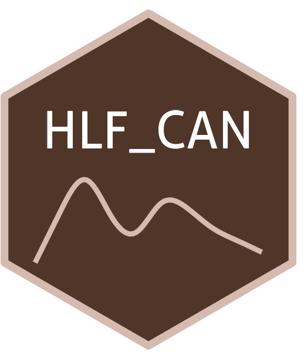

```{=html}
<div class="ossl-hero" style="background: #FEF4F1;">
  <div class="ossl-hero-logo">
    
  </div>
  <div class="ossl-hero-text">
    <h1 class="ossl-hero-title">HLF_CAN</h1>
    <p class="ossl-hero-desc">Soil spectral library from High-Latitude Forests of North Canada (HLF_CAN)</p>
    <div class="ossl-hero-meta">
      <div class="ossl-pill-row">
        <span class="ossl-pill ossl-pill-off">VNIR</span>
        <span class="ossl-pill ossl-pill-off">NIR</span>
        <span class="ossl-pill ossl-pill-on">MIR</span>
      </div>
      <span class="ossl-meta-divider"></span>
      <span class="ossl-meta-item"><i class="bi bi-globe-americas" aria-hidden="true"></i>Local — Canada</span>
    </div>
  </div>
</div>
<div class="ossl-quick-stats">
  <span class="ossl-stat-item"><i class="bi bi-database" aria-hidden="true"></i><span class="ossl-stat-val"><300</span> samples</span>
  <span class="ossl-stat-item"><i class="bi bi-calendar3" aria-hidden="true"></i><span class="ossl-stat-val">first release (v1)</span></span>
  <span class="ossl-stat-item"><i class="bi bi-file-earmark-text" aria-hidden="true"></i><span class="ossl-stat-val">CC-BY</span></span>
</div>

```

## <i class="bi bi-cloud-download ossl-section-icon" aria-hidden="true"></i> Database access

Data originally provided by:

- **Contact:** Marcus Schiedung
- **Email:** [marcus.schiedung@geo.uzh.ch](mailto:marcus.schiedung@geo.uzh.ch)
- **Original source:** <https://zenodo.org/records/10609291>

**Available files**

| Type | Filename | Link |
|------|----------|------|
| MIR spectra — CSV (gzip) | `ossl_mir_v1.3.csv.gz` | [Download](https://storage.googleapis.com/soilspec4gg-public/datasets/HLF_CAN/ossl_mir_v1.3.csv.gz) |
| MIR spectra — Parquet | `ossl_mir_v1.3.parquet` | [Download](https://storage.googleapis.com/soilspec4gg-public/datasets/HLF_CAN/ossl_mir_v1.3.parquet) |
| Soil lab measurements — CSV (gzip) | `ossl_soillab_v1.3.csv.gz` | [Download](https://storage.googleapis.com/soilspec4gg-public/datasets/HLF_CAN/ossl_soillab_v1.3.csv.gz) |
| Soil lab measurements — Parquet | `ossl_soillab_v1.3.parquet` | [Download](https://storage.googleapis.com/soilspec4gg-public/datasets/HLF_CAN/ossl_soillab_v1.3.parquet) |
| Soil site metadata — CSV (gzip) | `ossl_soilsite_v1.3.csv.gz` | [Download](https://storage.googleapis.com/soilspec4gg-public/datasets/HLF_CAN/ossl_soilsite_v1.3.csv.gz) |
| Soil site metadata — Parquet | `ossl_soilsite_v1.3.parquet` | [Download](https://storage.googleapis.com/soilspec4gg-public/datasets/HLF_CAN/ossl_soilsite_v1.3.parquet) |


## <i class="bi bi-geo-alt ossl-section-icon" aria-hidden="true"></i> Map


## <i class="bi bi-pin-map ossl-section-icon" aria-hidden="true"></i> Soil site information

- **Coordinates precision:** precise
- **Sampling depth:** various
- **Geography:** none
- **Variables available (OSSL):** 7 out of 7 — see [Database description](../db-desc.html#panel-soilsite) for full schema
- **Populated columns:** `id.layer_uuid_txt`, `id.layer_local_c`, `longitude.point_wgs84_dd`, `latitude.point_wgs84_dd`, `id.dataset.site_ascii_txt`, `layer.upper.depth_usda_cm`, `layer.lower.depth_usda_cm`

## <i class="bi bi-clipboard-data ossl-section-icon" aria-hidden="true"></i> Soil laboratory information

- **Total samples:** 289
- **Properties available (original):** 20
- **Properties standardized (OSSL):** 9 — summarized in **@tbl-soillab-hlf_can** below
- **Categories:** physical, chemical, hydrological, carbon & nutrients, metal elements
- **Original source:** see [Database access](#database-access)

```{=html}
<p class="ossl-tt-hint"><i class="bi bi-info-circle" aria-hidden="true"></i> Hover over any OSSL code in the table below to see its full description.</p>
```

::: {#tbl-soillab-hlf_can}

```{=html}
<table class="soil-lab-table"><thead><tr><th style="text-align:left">skim_variable</th><th style="text-align:right">n_missing</th><th style="text-align:right">mean</th><th style="text-align:right">sd</th><th style="text-align:right">p0</th><th style="text-align:right">p25</th><th style="text-align:right">p50</th><th style="text-align:right">p75</th><th style="text-align:right">p100</th></tr></thead><tbody><tr><td style="text-align:left"><span class="ossl-tt">bd_iso.11272_g.cm3<span class="ossl-tt-pop"><span class="tt-analyte">Bulk Density, ISO 11272</span><span class="tt-desc">Method: <code>iso.11272</code></span><span class="tt-unit">Unit: <code>g.cm3</code></span></span></span></td><td style="text-align:right">0</td><td style="text-align:right">1.27</td><td style="text-align:right">0.25</td><td style="text-align:right">0.38</td><td style="text-align:right">1.17</td><td style="text-align:right">1.33</td><td style="text-align:right">1.44</td><td style="text-align:right">1.72</td></tr><tr><td style="text-align:left"><span class="ossl-tt">n.tot_iso.13878_w.pct<span class="ossl-tt-pop"><span class="tt-analyte">Nitrogen, Total NCS, ISO 13878</span><span class="tt-desc">Method: <code>iso.13878</code></span><span class="tt-unit">Unit: <code>w.pct</code></span></span></span></td><td style="text-align:right">23</td><td style="text-align:right">0.10</td><td style="text-align:right">0.09</td><td style="text-align:right">0.02</td><td style="text-align:right">0.04</td><td style="text-align:right">0.07</td><td style="text-align:right">0.14</td><td style="text-align:right">0.68</td></tr><tr><td style="text-align:left"><span class="ossl-tt">c.tot_iso.10694_w.pct<span class="ossl-tt-pop"><span class="tt-analyte">Carbon, Total NCS, ISO 10694</span><span class="tt-desc">Method: <code>iso.10694</code></span><span class="tt-unit">Unit: <code>w.pct</code></span></span></span></td><td style="text-align:right">0</td><td style="text-align:right">1.79</td><td style="text-align:right">1.97</td><td style="text-align:right">0.00</td><td style="text-align:right">0.53</td><td style="text-align:right">1.24</td><td style="text-align:right">2.38</td><td style="text-align:right">15.68</td></tr><tr><td style="text-align:left"><span class="ossl-tt">oc_iso.10694_w.pct<span class="ossl-tt-pop"><span class="tt-analyte">Organic Carbon, ISO 10694</span><span class="tt-desc">Method: <code>iso.10694</code></span><span class="tt-unit">Unit: <code>w.pct</code></span></span></span></td><td style="text-align:right">0</td><td style="text-align:right">1.56</td><td style="text-align:right">1.87</td><td style="text-align:right">0.07</td><td style="text-align:right">0.31</td><td style="text-align:right">0.90</td><td style="text-align:right">2.13</td><td style="text-align:right">11.84</td></tr><tr><td style="text-align:left"><span class="ossl-tt">ph.cacl2_iso.10390_index<span class="ossl-tt-pop"><span class="tt-analyte">pH, 1:5 Soil-CaCl2 Suspension, ISO 10390</span><span class="tt-desc">Method: <code>iso.10390</code></span><span class="tt-unit">Unit: <code>index</code></span></span></span></td><td style="text-align:right">13</td><td style="text-align:right">5.24</td><td style="text-align:right">0.91</td><td style="text-align:right">3.65</td><td style="text-align:right">4.53</td><td style="text-align:right">5.18</td><td style="text-align:right">5.87</td><td style="text-align:right">7.07</td></tr><tr><td style="text-align:left"><span class="ossl-tt">ec_iso.11265_ds.m<span class="ossl-tt-pop"><span class="tt-analyte">Electrical Conductivity, ISO 11265</span><span class="tt-desc">Method: <code>iso.11265</code></span><span class="tt-unit">Unit: <code>ds.m</code></span></span></span></td><td style="text-align:right">13</td><td style="text-align:right">2.32</td><td style="text-align:right">0.03</td><td style="text-align:right">2.25</td><td style="text-align:right">2.31</td><td style="text-align:right">2.32</td><td style="text-align:right">2.34</td><td style="text-align:right">2.41</td></tr><tr><td style="text-align:left"><span class="ossl-tt">clay.tot_iso.11277_w.pct<span class="ossl-tt-pop"><span class="tt-analyte">Clay, ISO 11277</span><span class="tt-desc">Method: <code>iso.11277</code></span><span class="tt-unit">Unit: <code>w.pct</code></span></span></span></td><td style="text-align:right">13</td><td style="text-align:right">14.18</td><td style="text-align:right">11.32</td><td style="text-align:right">2.00</td><td style="text-align:right">5.00</td><td style="text-align:right">8.00</td><td style="text-align:right">25.00</td><td style="text-align:right">40.00</td></tr><tr><td style="text-align:left"><span class="ossl-tt">silt.tot_iso.11277_w.pct<span class="ossl-tt-pop"><span class="tt-analyte">Silt, Total, ISO 11277</span><span class="tt-desc">Method: <code>iso.11277</code></span><span class="tt-unit">Unit: <code>w.pct</code></span></span></span></td><td style="text-align:right">13</td><td style="text-align:right">30.47</td><td style="text-align:right">18.68</td><td style="text-align:right">3.00</td><td style="text-align:right">15.00</td><td style="text-align:right">28.00</td><td style="text-align:right">50.00</td><td style="text-align:right">66.00</td></tr><tr><td style="text-align:left"><span class="ossl-tt">sand.tot_iso.11277_w.pct<span class="ossl-tt-pop"><span class="tt-analyte">Sand, Total, ISO 11277</span><span class="tt-desc">Method: <code>iso.11277</code></span><span class="tt-unit">Unit: <code>w.pct</code></span></span></span></td><td style="text-align:right">13</td><td style="text-align:right">54.16</td><td style="text-align:right">29.64</td><td style="text-align:right">12.00</td><td style="text-align:right">23.75</td><td style="text-align:right">65.00</td><td style="text-align:right">81.00</td><td style="text-align:right">95.00</td></tr></tbody></table>
```

Summary statistics (mean, SD, percentiles) for OSSL-standardized soil properties.

:::

## <i class="bi bi-soundwave ossl-section-icon" aria-hidden="true"></i> MIR

- **Acquisition mode:** Not available
- **Intensity:** absorbance
- **Original range:** 400-4000
- **Standardized range:** 600-4000
- **Instrument:** TENSOR 27 Spectrophotometer
- **Manufacturer:** Bruker (Fällanden, Switzerland)
- **Scan accessory:** Not available
- **Sample preparation:** Oven dried, Sieved < 2 mm
- **Additional info:** Original raw spectra (imported) and KBr background-corrected spectra

### MIR plot


## <i class="bi bi-journal-text ossl-section-icon" aria-hidden="true"></i> References

1. [Publication 1](https://doi.org/10.1016/j.catena.2022.106194)

