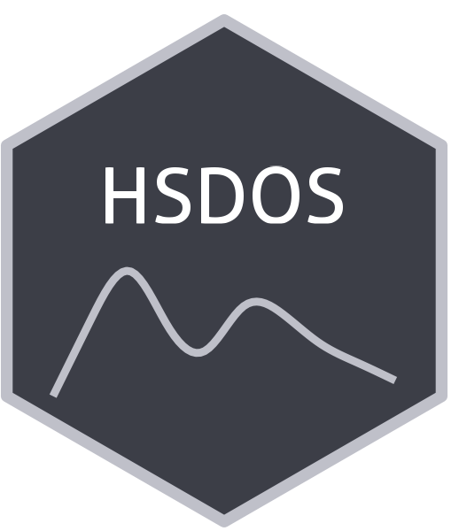

```{=html}
<div class="ossl-hero" style="background: #F4F6FF;">
  <div class="ossl-hero-logo">
    
  </div>
  <div class="ossl-hero-text">
    <h1 class="ossl-hero-title">HSDOS</h1>
    <p class="ossl-hero-desc">Soil spectral library from the Hungarian Soil Degradation Observation System (HSDOS)</p>
    <div class="ossl-hero-meta">
      <div class="ossl-pill-row">
        <span class="ossl-pill ossl-pill-on">VNIR</span>
        <span class="ossl-pill ossl-pill-off">NIR</span>
        <span class="ossl-pill ossl-pill-off">MIR</span>
      </div>
      <span class="ossl-meta-divider"></span>
      <span class="ossl-meta-item"><i class="bi bi-globe-americas" aria-hidden="true"></i>National — Hungarian</span>
    </div>
  </div>
</div>
<div class="ossl-quick-stats">
  <span class="ossl-stat-item"><i class="bi bi-database" aria-hidden="true"></i><span class="ossl-stat-val">5,000+</span> samples</span>
  <span class="ossl-stat-item"><i class="bi bi-calendar3" aria-hidden="true"></i><span class="ossl-stat-val">version v3</span></span>
  <span class="ossl-stat-item"><i class="bi bi-file-earmark-text" aria-hidden="true"></i><span class="ossl-stat-val">CC-BY</span></span>
</div>

```

## <i class="bi bi-geo-alt ossl-section-icon" aria-hidden="true"></i> Map


## <i class="bi bi-cloud-download ossl-section-icon" aria-hidden="true"></i> Database access

Data originally provided by:

- **Contact:** János Mészáros
- **Email:** [koos.sandor@atk.hun-ren.hu](mailto:koos.sandor@atk.hun-ren.hu)
- **Original source:** <https://zenodo.org/records/14610222>

**Available files**

| Type | Filename | Link |
|------|----------|------|
| Soil lab measurements — CSV (gzip) | `ossl_soillab_v1.3.csv.gz` | [Download](https://storage.googleapis.com/soilspec4gg-public/datasets/HSDOS/ossl_soillab_v1.3.csv.gz) |
| Soil lab measurements — Parquet | `ossl_soillab_v1.3.parquet` | [Download](https://storage.googleapis.com/soilspec4gg-public/datasets/HSDOS/ossl_soillab_v1.3.parquet) |
| Soil site metadata — CSV (gzip) | `ossl_soilsite_v1.3.csv.gz` | [Download](https://storage.googleapis.com/soilspec4gg-public/datasets/HSDOS/ossl_soilsite_v1.3.csv.gz) |
| Soil site metadata — Parquet | `ossl_soilsite_v1.3.parquet` | [Download](https://storage.googleapis.com/soilspec4gg-public/datasets/HSDOS/ossl_soilsite_v1.3.parquet) |
| VisNIR spectra — CSV (gzip) | `ossl_visnir_v1.3.csv.gz` | [Download](https://storage.googleapis.com/soilspec4gg-public/datasets/HSDOS/ossl_visnir_v1.3.csv.gz) |
| VisNIR spectra — Parquet | `ossl_visnir_v1.3.parquet` | [Download](https://storage.googleapis.com/soilspec4gg-public/datasets/HSDOS/ossl_visnir_v1.3.parquet) |


## <i class="bi bi-clipboard-data ossl-section-icon" aria-hidden="true"></i> Soil laboratory information

Summary statistics for soil properties in this dataset, sourced from the [ossl-imports README](https://github.com/soilspectroscopy/ossl-imports/tree/main/dataset/HSDOS).

| skim_variable          | n_missing |   mean |     sd |   p0 |    p25 |    p50 |    p75 |    p100 |
|:-----------------------|----------:|-------:|-------:|-----:|-------:|-------:|-------:|--------:|
| ph_kcl_iso.10390_index |         0 |   7.36 |   0.85 | 4.18 |   6.84 |   7.62 |   7.94 |    9.93 |
| oc_wb1934_w.pct        |         0 |   1.63 |   0.99 | 0.10 |   0.84 |   1.46 |   2.21 |    8.00 |
| caco3_iso.10693_w.pct  |         0 |   7.81 |  10.16 | 0.00 |   0.00 |   3.60 |  13.00 |   90.00 |
| ec_iso.11265_ds.m      |         0 |   0.99 |   0.93 | 0.50 |   0.50 |   0.50 |   1.25 |   12.75 |
| n.tot_iso.11261_w.pct  |         0 |   0.00 |   0.00 | 0.00 |   0.00 |   0.00 |   0.00 |    0.05 |
| p.ext_msz.20135_mg.kg  |         0 | 162.69 | 297.26 | 1.50 |  38.90 |  83.70 | 176.00 | 7900.00 |
| k.ext_msz.20135_mg.kg  |         0 | 197.12 | 160.74 | 5.10 | 103.00 | 158.00 | 242.00 | 3320.00 |

## <i class="bi bi-pin-map ossl-section-icon" aria-hidden="true"></i> Soil site information

- **coordinates precision:** precise
- **sampling depth:** various
- **geography:** none

## <i class="bi bi-soundwave ossl-section-icon" aria-hidden="true"></i> VNIR

- **Acquisition mode:** Not available
- **Intensity:** reflectance
- **Original range:** 350-2500
- **Instrument:** FieldSpec 4 Spectroradiometer
- **Manufacturer:** ASD (currently Malvern Panalytical)
- **Instrument co-scans:** 50
- **Scan repeats:** 5
- **Scan accessory:** Not available
- **Original resolution:** 3
- **Sample preparation:** Air-dried, Sieved < 2 mm
- **Additional info:** Not available


## <i class="bi bi-journal-text ossl-section-icon" aria-hidden="true"></i> References

1. [Publication 1](https://doi.org/10.1038/s41597-025-04667-9)

