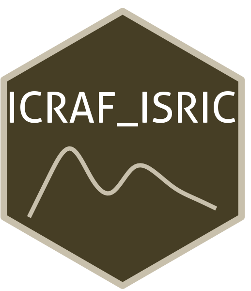

```{=html}
<div class="ossl-hero" style="background: #f1f3f5;">
  <div class="ossl-hero-logo">
    
  </div>
  <div class="ossl-hero-text">
    <h1 class="ossl-hero-title">ICRAF_ISRIC</h1>
    <p class="ossl-hero-desc">Soil spectral libraries from the ISRIC World Soil Reference Collection (58 countries) scanned by ICRAF</p>
    <div class="ossl-hero-meta">
      <div class="ossl-pill-row">
        <span class="ossl-pill ossl-pill-on">VNIR</span>
        <span class="ossl-pill ossl-pill-off">NIR</span>
        <span class="ossl-pill ossl-pill-on">MIR</span>
      </div>
      <span class="ossl-meta-divider"></span>
      <span class="ossl-meta-item"><i class="bi bi-globe-americas" aria-hidden="true"></i>Global — Africa, Europe, South America, North America, and Asia</span>
    </div>
  </div>
</div>
<div class="ossl-quick-stats">
  <span class="ossl-stat-item"><i class="bi bi-database" aria-hidden="true"></i><span class="ossl-stat-val">4,000+</span> samples</span>
  <span class="ossl-stat-item"><i class="bi bi-calendar3" aria-hidden="true"></i><span class="ossl-stat-val">first release (v1)</span></span>
  <span class="ossl-stat-item"><i class="bi bi-file-earmark-text" aria-hidden="true"></i><span class="ossl-stat-val">CC-BY</span></span>
</div>

```

## <i class="bi bi-geo-alt ossl-section-icon" aria-hidden="true"></i> Map


## <i class="bi bi-cloud-download ossl-section-icon" aria-hidden="true"></i> Database access

Data originally provided by:

- **Contact:** ISRIC - World Soil Information
- **Email:** [afsis.info@africasoils.net](mailto:afsis.info@africasoils.net)
- **Original source:** <https://data.isric.org/geonetwork/srv/eng/catalog.search#/metadata/1b65024a-cd9f-11e9-a8f9-a0481ca9e724>

**Available files**

| Type | Filename | Link |
|------|----------|------|
| MIR spectra — CSV (gzip) | `ossl_mir_v1.3.csv.gz` | [Download](https://storage.googleapis.com/soilspec4gg-public/datasets/ICRAF_ISRIC/ossl_mir_v1.3.csv.gz) |
| MIR spectra — Parquet | `ossl_mir_v1.3.parquet` | [Download](https://storage.googleapis.com/soilspec4gg-public/datasets/ICRAF_ISRIC/ossl_mir_v1.3.parquet) |
| Soil lab measurements — CSV (gzip) | `ossl_soillab_v1.3.csv.gz` | [Download](https://storage.googleapis.com/soilspec4gg-public/datasets/ICRAF_ISRIC/ossl_soillab_v1.3.csv.gz) |
| Soil lab measurements — Parquet | `ossl_soillab_v1.3.parquet` | [Download](https://storage.googleapis.com/soilspec4gg-public/datasets/ICRAF_ISRIC/ossl_soillab_v1.3.parquet) |
| Soil site metadata — CSV (gzip) | `ossl_soilsite_v1.3.csv.gz` | [Download](https://storage.googleapis.com/soilspec4gg-public/datasets/ICRAF_ISRIC/ossl_soilsite_v1.3.csv.gz) |
| Soil site metadata — Parquet | `ossl_soilsite_v1.3.parquet` | [Download](https://storage.googleapis.com/soilspec4gg-public/datasets/ICRAF_ISRIC/ossl_soilsite_v1.3.parquet) |
| VisNIR spectra — CSV (gzip) | `ossl_visnir_v1.3.csv.gz` | [Download](https://storage.googleapis.com/soilspec4gg-public/datasets/ICRAF_ISRIC/ossl_visnir_v1.3.csv.gz) |
| VisNIR spectra — Parquet | `ossl_visnir_v1.3.parquet` | [Download](https://storage.googleapis.com/soilspec4gg-public/datasets/ICRAF_ISRIC/ossl_visnir_v1.3.parquet) |


## <i class="bi bi-clipboard-data ossl-section-icon" aria-hidden="true"></i> Soil laboratory information

Summary statistics for soil properties in this dataset, sourced from the [ossl-imports README](https://github.com/soilspectroscopy/ossl-imports/tree/main/dataset/ICRAF_ISRIC).

| skim\_variable               | n\_missing |  mean |    sd |   p0 |   p25 |   p50 |   p75 |   p100 |
|:-----------------------------|-----------:|------:|------:|-----:|------:|------:|------:|-------:|
| ph.h2o\_usda.a268\_index     |        297 |  6.11 |  1.40 | 3.00 |  5.00 |  5.90 |  7.10 |  10.50 |
| ph.cacl2\_usda.a481\_index   |       4039 |  4.99 |  1.26 | 3.10 |  4.00 |  5.10 |  6.05 |   7.90 |
| caco3\_usda.a54\_w.pct       |       2956 |  9.94 | 16.41 | 0.00 |  1.00 |  2.60 | 11.60 |  99.70 |
| oc\_usda.c1059\_w.pct        |        373 |  1.20 |  2.66 | 0.00 |  0.22 |  0.48 |  1.20 |  60.00 |
| ca.ext\_usda.a722\_cmolc.kg  |        401 | 10.81 | 15.58 | 0.00 |  0.40 |  3.60 | 14.90 | 168.20 |
| mg.ext\_usda.a724\_cmolc.kg  |        393 |  2.81 |  4.69 | 0.00 |  0.20 |  1.00 |  3.40 |  68.00 |
| na.ext\_usda.a726\_cmolc.kg  |        409 |  0.62 |  2.39 | 0.00 |  0.00 |  0.10 |  0.30 |  31.60 |
| k.ext\_usda.a725\_cmolc.kg   |        399 |  0.33 |  0.57 | 0.00 |  0.10 |  0.20 |  0.40 |   9.80 |
| acidity\_usda.a795\_cmolc.kg |       2562 |  1.99 |  2.95 | 0.00 |  0.20 |  0.90 |  2.60 |  25.50 |
| al.ext\_usda.a69\_cmolc.kg   |       2532 |  1.58 |  2.56 | 0.00 |  0.00 |  0.70 |  2.10 |  25.30 |
| cec\_usda.a723\_cmolc.kg     |        419 | 16.27 | 16.41 | 0.00 |  5.20 | 11.50 | 21.60 | 189.60 |
| sand.tot\_usda.c60\_w.pct    |        392 | 38.24 | 29.15 | 0.00 | 11.10 | 33.00 | 61.20 |  99.60 |
| silt.tot\_usda.c62\_w.pct    |        339 | 29.22 | 20.39 | 0.00 | 13.00 | 25.00 | 42.50 | 256.00 |
| clay.tot\_usda.a334\_w.pct   |        333 | 32.60 | 22.27 | 0.00 | 14.70 | 30.10 | 47.00 |  96.80 |
| bd\_usda.a21\_g.cm3          |       3074 |  1.26 |  0.29 | 0.28 |  1.10 |  1.31 |  1.48 |   1.89 |
| wr.10kPa\_usda.a8\_w.pct     |       3145 | 36.77 | 13.27 | 4.40 | 28.60 | 36.45 | 45.62 |  77.30 |
| wr.33kPa\_usda.a9\_w.pct     |       3150 | 31.82 | 13.34 | 2.30 | 22.90 | 31.40 | 41.50 |  71.40 |
| wr.1500kPa\_usda.a417\_w.pct |       3102 | 21.74 | 11.44 | 0.10 | 12.90 | 21.90 | 29.55 |  56.40 |

## <i class="bi bi-pin-map ossl-section-icon" aria-hidden="true"></i> Soil site information

- **coordinates precision:** precise, country
- **sampling depth:** various
- **geography:** landuse

## <i class="bi bi-soundwave ossl-section-icon" aria-hidden="true"></i> MIR

- **Acquisition mode:** Not available
- **Intensity:** absorbance
- **Original range:** 400-4000
- **Standardized range:** 600-4000
- **Instrument:** FTS-7000 FT-IR Spectrometer
- **Manufacturer:** Bruker Optics (Karsruhe, Germany)
- **Scan accessory:** Not available
- **Sample preparation:** Air-dried, finely ground <0.1 mm
- **Additional info:** Liquid N2–cooled HgCdTe detector; Al as the reference material

### MIR plot


## <i class="bi bi-soundwave ossl-section-icon" aria-hidden="true"></i> VNIR

- **Acquisition mode:** Not available
- **Intensity:** reflectance
- **Original range:** 350-2500
- **Instrument:** FieldSpec FR Spectroradiometer
- **Manufacturer:** Analytical Spectral Devices (Boulder, CO, USA)
- **Instrument co-scans:** 25
- **Scan repeats:** 2
- **Scan accessory:** Not available
- **Original resolution:** 1
- **Sample preparation:** Air-dried, Sieved < 2 mm
- **Additional info:** Aluminum reflectors; Ten white reference spectra were recorded using calibrated spectralon

### VNIR plot


## <i class="bi bi-journal-text ossl-section-icon" aria-hidden="true"></i> References

1. [Publication 1](https://doi.org/10.2136/sssaj2002.9880)
2. [Publication 2](https://doi.org/10.2136/sssaj2009.0218)

