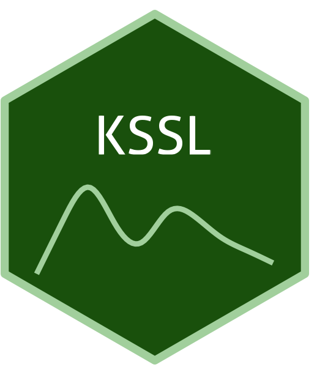

```{=html}
<div class="ossl-hero" style="background: #f1f3f5;">
  <div class="ossl-hero-logo">
    
  </div>
  <div class="ossl-hero-text">
    <h1 class="ossl-hero-title">KSSL</h1>
    <p class="ossl-hero-desc">The USDA-NRCS NCSS Kellogg Soil Survey Laboratory (KSSL) soil libraries from the United States and other territories</p>
    <div class="ossl-hero-meta">
      <div class="ossl-pill-row">
        <span class="ossl-pill ossl-pill-on">VNIR</span>
        <span class="ossl-pill ossl-pill-off">NIR</span>
        <span class="ossl-pill ossl-pill-on">MIR</span>
      </div>
      <span class="ossl-meta-divider"></span>
      <span class="ossl-meta-item"><i class="bi bi-globe-americas" aria-hidden="true"></i>National — USA</span>
    </div>
  </div>
</div>
<div class="ossl-quick-stats">
  <span class="ossl-stat-item"><i class="bi bi-database" aria-hidden="true"></i><span class="ossl-stat-val">90,000+</span> samples</span>
  <span class="ossl-stat-item"><i class="bi bi-calendar3" aria-hidden="true"></i><span class="ossl-stat-val">snapshot Jul 2022</span></span>
  <span class="ossl-stat-item"><i class="bi bi-file-earmark-text" aria-hidden="true"></i><span class="ossl-stat-val">Other (Custom)</span></span>
</div>

```

## <i class="bi bi-geo-alt ossl-section-icon" aria-hidden="true"></i> Map


## <i class="bi bi-cloud-download ossl-section-icon" aria-hidden="true"></i> Database access

Data originally provided by:

- **Contact:** Scarlett Murphy
- **Email:** [Scarlett.Murphy@usda.gov](mailto:Scarlett.Murphy@usda.gov)
- **Original source:** <https://ncsslabdatamart.sc.egov.usda.gov/>

No file listing available for this dataset.


## <i class="bi bi-clipboard-data ossl-section-icon" aria-hidden="true"></i> Soil laboratory information

Summary statistics for soil properties in this dataset, sourced from the [ossl-imports README](https://github.com/soilspectroscopy/ossl-imports/tree/main/dataset/KSSL).

| skim_variable                  | n_missing |    mean |      sd |   p0 |    p25 |     p50 |     p75 |     p100 |
|:-------------------------------|----------:|--------:|--------:|-----:|-------:|--------:|--------:|---------:|
| acidity_usda.a795_cmolc.kg     |     69255 |   14.52 |   24.20 | 0.00 |   3.72 |    7.17 |   13.65 |   291.92 |
| aggstb_usda.a1_w.pct           |     98354 |   37.51 |   30.59 | 0.00 |   9.00 |   29.00 |   64.00 |   123.00 |
| al.dith_usda.a65_w.pct         |     66218 |    0.19 |    0.31 | 0.00 |   0.04 |    0.10 |    0.21 |     7.70 |
| al.ext_usda.a1056_mg.kg        |    100222 |  855.81 |  745.07 | 0.00 | 318.66 |  742.53 | 1121.08 |  6748.01 |
| al.ext_usda.a69_cmolc.kg       |     85800 |    2.23 |    3.40 | 0.00 |   0.30 |    1.00 |    2.80 |    63.01 |
| al.ox_usda.a59_w.pct           |     70659 |    0.25 |    0.49 | 0.00 |   0.06 |    0.12 |    0.23 |     8.80 |
| awc.33.1500kPa_usda.c80_w.frac |     83118 |    0.15 |    0.07 | 0.00 |   0.11 |    0.14 |    0.18 |     0.78 |
| bd_usda.a21_g.cm3              |     94121 |    0.94 |    0.50 | 0.01 |   0.53 |    1.04 |    1.32 |     8.10 |
| bd_usda.a4_g.cm3               |     48528 |    1.22 |    0.37 | 0.02 |   1.04 |    1.32 |    1.47 |     2.53 |
| c.tot_usda.a622_w.pct          |      4139 |    6.23 |   12.46 | 0.00 |   0.52 |    1.45 |    3.81 |    78.45 |
| ca.ext_usda.a1059_mg.kg        |    100222 | 5501.26 | 8941.37 | 3.09 | 645.84 | 2333.22 | 4967.32 | 44723.96 |
| ca.ext_usda.a722_cmolc.kg      |     42301 |   22.09 |   32.40 | 0.00 |   3.22 |   11.84 |   28.50 |   410.41 |
| caco3_usda.a54_w.pct           |     64067 |    7.24 |   12.91 | 0.00 |   0.20 |    0.90 |    9.22 |   105.77 |
| cec_usda.a723_cmolc.kg         |     42306 |   20.58 |   22.78 | 0.00 |   7.65 |   15.22 |   24.32 |   584.59 |
| cf_usda.c236_w.pct             |     39477 |    8.16 |   16.52 | 0.00 |   0.00 |    0.27 |    7.00 |   100.00 |
| clay.tot_usda.a334_w.pct       |     45528 |   22.60 |   16.13 | 0.00 |   9.46 |   20.67 |   32.16 |    96.14 |
| cu.ext_usda.a1063_mg.kg        |    100222 |    2.65 |    4.18 | 0.00 |   0.48 |    1.78 |    3.24 |    77.82 |
| ec_usda.a364_ds.m              |     66449 |    2.79 |   11.89 | 0.00 |   0.11 |    0.25 |    0.85 |   313.13 |
| fe.dith_usda.a66_w.pct         |     66215 |    1.21 |    1.58 | 0.00 |   0.31 |    0.79 |    1.53 |    28.44 |
| fe.ext_usda.a1064_mg.kg        |    100222 |  132.09 |  149.40 | 0.00 |  56.44 |   94.14 |  160.02 |  2708.08 |
| fe.ox_usda.a60_w.pct           |     70660 |    0.41 |    0.62 | 0.00 |   0.09 |    0.23 |    0.53 |    22.27 |
| k.ext_usda.a1065_mg.kg         |    100222 |  183.70 |  190.44 | 0.00 |  75.18 |  141.43 |  237.52 |  3050.82 |
| k.ext_usda.a725_cmolc.kg       |     42304 |    0.65 |    1.03 | 0.00 |   0.15 |    0.36 |    0.74 |    32.33 |
| mg.ext_usda.a1066_mg.kg        |    100222 |  504.23 |  515.34 | 0.00 |  93.56 |  372.20 |  774.36 |  5608.60 |
| mg.ext_usda.a724_cmolc.kg      |     42301 |    5.29 |    8.12 | 0.00 |   0.92 |    2.81 |    6.51 |   172.64 |
| mn.ext_usda.a1067_mg.kg        |    100222 |   74.38 |   80.04 | 0.00 |  17.04 |   49.40 |  104.62 |   544.19 |
| mn.ext_usda.a70_mg.kg          |     85803 |   12.81 |  104.09 | 0.00 |   0.13 |    0.85 |    3.77 |  9787.33 |
| n.tot_usda.a623_w.pct          |      4140 |    0.32 |    0.60 | 0.00 |   0.05 |    0.11 |    0.26 |    41.90 |
| na.ext_usda.a1068_mg.kg        |    100222 |  202.61 |  775.32 | 0.00 |  11.87 |   30.05 |   99.22 | 15207.10 |
| na.ext_usda.a726_cmolc.kg      |     42303 |    3.73 |   22.69 | 0.00 |   0.00 |    0.00 |    0.21 |   868.36 |
| oc_usda.c1059_w.pct            |     68024 |    9.60 |   16.22 | 0.00 |   0.48 |    1.40 |    6.87 |    78.45 |
| oc_usda.c729_w.pct             |     39598 |    3.96 |    9.52 | 0.00 |   0.31 |    0.91 |    2.45 |    65.60 |
| p.ext_usda.a1070_mg.kg         |    100222 |   26.61 |   52.80 | 0.00 |   3.85 |   11.41 |   28.50 |   821.09 |
| p.ext_usda.a270_mg.kg          |     94023 |   19.56 |   44.36 | 0.00 |   1.07 |    4.89 |   18.44 |  1436.68 |
| p.ext_usda.a274_mg.kg          |     85631 |   13.69 |   22.38 | 0.00 |   1.85 |    5.68 |   16.45 |   686.28 |
| p.ext_usda.a652_mg.kg          |     75022 |   30.88 |  157.07 | 0.00 |   2.79 |   11.07 |   36.81 | 24425.23 |
| ph.cacl2_usda.a477_index       |    100409 |    4.76 |    1.27 | 1.74 |   3.75 |    4.68 |    5.64 |     8.27 |
| ph.cacl2_usda.a481_index       |     42743 |    5.94 |    1.39 | 2.14 |   4.79 |    5.76 |    7.29 |    10.68 |
| ph.h2o_usda.a268_index         |     42742 |    6.45 |    1.33 | 1.97 |   5.39 |    6.32 |    7.66 |    10.70 |
| s.tot_usda.a624_w.pct          |      4142 |    0.15 |    0.94 | 0.00 |   0.00 |    0.01 |    0.04 |    25.24 |
| sand.tot_usda.c405_w.pct       |    100564 |   32.85 |   27.07 | 0.30 |   9.80 |   24.00 |   54.60 |   100.00 |
| sand.tot_usda.c60_w.pct        |     46932 |   39.20 |   29.24 | 0.10 |  12.80 |   33.70 |   62.20 |   100.00 |
| silt.tot_usda.c407_w.pct       |    100564 |   41.41 |   19.58 | 0.00 |  27.55 |   40.90 |   55.75 |    87.60 |
| silt.tot_usda.c62_w.pct        |     46931 |   38.28 |   20.52 | 0.00 |  22.60 |   38.40 |   53.80 |    94.50 |
| wr.10kPa_usda.a414_w.pct       |     99177 |   29.85 |   19.76 | 0.68 |  17.10 |   29.85 |   38.82 |   355.29 |
| wr.10kPa_usda.a8_w.pct         |     99978 |   29.64 |   29.63 | 3.08 |  18.91 |   25.08 |   31.54 |   540.04 |
| wr.1500kPa_usda.a417_w.pct     |     55474 |   14.13 |   15.51 | 0.02 |   6.52 |   11.21 |   16.48 |   244.23 |
| wr.33kPa_usda.a415_w.pct       |     98625 |   25.77 |   23.89 | 0.26 |  12.44 |   22.22 |   31.92 |   200.26 |
| wr.33kPa_usda.a9_w.pct         |     82130 |   26.06 |   26.63 | 1.34 |  17.76 |   23.25 |   29.01 |  2124.87 |
| zn.ext_usda.a1073_mg.kg        |    100222 |    2.80 |   11.85 | 0.00 |   0.38 |    1.11 |    2.34 |   314.72 |

## <i class="bi bi-pin-map ossl-section-icon" aria-hidden="true"></i> Soil site information

- **coordinates precision:** precise, county, country
- **sampling depth:** various
- **geography:** soil taxonomy, soil horizon

## <i class="bi bi-soundwave ossl-section-icon" aria-hidden="true"></i> MIR

- **Acquisition mode:** Not available
- **Intensity:** absorbance
- **Original range:** 400-4000
- **Standardized range:** 600-4000
- **Instrument:** Vertex 70 FT-IR
- **Manufacturer:** Bruker Optics
- **Scan accessory:** Not available
- **Sample preparation:** Air-dried, finely ground < 80mesh
- **Additional info:** MCT (mercury cadmium telluride) detector

### MIR plot


## <i class="bi bi-soundwave ossl-section-icon" aria-hidden="true"></i> VNIR

- **Acquisition mode:** Not available
- **Intensity:** reflectance
- **Original range:** 350-2500
- **Instrument:** ASD Labspec 2500
- **Manufacturer:** Analytical Spectral Devices Inc., PANalytical NIR Excellence Center
- **Instrument co-scans:** Not available
- **Scan repeats:** Not available
- **Scan accessory:** Not available
- **Original resolution:** Not available
- **Sample preparation:** Air-dried, Sieved < 2 mm
- **Additional info:** A standard Spectralon panel was used to obtain the white reference at 15-min intervals.

### VNIR plot


## <i class="bi bi-journal-text ossl-section-icon" aria-hidden="true"></i> References

1. [Publication 1](https://doi.org/10.2136/sssaj2017.10.0361)
2. [Publication 2](https://doi.org/10.2136/sssaj2016.02.0052)

