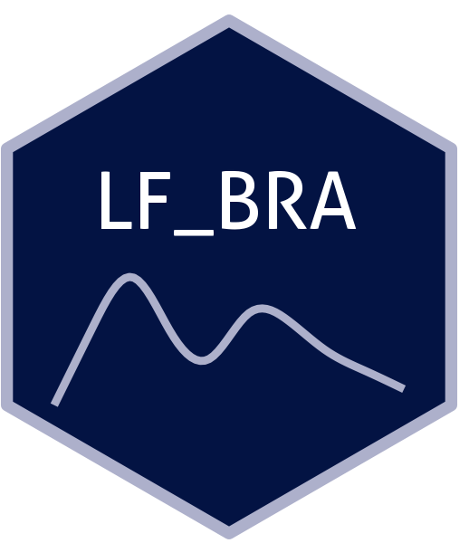

```{=html}
<div class="ossl-hero" style="background: #f1f3f5;">
  <div class="ossl-hero-logo">
    
  </div>
  <div class="ossl-hero-text">
    <h1 class="ossl-hero-title">LF_BRA</h1>
    <p class="ossl-hero-desc">Farm-scale soil spectral library from two local farms from Brazil (LF_BRA)</p>
    <div class="ossl-hero-meta">
      <div class="ossl-pill-row">
        <span class="ossl-pill ossl-pill-on">VNIR</span>
        <span class="ossl-pill ossl-pill-off">NIR</span>
        <span class="ossl-pill ossl-pill-off">MIR</span>
      </div>
      <span class="ossl-meta-divider"></span>
      <span class="ossl-meta-item"><i class="bi bi-globe-americas" aria-hidden="true"></i>Local — Brazil</span>
    </div>
  </div>
</div>
<div class="ossl-quick-stats">
  <span class="ossl-stat-item"><i class="bi bi-database" aria-hidden="true"></i><span class="ossl-stat-val"><300</span> samples</span>
  <span class="ossl-stat-item"><i class="bi bi-calendar3" aria-hidden="true"></i><span class="ossl-stat-val">version 3</span></span>
  <span class="ossl-stat-item"><i class="bi bi-file-earmark-text" aria-hidden="true"></i><span class="ossl-stat-val">CC-BY</span></span>
</div>

```

## <i class="bi bi-cloud-download ossl-section-icon" aria-hidden="true"></i> Database access

Data originally provided by:

- **Contact:** Tiago Rodrigues Tavares
- **Email:** [tiagosrt@usp.br](mailto:tiagosrt@usp.br)
- **Original source:** <https://data.mendeley.com/datasets/88c5kvmgbf/1>

**Available files**

| Type | Filename | Link |
|------|----------|------|
| Soil lab measurements — CSV (gzip) | `ossl_soillab_v1.3.csv.gz` | [Download](https://storage.googleapis.com/soilspec4gg-public/datasets/LF_BRA/ossl_soillab_v1.3.csv.gz) |
| Soil lab measurements — Parquet | `ossl_soillab_v1.3.parquet` | [Download](https://storage.googleapis.com/soilspec4gg-public/datasets/LF_BRA/ossl_soillab_v1.3.parquet) |
| Soil site metadata — CSV (gzip) | `ossl_soilsite_v1.3.csv.gz` | [Download](https://storage.googleapis.com/soilspec4gg-public/datasets/LF_BRA/ossl_soilsite_v1.3.csv.gz) |
| Soil site metadata — Parquet | `ossl_soilsite_v1.3.parquet` | [Download](https://storage.googleapis.com/soilspec4gg-public/datasets/LF_BRA/ossl_soilsite_v1.3.parquet) |
| VisNIR spectra — CSV (gzip) | `ossl_visnir_v1.3.csv.gz` | [Download](https://storage.googleapis.com/soilspec4gg-public/datasets/LF_BRA/ossl_visnir_v1.3.csv.gz) |
| VisNIR spectra — Parquet | `ossl_visnir_v1.3.parquet` | [Download](https://storage.googleapis.com/soilspec4gg-public/datasets/LF_BRA/ossl_visnir_v1.3.parquet) |


## <i class="bi bi-geo-alt ossl-section-icon" aria-hidden="true"></i> Map


## <i class="bi bi-pin-map ossl-section-icon" aria-hidden="true"></i> Soil site information

- **Coordinates precision:** none
- **Sampling depth:** top
- **Geography:** none
- **Variables available (OSSL):** 5 out of 5 — see [Database description](../db-desc.html#panel-soilsite) for full schema
- **Populated columns:** `id.layer_uuid_txt`, `id.layer_local_c`, `loc.field_src_txt`, `layer.upper.depth_usda_cm`, `layer.lower.depth_usda_cm`

## <i class="bi bi-clipboard-data ossl-section-icon" aria-hidden="true"></i> Soil laboratory information

- **Total samples:** 102
- **Properties available (original):** 9
- **Properties standardized (OSSL):** 8 — summarized in **@tbl-soillab-lf_bra** below
- **Categories:** physical, chemical, carbon & nutrients, metal elements
- **Original source:** see [Database access](#database-access)

```{=html}
<p class="ossl-tt-hint"><i class="bi bi-info-circle" aria-hidden="true"></i> Hover over any OSSL code in the table below to see its full description.</p>
```

::: {#tbl-soillab-lf_bra}

```{=html}
<table class="soil-lab-table"><thead><tr><th style="text-align:left">skim_variable</th><th style="text-align:right">n_missing</th><th style="text-align:right">mean</th><th style="text-align:right">sd</th><th style="text-align:right">p0</th><th style="text-align:right">p25</th><th style="text-align:right">p50</th><th style="text-align:right">p75</th><th style="text-align:right">p100</th></tr></thead><tbody><tr><td style="text-align:left"><span class="ossl-tt">clay.tot_usda.a334_w.pct<span class="ossl-tt-pop"><span class="tt-analyte">Clay</span><span class="tt-desc">Method: <code>usda.a334</code></span><span class="tt-unit">Unit: <code>w.pct</code></span></span></span></td><td style="text-align:right">0</td><td style="text-align:right">34.54</td><td style="text-align:right">9.42</td><td style="text-align:right">17.50</td><td style="text-align:right">25.02</td><td style="text-align:right">37.90</td><td style="text-align:right">41.05</td><td style="text-align:right">51.10</td></tr><tr><td style="text-align:left"><span class="ossl-tt">oc_iso.10694_w.pct<span class="ossl-tt-pop"><span class="tt-analyte">Organic Carbon, ISO 10694</span><span class="tt-desc">Method: <code>iso.10694</code></span><span class="tt-unit">Unit: <code>w.pct</code></span></span></span></td><td style="text-align:right">0</td><td style="text-align:right">2.54</td><td style="text-align:right">0.60</td><td style="text-align:right">1.40</td><td style="text-align:right">2.00</td><td style="text-align:right">2.50</td><td style="text-align:right">3.10</td><td style="text-align:right">3.70</td></tr><tr><td style="text-align:left"><span class="ossl-tt">cec_usda.a723_cmolc.kg<span class="ossl-tt-pop"><span class="tt-analyte">CEC, pH 7.0, NH4OAc, 2M KCl displacement</span><span class="tt-desc">Method: <code>usda.a723</code></span><span class="tt-unit">Unit: <code>cmolc.kg</code></span></span></span></td><td style="text-align:right">0</td><td style="text-align:right">8.00</td><td style="text-align:right">2.59</td><td style="text-align:right">3.75</td><td style="text-align:right">5.85</td><td style="text-align:right">7.99</td><td style="text-align:right">9.78</td><td style="text-align:right">14.89</td></tr><tr><td style="text-align:left"><span class="ossl-tt">ph.cacl2_iso.10390_index<span class="ossl-tt-pop"><span class="tt-analyte">pH, 1:2 Soil-CaCl2 Suspension, ISO 10390</span><span class="tt-desc">Method: <code>iso.10390</code></span><span class="tt-unit">Unit: <code>index</code></span></span></span></td><td style="text-align:right">0</td><td style="text-align:right">5.33</td><td style="text-align:right">0.44</td><td style="text-align:right">4.60</td><td style="text-align:right">5.00</td><td style="text-align:right">5.20</td><td style="text-align:right">5.60</td><td style="text-align:right">6.30</td></tr><tr><td style="text-align:left"><span class="ossl-tt">p.ext_brazil.ier_mg.kg<span class="ossl-tt-pop"><span class="tt-analyte">Phosphorus, Extractable, Ion Exchange Resin (IER)</span><span class="tt-desc">Method: <code>brazil.ier</code></span><span class="tt-unit">Unit: <code>mg.kg</code></span></span></span></td><td style="text-align:right">0</td><td style="text-align:right">21.46</td><td style="text-align:right">14.46</td><td style="text-align:right">4.00</td><td style="text-align:right">12.00</td><td style="text-align:right">17.50</td><td style="text-align:right">26.00</td><td style="text-align:right">104.00</td></tr><tr><td style="text-align:left"><span class="ossl-tt">k.ext_brazil.ier_cmolc.kg<span class="ossl-tt-pop"><span class="tt-analyte">Potassium, Extractable,  Ion Exchange Resin (IER)</span><span class="tt-desc">Method: <code>brazil.ier</code></span><span class="tt-unit">Unit: <code>cmolc.kg</code></span></span></span></td><td style="text-align:right">0</td><td style="text-align:right">0.34</td><td style="text-align:right">0.24</td><td style="text-align:right">0.09</td><td style="text-align:right">0.10</td><td style="text-align:right">0.28</td><td style="text-align:right">0.55</td><td style="text-align:right">1.03</td></tr><tr><td style="text-align:left"><span class="ossl-tt">ca.ext_brazil.ier_cmolc.kg<span class="ossl-tt-pop"><span class="tt-analyte">Calcium, Extractable, Ion Exchange Resin (IER)</span><span class="tt-desc">Method: <code>brazil.ier</code></span><span class="tt-unit">Unit: <code>cmolc.kg</code></span></span></span></td><td style="text-align:right">0</td><td style="text-align:right">3.49</td><td style="text-align:right">1.92</td><td style="text-align:right">0.80</td><td style="text-align:right">1.52</td><td style="text-align:right">3.30</td><td style="text-align:right">5.00</td><td style="text-align:right">7.80</td></tr><tr><td style="text-align:left"><span class="ossl-tt">mg.ext_brazil.ier_cmolc.kg<span class="ossl-tt-pop"><span class="tt-analyte">Magnesium, Extractable, Ion Exchange Resin (IER)</span><span class="tt-desc">Method: <code>brazil.ier</code></span><span class="tt-unit">Unit: <code>cmolc.kg</code></span></span></span></td><td style="text-align:right">0</td><td style="text-align:right">1.79</td><td style="text-align:right">1.26</td><td style="text-align:right">0.30</td><td style="text-align:right">0.60</td><td style="text-align:right">1.50</td><td style="text-align:right">2.80</td><td style="text-align:right">5.40</td></tr></tbody></table>
```

Summary statistics (mean, SD, percentiles) for OSSL-standardized soil properties.

:::

## <i class="bi bi-soundwave ossl-section-icon" aria-hidden="true"></i> VNIR

- **Acquisition mode:** Not available
- **Intensity:** reflectance
- **Original range:** 431-2153
- **Instrument:** Veris MSP3 (USB4000 & C9914GB detectors)
- **Manufacturer:** Veris Technologies (Salina, KS, USA)
- **Instrument co-scans:** Not available
- **Scan repeats:** 3
- **Scan accessory:** Not available
- **Original resolution:** 5
- **Sample preparation:** Air-dried, Sieved < 2 mm
- **Additional info:** Not available

### VNIR plot


## <i class="bi bi-journal-text ossl-section-icon" aria-hidden="true"></i> References

1. [Publication 1](https://doi.org/10.1016/j.dib.2022.108004)
2. [Publication 2](https://doi.org/10.3390/s21010148)
3. [Publication 3](https://doi.org/10.3390/agronomy11061028)

