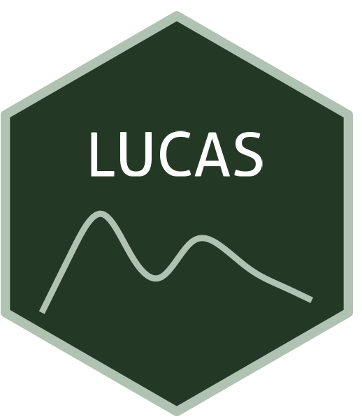

```{=html}
<div class="ossl-hero" style="background: #E9FBEA;">
  <div class="ossl-hero-logo">
    
  </div>
  <div class="ossl-hero-text">
    <h1 class="ossl-hero-title">LUCAS</h1>
    <p class="ossl-hero-desc">Land Use and Cover Survey (LUCAS) library from European soils (23-28 countries)</p>
    <div class="ossl-hero-meta">
      <div class="ossl-pill-row">
        <span class="ossl-pill ossl-pill-on">VNIR</span>
        <span class="ossl-pill ossl-pill-off">NIR</span>
        <span class="ossl-pill ossl-pill-on">MIR</span>
      </div>
      <span class="ossl-meta-divider"></span>
      <span class="ossl-meta-item"><i class="bi bi-globe-americas" aria-hidden="true"></i>Continental — European Union</span>
    </div>
  </div>
</div>
<div class="ossl-quick-stats">
  <span class="ossl-stat-item"><i class="bi bi-database" aria-hidden="true"></i><span class="ossl-stat-val">20,000+</span> samples</span>
  <span class="ossl-stat-item"><i class="bi bi-calendar3" aria-hidden="true"></i><span class="ossl-stat-val">2009, 2012, 2015</span></span>
  <span class="ossl-stat-item"><i class="bi bi-file-earmark-text" aria-hidden="true"></i><span class="ossl-stat-val">Other (Custom) with redistribution permission upon spatial anonymization</span></span>
</div>

```

## <i class="bi bi-geo-alt ossl-section-icon" aria-hidden="true"></i> Map


## <i class="bi bi-cloud-download ossl-section-icon" aria-hidden="true"></i> Database access

Data originally provided by:

- **Contact:** European Soil Data Centre (ESDAC)
- **Email:** [panos.panagos@ec.europa.eu](mailto:panos.panagos@ec.europa.eu)
- **Original source:** <https://esdac.jrc.ec.europa.eu/resource-type/soil-point-data>

**Available files**

| Type | Filename | Link |
|------|----------|------|
| MIR spectra — CSV (gzip) | `ossl_mir_v1.3.csv.gz` | [Download](https://storage.googleapis.com/soilspec4gg-public/datasets/LUCAS/ossl_mir_v1.3.csv.gz) |
| MIR spectra — Parquet | `ossl_mir_v1.3.parquet` | [Download](https://storage.googleapis.com/soilspec4gg-public/datasets/LUCAS/ossl_mir_v1.3.parquet) |
| Soil lab measurements — CSV (gzip) | `ossl_soillab_v1.3.csv.gz` | [Download](https://storage.googleapis.com/soilspec4gg-public/datasets/LUCAS/ossl_soillab_v1.3.csv.gz) |
| Soil lab measurements — Parquet | `ossl_soillab_v1.3.parquet` | [Download](https://storage.googleapis.com/soilspec4gg-public/datasets/LUCAS/ossl_soillab_v1.3.parquet) |
| Soil site metadata — CSV (gzip) | `ossl_soilsite_v1.3.csv.gz` | [Download](https://storage.googleapis.com/soilspec4gg-public/datasets/LUCAS/ossl_soilsite_v1.3.csv.gz) |
| Soil site metadata — Parquet | `ossl_soilsite_v1.3.parquet` | [Download](https://storage.googleapis.com/soilspec4gg-public/datasets/LUCAS/ossl_soilsite_v1.3.parquet) |
| VisNIR spectra — CSV (gzip) | `ossl_visnir_v1.3.csv.gz` | [Download](https://storage.googleapis.com/soilspec4gg-public/datasets/LUCAS/ossl_visnir_v1.3.csv.gz) |
| VisNIR spectra — Parquet | `ossl_visnir_v1.3.parquet` | [Download](https://storage.googleapis.com/soilspec4gg-public/datasets/LUCAS/ossl_visnir_v1.3.parquet) |


## <i class="bi bi-clipboard-data ossl-section-icon" aria-hidden="true"></i> Soil laboratory information

Summary statistics for soil properties in this dataset, sourced from the [ossl-imports README](https://github.com/soilspectroscopy/ossl-imports/tree/main/dataset/LUCAS).

| skim_variable            | n_missing |  mean |    sd |   p0 |   p25 |   p50 |   p75 |    p100 |
|:-------------------------|----------:|------:|------:|-----:|------:|------:|------:|--------:|
| cf_iso.11464_w.pct       |     17601 | 14.89 | 13.09 | 0.00 |  5.00 | 11.00 | 21.00 |   92.00 |
| clay.tot_iso.11277_w.pct |     17628 | 19.69 | 14.63 | 0.00 |  8.00 | 17.00 | 28.00 |   96.00 |
| silt.tot_iso.11277_w.pct |     17630 | 37.24 | 19.06 | 0.00 | 24.00 | 38.00 | 51.00 |   93.00 |
| sand.tot_iso.11277_w.pct |     17628 | 38.78 | 26.01 | 0.00 | 16.00 | 36.00 | 59.00 |  100.00 |
| ph.h2o_iso.10390_index   |         2 |  6.19 |  1.34 | 3.17 |  5.02 |  6.18 |  7.48 |   10.37 |
| ph.cacl2_iso.10390_index |         2 |  5.71 |  1.40 | 2.57 |  4.50 |  5.76 |  7.10 |   10.00 |
| oc_iso.10694_w.pct       |       249 |  4.52 |  8.22 | 0.01 |  1.26 |  2.02 |  3.79 |   58.68 |
| caco3_iso.10693_w.pct    |       697 |  5.44 | 13.05 | 0.00 |  0.00 |  0.10 |  1.60 |   97.60 |
| n.tot_iso.11261_w.pct    |         7 |  0.30 |  0.36 | 0.00 |  0.12 |  0.18 |  0.30 |    3.86 |
| p.ext_iso.11263_mg.kg    |       697 | 31.21 | 32.69 | 0.00 | 10.90 | 22.70 | 43.00 | 1366.40 |
| k.ext_usda.a725_cmolc.kg |         2 |  1.02 |  1.18 | 0.00 |  0.39 |  0.74 |  1.29 |   51.31 |
| cec_iso.11260_cmolc.kg   |     21882 | 17.31 | 15.19 | 0.00 |  7.50 | 13.50 | 22.80 |  234.00 |
| ec_iso.11265_ds.m        |     22066 |  0.26 |  0.33 | 0.00 |  0.10 |  0.17 |  0.28 |    9.69 |

## <i class="bi bi-pin-map ossl-section-icon" aria-hidden="true"></i> Soil site information

- **coordinates precision:** precise, country
- **sampling depth:** top
- **geography:** soil taxonomy, elevation, landuse

## <i class="bi bi-soundwave ossl-section-icon" aria-hidden="true"></i> MIR

- **Acquisition mode:** Not available
- **Intensity:** absorbance
- **Original range:** 600-4000
- **Standardized range:** 628-4000
- **Instrument:** Vertex 70 FT-IR
- **Manufacturer:** Bruker Optics
- **Scan accessory:** Not available
- **Sample preparation:** Air-dried, finely ground <0.2 mm
- **Additional info:** KBr beamsplitter; Gold mirror; Mirror background

### MIR plot


## <i class="bi bi-soundwave ossl-section-icon" aria-hidden="true"></i> VNIR

- **Acquisition mode:** Not available
- **Intensity:** reflectance
- **Original range:** 400-2500
- **Instrument:** FOSS NIRS XDS RapidContent Analyzer
- **Manufacturer:** FOSS NIRSystems Inc., Laurel, MD/ Denmark
- **Instrument co-scans:** Not available
- **Scan repeats:** Not available
- **Scan accessory:** Not available
- **Original resolution:** 2
- **Sample preparation:** Air-dried, Sieved <2 mm
- **Additional info:** Si (400–1100 nm) and PbS (1100–2500 nm) detectors

### VNIR plot


## <i class="bi bi-journal-text ossl-section-icon" aria-hidden="true"></i> References

1. [Publication 1](https://doi.org/10.1111/ejss.12499)
2. [Publication 2](https://doi.org/10.1371/journal.pone.0066409)
3. [Publication 3](http://dx.doi.org/10.1016/j.soilbio.2013.10.022)

