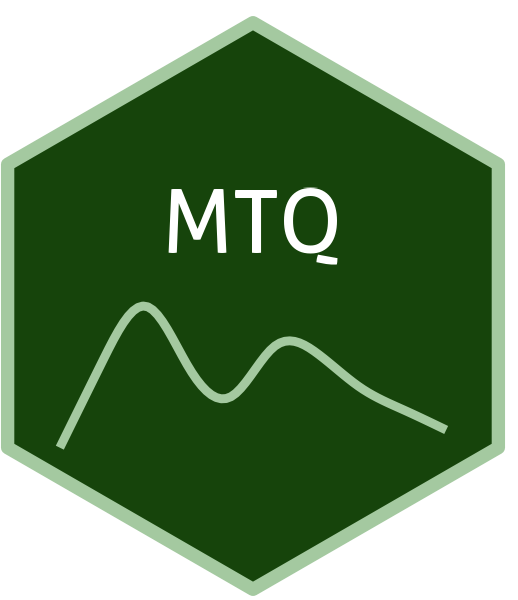

```{=html}
<div class="ossl-hero" style="background: #f1f3f5;">
  <div class="ossl-hero-logo">
    
  </div>
  <div class="ossl-hero-text">
    <h1 class="ossl-hero-title">MTQ</h1>
    <p class="ossl-hero-desc">Near-infrared soil spectral library from rural areas of the Martinique island (MTQ)</p>
    <div class="ossl-hero-meta">
      <div class="ossl-pill-row">
        <span class="ossl-pill ossl-pill-off">VNIR</span>
        <span class="ossl-pill ossl-pill-on">NIR</span>
        <span class="ossl-pill ossl-pill-off">MIR</span>
      </div>
      <span class="ossl-meta-divider"></span>
      <span class="ossl-meta-item"><i class="bi bi-globe-americas" aria-hidden="true"></i>National — Martinique island</span>
    </div>
  </div>
</div>
<div class="ossl-quick-stats">
  <span class="ossl-stat-item"><i class="bi bi-database" aria-hidden="true"></i><span class="ossl-stat-val"><1,000</span> samples</span>
  <span class="ossl-stat-item"><i class="bi bi-calendar3" aria-hidden="true"></i><span class="ossl-stat-val">version 3.1</span></span>
  <span class="ossl-stat-item"><i class="bi bi-file-earmark-text" aria-hidden="true"></i><span class="ossl-stat-val">CC-BY</span></span>
</div>

```

## <i class="bi bi-geo-alt ossl-section-icon" aria-hidden="true"></i> Map


## <i class="bi bi-cloud-download ossl-section-icon" aria-hidden="true"></i> Database access

Data originally provided by:

- **Contact:** Aurélie Cambou
- **Email:** [aurelie.cambou@ird.fr](mailto:aurelie.cambou@ird.fr)
- **Original source:** <https://dataverse.ird.fr/dataset.xhtml?persistentId=doi:10.23708/C2TV6W>

**Available files**

| Type | Filename | Link |
|------|----------|------|
| NIR spectra — CSV (gzip) | `ossl_nir_v1.3.csv.gz` | [Download](https://storage.googleapis.com/soilspec4gg-public/datasets/MTQ/ossl_nir_v1.3.csv.gz) |
| NIR spectra — Parquet | `ossl_nir_v1.3.parquet` | [Download](https://storage.googleapis.com/soilspec4gg-public/datasets/MTQ/ossl_nir_v1.3.parquet) |
| Soil lab measurements — CSV (gzip) | `ossl_soillab_v1.3.csv.gz` | [Download](https://storage.googleapis.com/soilspec4gg-public/datasets/MTQ/ossl_soillab_v1.3.csv.gz) |
| Soil lab measurements — Parquet | `ossl_soillab_v1.3.parquet` | [Download](https://storage.googleapis.com/soilspec4gg-public/datasets/MTQ/ossl_soillab_v1.3.parquet) |
| Soil site metadata — CSV (gzip) | `ossl_soilsite_v1.3.csv.gz` | [Download](https://storage.googleapis.com/soilspec4gg-public/datasets/MTQ/ossl_soilsite_v1.3.csv.gz) |
| Soil site metadata — Parquet | `ossl_soilsite_v1.3.parquet` | [Download](https://storage.googleapis.com/soilspec4gg-public/datasets/MTQ/ossl_soilsite_v1.3.parquet) |


## <i class="bi bi-clipboard-data ossl-section-icon" aria-hidden="true"></i> Soil laboratory information

_Soil analytical data summary not available for this dataset._

## <i class="bi bi-pin-map ossl-section-icon" aria-hidden="true"></i> Soil site information

- **coordinates precision:** precise
- **sampling depth:** various
- **geography:** soil taxonomy, landuse

## <i class="bi bi-soundwave ossl-section-icon" aria-hidden="true"></i> NIR

- **Acquisition mode:** Not available
- **Intensity:** reflectance
- **Original range:** 1100-2498
- **Instrument:** Foss NIRSystems 5000 spectrophotometer
- **Manufacturer:** Laurel, MD, USA; 2003
- **Instrument co-scans:** 32
- **Scan repeats:** 2
- **Scan accessory:** Not available
- **Original resolution:** 2 nm
- **Sample preparation:** Oven-dried, Sieved < 2mm
- **Additional info:** Not available


## <i class="bi bi-journal-text ossl-section-icon" aria-hidden="true"></i> References

1. [Publication 1](https://doi.org/10.1111/ejss.13453)

