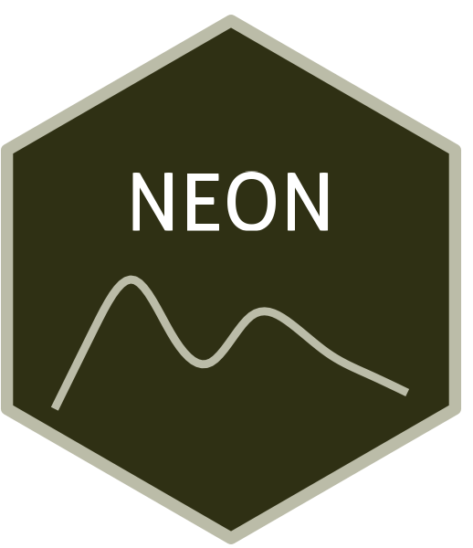

```{=html}
<div class="ossl-hero" style="background: #F6F7E3;">
  <div class="ossl-hero-logo">
    
  </div>
  <div class="ossl-hero-text">
    <h1 class="ossl-hero-title">NEON</h1>
    <p class="ossl-hero-desc">National Ecological Observatory Network (NEON) soil spectral library</p>
    <div class="ossl-hero-meta">
      <div class="ossl-pill-row">
        <span class="ossl-pill ossl-pill-off">VNIR</span>
        <span class="ossl-pill ossl-pill-off">NIR</span>
        <span class="ossl-pill ossl-pill-on">MIR</span>
      </div>
      <span class="ossl-meta-divider"></span>
      <span class="ossl-meta-item"><i class="bi bi-globe-americas" aria-hidden="true"></i>National — United States</span>
    </div>
  </div>
</div>
<div class="ossl-quick-stats">
  <span class="ossl-stat-item"><i class="bi bi-database" aria-hidden="true"></i><span class="ossl-stat-val"><300</span> samples</span>
  <span class="ossl-stat-item"><i class="bi bi-calendar3" aria-hidden="true"></i><span class="ossl-stat-val">first release (v1)</span></span>
  <span class="ossl-stat-item"><i class="bi bi-file-earmark-text" aria-hidden="true"></i><span class="ossl-stat-val">CC-BY</span></span>
</div>

```

## <i class="bi bi-geo-alt ossl-section-icon" aria-hidden="true"></i> Map


## <i class="bi bi-cloud-download ossl-section-icon" aria-hidden="true"></i> Database access

Data originally provided by:

- **Contact:** Jonathan Sanderman
- **Email:** [jsanderman@woodwellclimate.org](mailto:jsanderman@woodwellclimate.org)
- **Original source:** <https://www.neonscience.org/samples/soil-archive>

No file listing available for this dataset.


## <i class="bi bi-clipboard-data ossl-section-icon" aria-hidden="true"></i> Soil laboratory information

Summary statistics for soil properties in this dataset, sourced from the [ossl-imports README](https://github.com/soilspectroscopy/ossl-imports/tree/main/dataset/NEON).

| skim_variable             | n_missing |  mean |    sd |   p0 |   p25 |   p50 |   p75 |   p100 |
|:--------------------------|----------:|------:|------:|-----:|------:|------:|------:|-------:|
| c.tot_usda.a622_w.pct     |         0 |  3.92 |  8.87 | 0.02 |  0.25 |  1.09 |  2.96 |  55.51 |
| n.tot_usda.a623_w.pct     |        25 |  0.20 |  0.32 | 0.01 |  0.04 |  0.07 |  0.20 |   1.82 |
| s.tot_usda.a624_w.pct     |       138 |  0.05 |  0.15 | 0.01 |  0.01 |  0.02 |  0.04 |   2.01 |
| oc_usda.c729_w.pct        |         0 |  3.49 |  8.93 | 0.00 |  0.10 |  0.50 |  2.00 |  55.50 |
| ph.h2o_usda.a268_index    |         1 |  5.72 |  1.50 | 3.10 |  4.60 |  5.10 |  7.40 |   8.70 |
| ph.cacl2_usda.a481_index  |         1 |  6.40 |  1.40 | 3.80 |  5.30 |  5.80 |  7.90 |   9.20 |
| ec_usda.a364_ds.m         |         2 |  0.40 |  1.06 | 0.01 |  0.03 |  0.09 |  0.24 |   7.70 |
| caco3_usda.a54_w.pct      |         0 |  3.62 |  9.95 | 0.00 |  0.00 |  0.00 |  0.00 |  68.00 |
| ca.ext_usda.a722_cmolc.kg |         0 | 16.48 | 21.40 | 0.00 |  0.70 |  4.70 | 26.30 | 142.00 |
| k.ext_usda.a725_cmolc.kg  |         0 |  0.46 |  0.67 | 0.00 |  0.10 |  0.20 |  0.50 |   4.30 |
| mg.ext_usda.a724_cmolc.kg |         0 |  3.63 |  6.12 | 0.00 |  0.20 |  1.50 |  5.10 |  70.70 |
| na.ext_usda.a726_cmolc.kg |         0 |  0.83 |  3.66 | 0.00 |  0.00 |  0.00 |  0.00 |  36.40 |
| cec_usda.a723_cmolc.kg    |         0 | 16.26 | 16.19 | 0.00 |  5.60 | 10.60 | 21.10 | 100.30 |
| al.ext_usda.a69_cmolc.kg  |       161 |  2.12 |  2.50 | 0.00 |  0.30 |  1.00 |  2.92 |  11.80 |
| cf_usda.c232_w.pct        |         0 |  5.33 |  6.78 | 0.00 |  0.00 |  2.50 |  8.60 |  36.80 |
| cf_usda.c235_w.pct        |         0 |  6.18 | 10.54 | 0.00 |  0.00 |  1.00 |  8.60 |  72.80 |
| sand.tot_usda.c60_w.pct   |        11 | 50.93 | 27.81 | 1.60 | 27.52 | 53.20 | 74.55 |  97.60 |
| silt.tot_usda.c62_w.pct   |        11 | 31.15 | 17.57 | 1.30 | 17.02 | 29.90 | 44.03 |  78.80 |
| clay.tot_usda.a334_w.pct  |        11 | 17.92 | 14.35 | 0.00 |  5.90 | 14.55 | 27.40 |  60.30 |
| bd_usda.a4_g.cm3          |         6 |  1.23 |  0.42 | 0.03 |  1.04 |  1.30 |  1.52 |   2.27 |

## <i class="bi bi-pin-map ossl-section-icon" aria-hidden="true"></i> Soil site information

- **coordinates precision:** precise
- **sampling depth:** various
- **geography:** soil taxonomy, soil horizon

## <i class="bi bi-soundwave ossl-section-icon" aria-hidden="true"></i> MIR

- **Acquisition mode:** Not available
- **Intensity:** absorbance
- **Original range:** 400-4000
- **Standardized range:** 628-4000
- **Instrument:** Vertex 70 FT-IR & Vertex 70 FT-IR
- **Manufacturer:** Bruker Optics
- **Scan accessory:** Not available
- **Sample preparation:** Air-dried, finely ground < 80mesh
- **Additional info:** MCT (mercury cadmium telluride) detector & KBr beamsplitter; Gold mirror; Mirror background

### MIR plot


## <i class="bi bi-journal-text ossl-section-icon" aria-hidden="true"></i> References

1. [Publication 1](https://doi.org/10.3390/s20236729)

