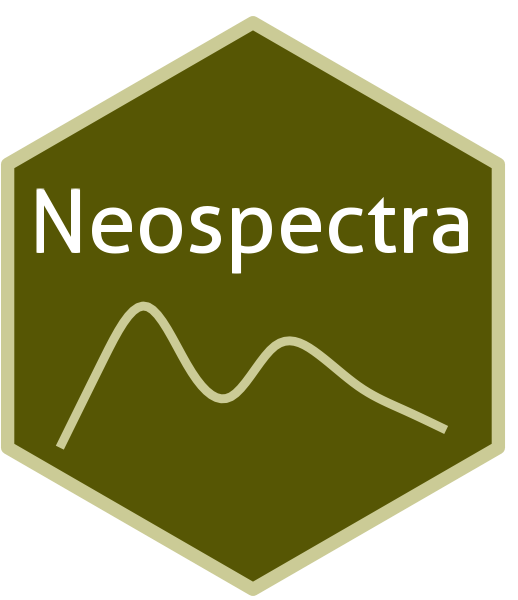

```{=html}
<div class="ossl-hero" style="background: #FBFBC6;">
  <div class="ossl-hero-logo">
    
  </div>
  <div class="ossl-hero-text">
    <h1 class="ossl-hero-title">Neospectra</h1>
    <p class="ossl-hero-desc">Near-infrared soil spectral library (Neospectra) from selected KSSL samples (USA) and Africa</p>
    <div class="ossl-hero-meta">
      <div class="ossl-pill-row">
        <span class="ossl-pill ossl-pill-off">VNIR</span>
        <span class="ossl-pill ossl-pill-on">NIR</span>
        <span class="ossl-pill ossl-pill-off">MIR</span>
      </div>
      <span class="ossl-meta-divider"></span>
      <span class="ossl-meta-item"><i class="bi bi-globe-americas" aria-hidden="true"></i>National — USA, Africa</span>
    </div>
  </div>
</div>
<div class="ossl-quick-stats">
  <span class="ossl-stat-item"><i class="bi bi-database" aria-hidden="true"></i><span class="ossl-stat-val">2,000+</span> samples</span>
  <span class="ossl-stat-item"><i class="bi bi-calendar3" aria-hidden="true"></i><span class="ossl-stat-val">second update (v1)</span></span>
  <span class="ossl-stat-item"><i class="bi bi-file-earmark-text" aria-hidden="true"></i><span class="ossl-stat-val">CC-BY</span></span>
</div>

```

## <i class="bi bi-geo-alt ossl-section-icon" aria-hidden="true"></i> Map


## <i class="bi bi-cloud-download ossl-section-icon" aria-hidden="true"></i> Database access

Data originally provided by:

- **Contact:** Jonathan Sanderman
- **Email:** [jsanderman@woodwellclimate.org](mailto:jsanderman@woodwellclimate.org)
- **Original source:** <https://doi.org/10.5281/zenodo.13122321>

No file listing available for this dataset.


## <i class="bi bi-clipboard-data ossl-section-icon" aria-hidden="true"></i> Soil laboratory information

Summary statistics for soil properties in this dataset, sourced from the [ossl-imports README](https://github.com/soilspectroscopy/ossl-imports/tree/main/dataset/Neospectra).

| skim_variable | n_missing | mean | sd | p0 | p25 | p50 | p75 | p100 |
|:---|---:|---:|---:|---:|---:|---:|---:|---:|
| scan_nir.1500_ref | 0 | 0.48 | 0.12 | 0.11 | 0.40 | 0.48 | 0.56 | 0.93 |
| oc_usda.c729_w.pct | 0 | 2.00 | 2.71 | -0.03 | 0.59 | 1.31 | 2.63 | 53.88 |
| c.tot_usda.a622_w.pct | 90 | 2.29 | 2.80 | 0.02 | 0.82 | 1.59 | 2.97 | 53.88 |
| n.tot_usda.a623_w.pct | 0 | 0.17 | 0.18 | 0.00 | 0.06 | 0.12 | 0.22 | 3.02 |
| s.tot_usda.a624_w.pct | 90 | 0.13 | 1.02 | 0.00 | 0.00 | 0.01 | 0.03 | 18.38 |
| ph.h2o_usda.a268_index | 10 | 6.25 | 1.26 | 3.69 | 5.21 | 6.12 | 7.35 | 9.52 |
| bd_usda.a4_g.cm3 | 1142 | 1.31 | 0.24 | 0.30 | 1.18 | 1.34 | 1.47 | 2.03 |
| clay.tot_usda.a334_w.pct | 0 | 20.55 | 14.54 | 0.00 | 9.08 | 18.33 | 28.82 | 86.69 |
| silt.tot_usda.c62_w.pct | 0 | 37.57 | 20.30 | 0.00 | 21.80 | 37.40 | 52.10 | 87.90 |
| sand.tot_usda.c60_w.pct | 0 | 41.88 | 27.95 | 0.30 | 17.60 | 39.25 | 64.38 | 100.00 |
| caco3_usda.a54_w.pct | 1413 | 5.91 | 9.49 | -0.57 | 0.26 | 1.64 | 7.61 | 89.03 |
| cec_usda.a723_cmolc.kg | 10 | 16.05 | 12.11 | 0.13 | 7.74 | 14.08 | 21.96 | 190.11 |
| ca.ext_usda.a722_cmolc.kg | 10 | 19.23 | 31.73 | 0.00 | 2.52 | 9.78 | 22.19 | 363.64 |
| mg.ext_usda.a724_cmolc.kg | 10 | 3.24 | 4.52 | 0.00 | 0.68 | 1.98 | 4.29 | 82.14 |
| k.ext_usda.a725_cmolc.kg | 10 | 0.55 | 0.73 | 0.00 | 0.14 | 0.33 | 0.68 | 11.25 |
| na.ext_usda.a726_cmolc.kg | 10 | 0.88 | 8.10 | 0.00 | 0.00 | 0.00 | 0.05 | 202.96 |
| wr.33kPa_usda.a415_w.pct | 1875 | 23.87 | 13.74 | 1.00 | 14.17 | 24.22 | 31.44 | 127.90 |
| wr.1500kPa_usda.a417_w.pct | 35 | 11.59 | 7.27 | 0.08 | 6.49 | 10.81 | 15.21 | 96.14 |
| al.dith_usda.a65_w.pct | 231 | 0.18 | 0.25 | 0.00 | 0.04 | 0.10 | 0.19 | 2.28 |
| p.ext_usda.a652_mg.kg | 1378 | 35.21 | 81.75 | 0.00 | 2.96 | 11.25 | 34.89 | 1358.90 |
| p.ext_usda.a1070_mg.kg | 2030 | 27.26 | 35.04 | 0.36 | 6.52 | 15.96 | 39.22 | 256.44 |
| k.ext_usda.a1065_mg.kg | 2030 | 185.49 | 136.84 | 0.00 | 82.01 | 147.45 | 256.33 | 730.19 |
| ec_usda.a364_ds.m | 1154 | 1.00 | 4.72 | 0.01 | 0.13 | 0.23 | 0.46 | 81.93 |

## <i class="bi bi-pin-map ossl-section-icon" aria-hidden="true"></i> Soil site information

- **coordinates precision:** precise, county, country
- **sampling depth:** various
- **geography:** soil taxonomy, soil horizon

## <i class="bi bi-soundwave ossl-section-icon" aria-hidden="true"></i> NIR

- **Acquisition mode:** Not available
- **Intensity:** reflectance
- **Original range:** 1350-2550
- **Instrument:** Neospectra
- **Manufacturer:** SiWare
- **Instrument co-scans:** Not available
- **Scan repeats:** 6
- **Scan accessory:** Not available
- **Original resolution:** 8-16 cm-1
- **Sample preparation:** Oven-dried, Sieved < 2mm
- **Additional info:** Not available

### NIR plot


## <i class="bi bi-journal-text ossl-section-icon" aria-hidden="true"></i> References

1. [Publication 1](https://doi.org/10.1016/j.dib.2024.111229)
2. [Publication 2](https://doi.org/10.1002/saj2.20678)

