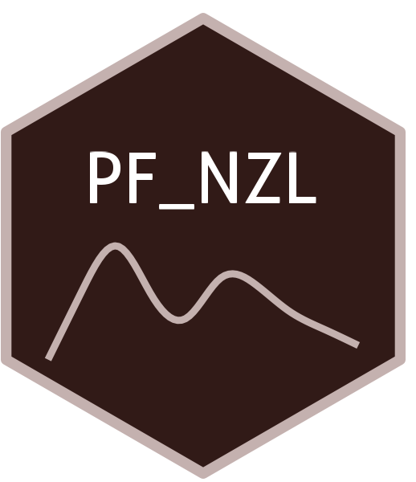

```{=html}
<div class="ossl-hero" style="background: #FFF2F1;">
  <div class="ossl-hero-logo">
    
  </div>
  <div class="ossl-hero-text">
    <h1 class="ossl-hero-title">PF_NZL</h1>
    <p class="ossl-hero-desc">Soil spectral library from Planted Forest soils of New Zealand (PF_NZL)</p>
    <div class="ossl-hero-meta">
      <div class="ossl-pill-row">
        <span class="ossl-pill ossl-pill-off">VNIR</span>
        <span class="ossl-pill ossl-pill-off">NIR</span>
        <span class="ossl-pill ossl-pill-on">MIR</span>
      </div>
      <span class="ossl-meta-divider"></span>
      <span class="ossl-meta-item"><i class="bi bi-globe-americas" aria-hidden="true"></i>National — New Zealand</span>
    </div>
  </div>
</div>
<div class="ossl-quick-stats">
  <span class="ossl-stat-item"><i class="bi bi-database" aria-hidden="true"></i><span class="ossl-stat-val"><1,000</span> samples</span>
  <span class="ossl-stat-item"><i class="bi bi-calendar3" aria-hidden="true"></i><span class="ossl-stat-val">first release (v1)</span></span>
  <span class="ossl-stat-item"><i class="bi bi-file-earmark-text" aria-hidden="true"></i><span class="ossl-stat-val">CC-BY</span></span>
</div>

```

## <i class="bi bi-cloud-download ossl-section-icon" aria-hidden="true"></i> Database access

Data originally provided by:

- **Contact:** Loretta Garrett
- **Email:** [loretta.garrett@scionresearch.com](mailto:loretta.garrett@scionresearch.com)
- **Original source:** <https://doi.org/10.6084/m9.figshare.20506587.v2>

No file listing available for this dataset.


## <i class="bi bi-clipboard-data ossl-section-icon" aria-hidden="true"></i> Soil laboratory information

Summary statistics for soil properties in this dataset, sourced from the [ossl-imports README](https://github.com/soilspectroscopy/ossl-imports/tree/main/dataset/PF_NZL).

| skim_variable | n_missing | mean | sd | p0 | p25 | p50 | p75 | p100 |
|:---|---:|---:|---:|---:|---:|---:|---:|---:|
| clay.tot_usda.a334_w.pct | 640 | 41.88 | 27.64 | 3.00 | 20.75 | 35.50 | 56.50 | 100.00 |
| sand.tot_usda.c60_w.pct | 640 | 37.93 | 19.61 | 0.00 | 26.75 | 39.00 | 50.00 | 79.00 |
| silt.tot_usda.c62_w.pct | 640 | 20.14 | 15.33 | 0.00 | 7.00 | 18.50 | 29.25 | 61.00 |
| bd_usda.a4_g.cm3 | 297 | 0.91 | 0.30 | 0.24 | 0.66 | 0.93 | 1.16 | 1.69 |
| wr.10kPa_usda.a414_w.pct | 745 | 46.19 | 27.64 | 10.85 | 32.11 | 38.87 | 56.45 | 143.33 |
| wr.1500kPa_usda.a417_w.pct | 745 | 20.17 | 13.37 | 1.60 | 10.43 | 18.50 | 25.35 | 62.65 |
| c.tot_usda.a622_w.pct | 1 | 3.13 | 2.27 | 0.03 | 1.50 | 2.84 | 4.42 | 21.56 |
| n.tot_usda.a623_w.pct | 3 | 0.21 | 0.14 | 0.00 | 0.09 | 0.18 | 0.28 | 1.15 |
| p.ext_usda.a274_mg.kg | 649 | 4.35 | 4.96 | 0.00 | 1.01 | 2.44 | 5.84 | 29.07 |
| p.ext_usda.a270_mg.kg | 649 | 14.93 | 32.09 | 0.97 | 3.11 | 6.90 | 14.68 | 328.41 |
| cec_usda.a723_cmolc.kg | 492 | 16.07 | 10.05 | 0.51 | 9.23 | 14.08 | 21.74 | 71.62 |
| ca.ext_usda.a722_cmolc.kg | 492 | 2.26 | 3.63 | 0.00 | 0.41 | 1.08 | 2.86 | 29.03 |
| mg.ext_usda.a724_cmolc.kg | 492 | 1.17 | 3.45 | 0.01 | 0.17 | 0.47 | 1.18 | 32.38 |
| k.ext_usda.a725_cmolc.kg | 492 | 0.29 | 0.25 | 0.00 | 0.11 | 0.20 | 0.40 | 1.30 |
| na.ext_usda.a726_cmolc.kg | 492 | 0.26 | 0.22 | 0.00 | 0.11 | 0.20 | 0.36 | 1.64 |
| ph.h2o_usda.a268_index | 216 | 4.99 | 0.52 | 3.40 | 4.63 | 5.01 | 5.31 | 6.69 |
| b.ext_mel3_mg.kg | 331 | 0.26 | 0.18 | 0.03 | 0.15 | 0.19 | 0.33 | 1.20 |
| al.ext_usda.a1056_mg.kg | 216 | 1442.78 | 643.73 | 33.22 | 999.51 | 1470.35 | 1859.20 | 4952.69 |
| na.ext_usda.a1068_mg.kg | 216 | 35.03 | 26.64 | 2.53 | 18.13 | 26.18 | 44.37 | 280.29 |
| mg.ext_usda.a1066_mg.kg | 216 | 90.73 | 203.71 | 1.38 | 13.40 | 42.50 | 102.37 | 2380.07 |
| p.ext_usda.a652_mg.kg | 219 | 18.82 | 27.84 | 0.11 | 4.94 | 11.24 | 21.85 | 376.21 |
| k.ext_usda.a1065_mg.kg | 216 | 84.73 | 85.94 | 4.90 | 37.71 | 70.26 | 110.44 | 1361.72 |
| ca.ext_usda.a1059_mg.kg | 216 | 315.04 | 574.15 | 5.15 | 65.93 | 158.55 | 391.95 | 7907.54 |
| mn.ext_usda.a1067_mg.kg | 217 | 21.44 | 39.90 | 0.06 | 4.02 | 9.04 | 20.68 | 336.87 |
| fe.ext_usda.a1064_mg.kg | 216 | 167.20 | 121.31 | 10.12 | 79.34 | 122.28 | 222.45 | 668.26 |
| cu.ext_usda.a1063_mg.kg | 218 | 1.49 | 2.39 | 0.04 | 0.48 | 0.93 | 1.69 | 32.81 |
| zn.ext_usda.a1073_mg.kg | 228 | 1.65 | 1.32 | 0.09 | 0.74 | 1.22 | 2.17 | 9.21 |

## <i class="bi bi-pin-map ossl-section-icon" aria-hidden="true"></i> Soil site information

- **coordinates precision:** precise
- **sampling depth:** various
- **geography:** soil taxonomy, elevation, landuse

## <i class="bi bi-geo-alt ossl-section-icon" aria-hidden="true"></i> Map


## <i class="bi bi-soundwave ossl-section-icon" aria-hidden="true"></i> MIR

- **Acquisition mode:** Not available
- **Intensity:** absorbance
- **Original range:** 400-8000
- **Standardized range:** 600-4000
- **Instrument:** Invenio-S FT-IR
- **Manufacturer:** Bruker Optics
- **Scan accessory:** Not available
- **Sample preparation:** Ground 180s (Zirconia mill)
- **Additional info:** Liquid nitrogen cooled mercury cadmium telluride detector; sintered gold plate as the background

### MIR plot


## <i class="bi bi-journal-text ossl-section-icon" aria-hidden="true"></i> References

1. [Publication 1](https://doi.org/10.1016/j.tfp.2022.100280;)

