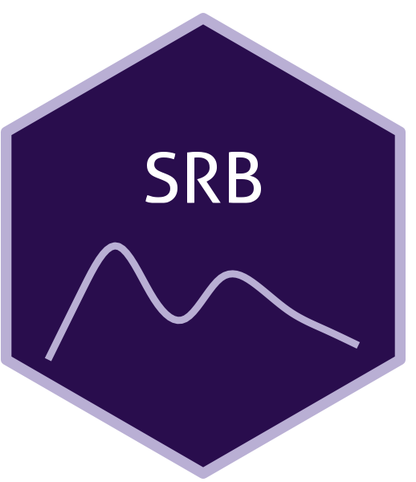

```{=html}
<div class="ossl-hero" style="background: #f1f3f5;">
  <div class="ossl-hero-logo">
    
  </div>
  <div class="ossl-hero-text">
    <h1 class="ossl-hero-title">SRB</h1>
    <p class="ossl-hero-desc">Soil spectral library from Serbia (SRB)</p>
    <div class="ossl-hero-meta">
      <div class="ossl-pill-row">
        <span class="ossl-pill ossl-pill-off">VNIR</span>
        <span class="ossl-pill ossl-pill-off">NIR</span>
        <span class="ossl-pill ossl-pill-on">MIR</span>
      </div>
      <span class="ossl-meta-divider"></span>
      <span class="ossl-meta-item"><i class="bi bi-globe-americas" aria-hidden="true"></i>National — Serbia</span>
    </div>
  </div>
</div>
<div class="ossl-quick-stats">
  <span class="ossl-stat-item"><i class="bi bi-database" aria-hidden="true"></i><span class="ossl-stat-val"><300</span> samples</span>
  <span class="ossl-stat-item"><i class="bi bi-calendar3" aria-hidden="true"></i><span class="ossl-stat-val">first release (v1)</span></span>
  <span class="ossl-stat-item"><i class="bi bi-file-earmark-text" aria-hidden="true"></i><span class="ossl-stat-val">Agreement</span></span>
</div>

```

## <i class="bi bi-cloud-download ossl-section-icon" aria-hidden="true"></i> Database access

Data originally provided by:

- **Contact:** Branislav Jović
- **Email:** [branislav.jovic@dh.uns.ac.rs](mailto:branislav.jovic@dh.uns.ac.rs)
- **Original source:** <https://doi.org/10.1016/j.saa.2018.08.039>

**Available files**

| Type | Filename | Link |
|------|----------|------|
| MIR spectra — CSV (gzip) | `ossl_mir_v1.3.csv.gz` | [Download](https://storage.googleapis.com/soilspec4gg-public/datasets/SRB/ossl_mir_v1.3.csv.gz) |
| MIR spectra — Parquet | `ossl_mir_v1.3.parquet` | [Download](https://storage.googleapis.com/soilspec4gg-public/datasets/SRB/ossl_mir_v1.3.parquet) |
| Soil lab measurements — CSV (gzip) | `ossl_soillab_v1.3.csv.gz` | [Download](https://storage.googleapis.com/soilspec4gg-public/datasets/SRB/ossl_soillab_v1.3.csv.gz) |
| Soil lab measurements — Parquet | `ossl_soillab_v1.3.parquet` | [Download](https://storage.googleapis.com/soilspec4gg-public/datasets/SRB/ossl_soillab_v1.3.parquet) |
| Soil site metadata — CSV (gzip) | `ossl_soilsite_v1.3.csv.gz` | [Download](https://storage.googleapis.com/soilspec4gg-public/datasets/SRB/ossl_soilsite_v1.3.csv.gz) |
| Soil site metadata — Parquet | `ossl_soilsite_v1.3.parquet` | [Download](https://storage.googleapis.com/soilspec4gg-public/datasets/SRB/ossl_soilsite_v1.3.parquet) |


## <i class="bi bi-geo-alt ossl-section-icon" aria-hidden="true"></i> Map


## <i class="bi bi-pin-map ossl-section-icon" aria-hidden="true"></i> Soil site information

- **Coordinates precision:** precise
- **Sampling depth:** various
- **Geography:** soil taxonomy, landuse
- **Variables available (OSSL):** 8 out of 8 — see [Database description](../db-desc.html#panel-soilsite) for full schema
- **Populated columns:** `id.layer_uuid_txt`, `id.layer_local_c`, `site.location.use_src_txt`, `longitude.point_wgs84_dd`, `latitude.point_wgs84_dd`, `pedon.taxa_src_txt`, `layer.upper.depth_usda_cm`, `layer.lower.depth_usda_cm`

## <i class="bi bi-clipboard-data ossl-section-icon" aria-hidden="true"></i> Soil laboratory information

- **Total samples:** 135
- **Properties available (original):** 10
- **Properties standardized (OSSL):** 8 — summarized in **@tbl-soillab-srb** below
- **Categories:** physical, chemical, carbon & nutrients
- **Original source:** see [Database access](#database-access)

```{=html}
<p class="ossl-tt-hint"><i class="bi bi-info-circle" aria-hidden="true"></i> Hover over any OSSL code in the table below to see its full description.</p>
```

::: {#tbl-soillab-srb}

```{=html}
<table class="soil-lab-table"><thead><tr><th style="text-align:left">skim_variable</th><th style="text-align:right">n_missing</th><th style="text-align:right">mean</th><th style="text-align:right">sd</th><th style="text-align:right">p0</th><th style="text-align:right">p25</th><th style="text-align:right">p50</th><th style="text-align:right">p75</th><th style="text-align:right">p100</th></tr></thead><tbody><tr><td style="text-align:left"><span class="ossl-tt">silt.tot_usda.c62_w.pct<span class="ossl-tt-pop"><span class="tt-analyte">Silt, Total, S prep</span><span class="tt-desc">Method: <code>usda.c62</code></span><span class="tt-unit">Unit: <code>w.pct</code></span></span></span></td><td style="text-align:right">0</td><td style="text-align:right">25.35</td><td style="text-align:right">12.61</td><td style="text-align:right">1.23</td><td style="text-align:right">15.04</td><td style="text-align:right">27.83</td><td style="text-align:right">35.60</td><td style="text-align:right">53.39</td></tr><tr><td style="text-align:left"><span class="ossl-tt">clay.tot_usda.a334_w.pct<span class="ossl-tt-pop"><span class="tt-analyte">Clay</span><span class="tt-desc">Method: <code>usda.a334</code></span><span class="tt-unit">Unit: <code>w.pct</code></span></span></span></td><td style="text-align:right">0</td><td style="text-align:right">27.61</td><td style="text-align:right">13.54</td><td style="text-align:right">5.53</td><td style="text-align:right">15.95</td><td style="text-align:right">27.43</td><td style="text-align:right">36.92</td><td style="text-align:right">60.81</td></tr><tr><td style="text-align:left"><span class="ossl-tt">sand.tot_usda.c60_w.pct<span class="ossl-tt-pop"><span class="tt-analyte">Sand, Total, S prep</span><span class="tt-desc">Method: <code>usda.c60</code></span><span class="tt-unit">Unit: <code>w.pct</code></span></span></span></td><td style="text-align:right">0</td><td style="text-align:right">47.13</td><td style="text-align:right">23.87</td><td style="text-align:right">9.03</td><td style="text-align:right">28.84</td><td style="text-align:right">38.65</td><td style="text-align:right">68.61</td><td style="text-align:right">92.27</td></tr><tr><td style="text-align:left"><span class="ossl-tt">c.tot_usda.a622_w.pct<span class="ossl-tt-pop"><span class="tt-analyte">Carbon, Total NCS</span><span class="tt-desc">Method: <code>usda.a622</code></span><span class="tt-unit">Unit: <code>w.pct</code></span></span></span></td><td style="text-align:right">90</td><td style="text-align:right">3.47</td><td style="text-align:right">1.49</td><td style="text-align:right">1.43</td><td style="text-align:right">2.15</td><td style="text-align:right">2.99</td><td style="text-align:right">4.79</td><td style="text-align:right">7.06</td></tr><tr><td style="text-align:left"><span class="ossl-tt">oc_usda.c729_w.pct<span class="ossl-tt-pop"><span class="tt-analyte">Organic Carbon, Total C without CaCO3, S prep</span><span class="tt-desc">Method: <code>usda.c729</code></span><span class="tt-unit">Unit: <code>w.pct</code></span></span></span></td><td style="text-align:right">90</td><td style="text-align:right">2.83</td><td style="text-align:right">0.97</td><td style="text-align:right">1.30</td><td style="text-align:right">2.12</td><td style="text-align:right">2.67</td><td style="text-align:right">3.33</td><td style="text-align:right">5.02</td></tr><tr><td style="text-align:left"><span class="ossl-tt">ph.h2o_usda.a268_index<span class="ossl-tt-pop"><span class="tt-analyte">pH, 1:1 Soil-Water Suspension</span><span class="tt-desc">Method: <code>usda.a268</code></span><span class="tt-unit">Unit: <code>index</code></span></span></span></td><td style="text-align:right">90</td><td style="text-align:right">7.41</td><td style="text-align:right">0.87</td><td style="text-align:right">5.38</td><td style="text-align:right">6.77</td><td style="text-align:right">7.80</td><td style="text-align:right">7.97</td><td style="text-align:right">9.18</td></tr><tr><td style="text-align:left"><span class="ossl-tt">n.tot_usda.a623_w.pct<span class="ossl-tt-pop"><span class="tt-analyte">Nitrogen, Total NCS</span><span class="tt-desc">Method: <code>usda.a623</code></span><span class="tt-unit">Unit: <code>w.pct</code></span></span></span></td><td style="text-align:right">90</td><td style="text-align:right">0.19</td><td style="text-align:right">0.11</td><td style="text-align:right">0.05</td><td style="text-align:right">0.12</td><td style="text-align:right">0.19</td><td style="text-align:right">0.24</td><td style="text-align:right">0.49</td></tr><tr><td style="text-align:left"><span class="ossl-tt">caco3_usda.a54_w.pct<span class="ossl-tt-pop"><span class="tt-analyte">Carbonate, &lt;2mm Fraction</span><span class="tt-desc">Method: <code>usda.a54</code></span><span class="tt-unit">Unit: <code>w.pct</code></span></span></span></td><td style="text-align:right">90</td><td style="text-align:right">5.33</td><td style="text-align:right">6.54</td><td style="text-align:right">0.00</td><td style="text-align:right">0.00</td><td style="text-align:right">2.19</td><td style="text-align:right">10.11</td><td style="text-align:right">21.99</td></tr></tbody></table>
```

Summary statistics (mean, SD, percentiles) for OSSL-standardized soil properties.

:::

## <i class="bi bi-soundwave ossl-section-icon" aria-hidden="true"></i> MIR

- **Acquisition mode:** Not available
- **Intensity:** absorbance
- **Original range:** 400-4000
- **Standardized range:** 600-4000
- **Instrument:** Nexus 670 FT-IR
- **Manufacturer:** Thermo-Nicolet
- **Scan accessory:** Not available
- **Sample preparation:** Air-dried, Sieved < 2 mm
- **Additional info:** DTGS detector

### MIR plot


## <i class="bi bi-journal-text ossl-section-icon" aria-hidden="true"></i> References

1. [Publication 1](https://doi.org/10.1016/j.saa.2018.08.039)

