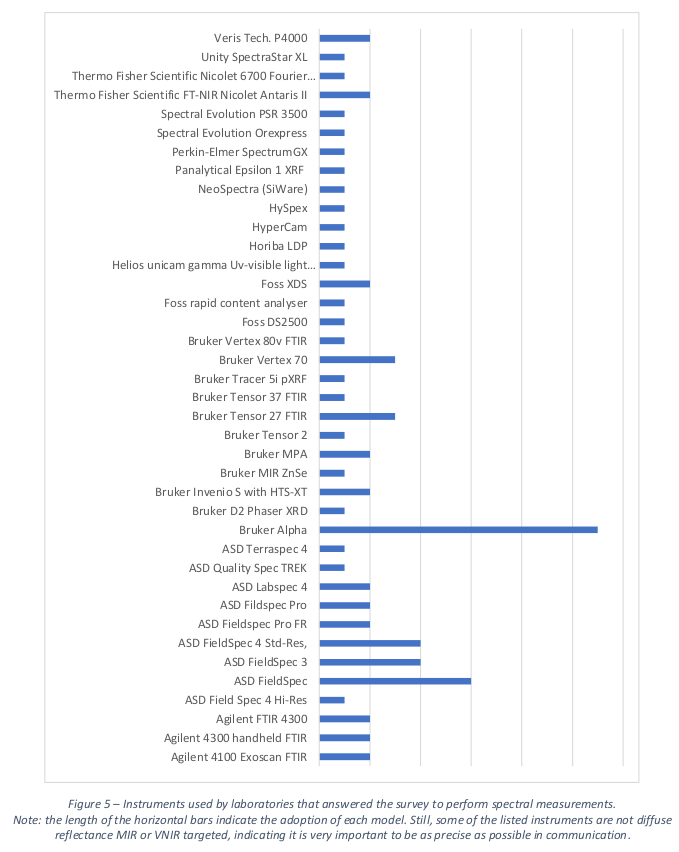
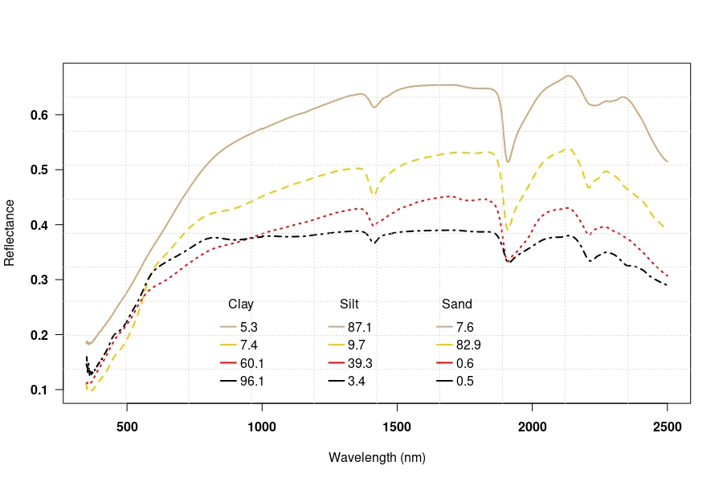
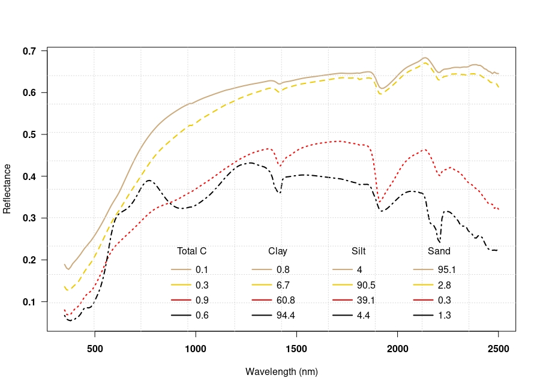

# Soil spectroscopy tools and users

::: {.rmdnote}
You are reading the work-in-progress of the SoilSpec4GG manual. This chapter is currently draft version, a peer-review publication is pending. You can find the polished first edition at <https://soilspectroscopy.github.io/ossl-manual/>.
:::

## Soil Spectroscopy Instruments

(\#fig:soil-db)Most frequently used MIR / VISNIR instruments based on @BenedettiEgmond2021.

### Bruker Alpha 1_FT-MIR_Zn Se

- 🆔 Bruker_Alpha1_FT.MIR.Zn.Se
- 🏭 Producer: Bruker  
- 🔗 Documentation: <https://www.bruker.com/>  
- 📂 Model type: MIR (4000-400 cm-1)  
- 📅 Production year: 2012  

### Bruker Alpha 1_FT-MIR_KBr

- 🆔 Bruker_Alpha1_FT.MIR.KBr
- 🏭 Producer: Bruker  
- 🔗 Documentation: <https://www.bruker.com/>  
- 📂 Model type: MIR (4000-400 cm-1)  
- 📅 Production year: 2012  

### Bruker Vertex 70 with HTS-XT accessory

- 🆔 Bruker_Vertex_70.HTS.XT  
- 🏭 Producer: Bruker  
- 🔗 Documentation: <https://www.bruker.com/en/products-and-solutions/infrared-and-raman/ft-ir-research-spectrometers/vertex-research-ft-ir-spectrometer.html>  
- 📂 Model type: MIR (4000-400 cm-1)  
- 📅 Production year: 2012

### ASD Labspec 2500 with Muglight accessory

- 🆔 ASD_Labspec_2500_MA  
- 🏭 Producer: Malvern Panalytical Ltd / Spectris  
- 🔗 Documentation: <https://www.malvernpanalytical.com/en/products/product-range/asd-range/labspec-range>  
- 📂 Model type: NIR (350nm - 2500nm)  
- 📅 Production year: 2018  

### ASD FieldSpec FR

- 🆔 ASD_FieldSpec_FR  
- 🏭 Producer: Analytical Spectral Devices, Inc.  
- 🔗 Documentation: <https://www.laboratorynetwork.com/doc/fieldspec-pro-fr-portable-spectroradiometer-0001>  
- 📂 Model type: NIR (350nm - 2500nm)  
- 📅 Production year: 2016  

### XDS Rapid Content Analyzer

- 🆔 XDS_Rapid_Content_Analyzer  
- 🏭 Producer: FOSS NIRSystems Inc.  
- 🔗 Documentation: <https://www.selectscience.net/products/xds-rapid-content-analyzer/?prodID=106696>  
- 📂 Model type: NIR (Si 400–1100 nm and PbS 1100–2500 nm detectors)  
- 📅 Production year: 2008  

## Registered soil spectral libraries

### KSSL.SSL

_Description_: MIR and NIR spectral library and associated soil characterization database, which now
includes >50,000 MIR spectra collected on soils primarily from the United States. Freely available by request (see below). 

- 📕 Seybold, C. A., Ferguson, R., Wysocki, D., Bailey, S., Anderson, J., Nester, B., ... & Thomas, P. (2019). [Application of Mid‐Infrared Spectroscopy in Soil Survey](https://doi.org/10.2136/sssaj2019.06.0205). Soil Science Society of America Journal, 83(6), 1746-1759. <https://doi.org/10.2136/sssaj2019.06.0205> / Sanderman, J., Savage, K., & Dangal, S. R. (2020). Mid‐infrared spectroscopy for prediction of soil health indicators in the United States. Soil Science Society of America Journal, 84(1), 251-261. <https://doi.org/10.1002/saj2.20009>  
- 🔗 Project website: <https://www.nrcs.usda.gov/wps/portal/nrcs/main/soils/research/>  
- ©️ Data license: [CC-BY](https://ncsslabdatamart.sc.egov.usda.gov/datause.aspx)  
- 📍 Unique sites: 61,103  
- 📋 Unique complete scans:  
- 📝 Import steps: [KSSL](https://github.com/soilspectroscopy/ossl-imports/tree/main/dataset/KSSL)  

(\#fig:kssl-curves)KSSL VisNIR spectral signatures for different soil texture fractions.

### ICRAF.ISRIC

_Description_: [A Globally Distributed Soil Spectral Library Mid Infrared Diffuse 
Reflectance Spectra](https://data.isric.org/geonetwork/srv/eng/catalog.search#/metadata/1b65024a-cd9f-11e9-a8f9-a0481ca9e724). MIR scans for some 785 profiles from the ISRIC World Soil Reference Collection.
The samples are from 58 countries spanning Africa, Asia, Europe, North America, and South America. 
Data available under the CC-BY 4.0 license.

- 📕 World Agroforestry Centre, (2014). [The ICRAF/ISRIC spectral library](https://worldagroforestry.org/sites/default/files/Description_ICRAF-ISRIC%20Soil%20VNIR%20Spectral%20Library.pdf), Soil-Plant Spectral Diagnostics laboratory, United
Nations Avenue, Nairobi, Kenya. <https://doi.org/10.34725/DVN/MFHA9C>  
- 🔗 Project website: <https://www.worldagroforestry.org/sd/landhealth/soil-plant-spectral-diagnostics-laboratory/soil-spectra-library>  
- ©️ Data license: [CC-BY 4.0](https://creativecommons.org/licenses/by/4.0/)  
- 📍 Unique locations: 785  
- 📋 Unique complete scans: 4308  
- 📝 Import steps: [ICRAF_ISRIC](https://github.com/soilspectroscopy/ossl-imports/tree/main/dataset/ICRAF_ISRIC)  

(\#fig:icraf-curves)ICRAF-ISRIC VisNIR spectral signatures for different soil texture fractions.

### LUCAS.SSL

_Description_: [LUCAS 2009, 2015 top-soil data](https://esdac.jrc.ec.europa.eu/resource-type/soil-point-data). VisNIR scans of some 19,860 in 2009 (2012) and 21,859 points in 2015. 
Data available publicly under condition that _"Graphical representation of individual units on a map is permitted as far as the geographical location of the soil samples is not detectable"_.
Additional 600 samples have been scanned by Woodwell Climate Research using an MIR instrument.

- 📕 Jones, A, Fernandez-Ugalde, O., Scarpa, S., (2020). [LUCAS 2015 Topsoil Survey. Presentation of dataset and results](https://esdac.jrc.ec.europa.eu/resource-type/soil-point-data), EUR 30332 EN, Publications Office of the European Union: Luxembourg, ISBN 978-92-76-21080-1, doi:10.2760/616084, JRC121325.  
- 🔗 Project website: <https://esdac.jrc.ec.europa.eu/resource-type/soil-point-data>  
- ©️ Data license: [JRC License Agreement](https://esdac.jrc.ec.europa.eu/content/lucas2015-topsoil-data)  
- 📍 Unique locations: 41,719  
- 📋 Unique complete scans: 41,719  
- 📝 Import steps: [LUCAS](https://github.com/soilspectroscopy/ossl-imports/tree/main/dataset/LUCAS)  

### AFSIS1.SSL

_Description_: [Africa Soil Information Service (AfSIS) Soil Chemistry Phase I](http://africasoils.net/services/data/soil-databases/). 
MIR and VisNIR scans of 1903 georeferenced soil samples collected from 19 countries in 
Sub-Saharan Africa including a suite of wet chemistry data. Data available publicly 
under Open Data Commons Open Database License ("ODbL") version 1.0, with attribution to AfSIS.
Data retrieved from: <https://registry.opendata.aws/afsis/> and <https://doi.org/10.34725/DVN/QXCWP1>.

- 📕 Vågen, T.-G., Winowiecki, L.A., Desta, L., Tondoh, E.J., Weullow, E., Shepherd, K., Sila, A., (2020). Mid-Infrared Spectra (MIRS) from ICRAF Soil and Plant Spectroscopy Laboratory: Africa Soil Information Service (AfSIS) Phase I 2009-2013. <https://doi.org/10.34725/DVN/QXCWP1>, World Agroforestry - Research Data Repository, V1, UNF:6:bMN2MBGqFewDKHPgIeRjog== [fileUNF].  
- 🔗 Project website: <http://africasoils.net/services/data/soil-databases/>  
- ©️ Data license: [Open Database License ("ODbL")](https://opendatacommons.org/licenses/odbl/)   
- 📍 Unique locations: 1903  
- 📋 Unique complete scans: 3806  
- 📝 Import steps: [AFSIS](https://github.com/soilspectroscopy/ossl-imports/tree/main/dataset/AFSIS)  

### AFSIS2.SSL

_Description_: Africa Soil Information Service (AfSIS) Soil Chemistry Phase II. 
The three datasets for Tanzania (<https://doi.org/10.34725/DVN/XUDGJY>), Ghana (<https://doi.org/10.34725/DVN/SPRSFN>) and Nigeria (<https://doi.org/10.34725/DVN/WLAKR2>). 
Documentation of the datasets is available in @hengl2021african.
Data has been analyzed at the ICRAF Soil-Plant Spectral Diagnostics Laboratory, Nairobi, and the Rothamsted Research. From the 31,269 soil scans, only 820 (2.6%) have reference data atteched to it.

- 📕 Hengl, T., Miller, M.A.E., Križan, J., Shepherd, K.D., Sila, A., Kilibarda, M., Antonijevi, O., Glušica, L., Dobermann, A., Haefele, S.M., McGrath, S.P., Acquah, G.E., Collinson, J., Parente, L., Sheykhmousa, M., Saito, K., Johnson, J-M., Chamberlin, J., Silatsa, F.B.T., Yemefack, M., Wendt, J., MacMillan, R.A., Wheeler I. and Crouch, J. (2021) African soil properties and nutrients mapped at 30 m spatial resolution using two-scale ensemble machine learning. Scientific Reports, 11, 6130. <https://www.nature.com/articles/s41598-021-85639-y>.  
- 🔗 Project website: <https://data.worldagroforestry.org/dataverse/icraf_soils>  
- ©️ Data license: [Creative Commons — CC0 1.0 Universal](https://creativecommons.org/publicdomain/zero/1.0/)   
- 📍 Unique locations: 367  
- 📋 Unique complete scans: 820  
- 📝 Import steps: [AFSIS2](https://github.com/soilspectroscopy/ossl-imports/tree/main/dataset/AFSIS2)  

### CAF.SSL

_Description_: [The Central African Soil Spectral Library](https://doi.org/10.5194/soil-7-693-2021). MIR scans of some collected based on 1800 samples in Central Africa. 

- 📕 Summerauer, L., Baumann, P., Ramirez-Lopez, L., Barthel, M., Bauters, M., Bukombe, B., Reichenbach, M., Boeckx, P., Kearsley, E., Van Oost, K., Vanlauwe, B., Chiragaga, D., Heri-Kazi, A. B., Moonen, P., Sila, A., Shepherd, K., Bazirake Mujinya, B., Van Ranst, E., Baert, G., Doetterl, S., and Six, J. (2021). [The central African soil spectral library: a new soil infrared repository and a geographical prediction analysis](https://doi.org/10.5194/soil-7-693-2021), SOIL, 7, 693–715, <https://doi.org/10.5194/soil-7-693-2021>  
- 🔗 Project website: <https://github.com/laura-summerauer/ssl-central-africa>  
- ©️ Data license: CC-BY?  
- 📍 Unique locations:   
- 📋 Unique complete scans: 1852  
- 📝 Import steps: [CASSL](https://github.com/soilspectroscopy/ossl-imports/tree/main/dataset/CASSL)  

### NEON.SSL

_Description_: [The National Ecological Observatory Network (NEON) Soil Spectral Library](https://www.neonscience.org/samples/soil-archive). Soil samples were sent to KSSL and scanned using standard procedures. 

- 📕 National Ecological Observatory Network, (2021). [Data Product DP1.00096.001, Soil physical and chemical properties, Megapit](https://data.neonscience.org/data-products/DP1.00096.001). Provisional data downloaded from <https://data.neonscience.org>. Battelle, Boulder, CO, USA NEON. / Dangal & Sanderman (2020). Is Standardization Necessary for Sharing of a Large Mid-Infrared Soil Spectral Library? Sensors 20, 6729. <https://doi.org/10.3390/s20236729>  
- 🔗 Project website: <https://www.neonscience.org/samples/soil-archive>  
- ©️ Data license: CC-BY  
- 📍 Unique locations:   
- 📋 Unique complete scans: 305  
- 📝 Import steps: [NEON](https://github.com/soilspectroscopy/ossl-imports/tree/main/dataset/CASSL)  

### SCHIEDUNG.SSL

_Description_: Dataset to the manuscript @Schiedung2022. MIR scans of 284 samples from high-latitude forest soils of Canada. DOI: <https://doi.org/10.5281/zenodo.6024831>.

- 📕 Schiedung, M., Bellè, S.-L., Malhotra, A., & Abiven, S. (2022). [Organic carbon stocks, quality and prediction in permafrost-affected forest soils in north Canada](https://doi.org/10.1016/j.catena.2022.106194). CATENA, 213, 106194. <https://doi.org/10.1016/j.catena.2022.106194>.  
- 🔗 Project website: <https://doi.org/10.5281/zenodo.6024831>  
- ©️ Data license: CC-BY 4.0  
- 📍 Unique locations: 289   
- 📋 Unique complete scans: 259  
- 📝 Import steps: [Schiedung](https://github.com/soilspectroscopy/ossl-imports/tree/main/dataset/Schiedung)  
### GARRETT.SSL

_Description_: A soil dataset from the FR380 trial series spanning 35 Pinus radiata forest sites in New Zealand. The dataset underpins three existing publications by Watt et al. (2005; 2008) and Ross et al. (2009) which details sample sites and the time zero (i.e. time of tree planting) sample collection and testing method. The publication by @Garrett2022 details the soil mid-infrared spectroscopy method and extension on soil chemistry testing using the same time zero samples. A total of 184 samples have publicly available MIR scans.  

- 📕 Garrett, L. G., Sanderman, J., Palmer, D. J., Dean, F., Patel, S., Bridson, J. H., & Carlin, T. (2022). Mid-infrared spectroscopy for planted forest soil and foliage nutrition predictions, New Zealand case study. In Trees, Forests and People (Vol. 8, p. 100280). <https://doi.org/10.1016/j.tfp.2022.100280>.   
- 🔗 Project website: <https://doi.org/10.6084/m9.figshare.20506587.v2>  
- ©️ Data license: CC-BY 4.0  
- 📍 Unique locations: 35   
- 📋 Unique complete scans: 184  
- 📝 Import steps: [Garrett](https://github.com/soilspectroscopy/ossl-imports/tree/main/dataset/Garrett)  

### SERBIA.SSL

_Description_: A soil dataset from the FR380 trial series spanning 35 Pinus radiata forest sites in New Zealand. The dataset underpins three existing publications by Watt et al. (2005; 2008) and Ross et al. (2009) which details sample sites and the time zero (i.e. time of tree planting) sample collection and testing method. The publication by @Garrett2022 details the soil mid-infrared spectroscopy method and extension on soil chemistry testing using the same time zero samples. A total of 184 samples have publicly available MIR scans.  

- 📕 Garrett, L. G., Sanderman, J., Palmer, D. J., Dean, F., Patel, S., Bridson, J. H., & Carlin, T. (2022). Mid-infrared spectroscopy for planted forest soil and foliage nutrition predictions, New Zealand case study. In Trees, Forests and People (Vol. 8, p. 100280). <https://doi.org/10.1016/j.tfp.2022.100280>.   
- 🔗 Project website: <https://doi.org/10.6084/m9.figshare.20506587.v2>  
- ©️ Data license: CC-BY 4.0  
- 📍 Unique locations: 35   
- 📋 Unique complete scans: 184  
- 📝 Import steps: [Garrett](https://github.com/soilspectroscopy/ossl-imports/tree/main/dataset/Garrett)  

## Soil spetroscopy organizations

National and regional soil spectral laboratories actively processing soil samples 
and providing soil spectroscopy services, and other organizations and companies 
producing or using soil spectroscopy data.  

See also: [**The Global Soil Laboratory Network (GLOSOLAN)**](http://www.fao.org/global-soil-partnership/glosolan/en/)

### KSSL

- 📛 Name: The Charles E. Kellogg Soil Survey Laboratory (KSSL)  
- 📫 Address: USDA-NRCS-NSSC, Federal Building, Room 152, Mail Stop 41/51, 100 Centennial Mall North
Lincoln, NE 68508-3866, USA  
- 🔗 Organization website: <https://www.nrcs.usda.gov/wps/portal/nrcs/detail/soils/contactus/?cid=nrcs142p2_053895#laboratory>  
- 🔬 Types of services: USDA soil laboratory, MIR, VisNIR,  

## Soil Spectroscopy software

Open source and commercial software used to process soil spectral scans.
See also this [detailed review of software used for soil spectroscopy](https://soilspectroscopy.org/soil-spectroscopy-state-of-the-art-open-source-software/).
Even more in-depth review of R packages used for soil spectroscopy can be found in @malone2021soil.

### asdreader

- 📛 Name: asdreader  
- 💼 Specialty: Reading ASD Binary Files in R  
- 💻 Programming language: R project  
- 🔗 Homepage: <https://github.com/pierreroudier/asdreader>  
- 📕 Roudier, P. (2020). asdreader: reading ASD binary files in R. R package version 0.1-3 CRAN.  
- ©️ License: GPL  
- 📧 Maintainer: [Pierre Roudier](https://github.com/pierreroudier)

### prospectr

- 📛 Name: prospectr  
- 💼 Specialty: Signal processing, Resampling  
- 💻 Programming language: R project  
- 🔗 Homepage: <https://github.com/l-ramirez-lopez/prospectr>  
- 📕 Stevens, A., & Ramirez-Lopez, L. (2014). An introduction to the prospectr package. R Package Vignette, Report No.: R Package Version 0.1, 3.  
- ©️ License: [MIT](https://cran.r-project.org/web/licenses/MIT) + [file LICENSE](https://cran.r-project.org/web/packages/prospectr/LICENSE)  
- 📧 Maintainer: [Leornardo Ramirez-Lopez](https://orcid.org/0000-0002-5369-5120)

### simplerspec

- 📛 Name: simplerspec  
- 💼 Specialty: Soil and plant spectroscopic model building and prediction  
- 💻 Programming language: R project  
- 🔗 Homepage: <https://philipp-baumann.github.io/simplerspec>  
- 📕 Baumann, P. (2020). simplerspec: Soil and plant spectroscopic model building and prediction. Packages R CRAN.  
- ©️ License: [GNU General Public License v3.0](https://github.com/philipp-baumann/simplerspec/blob/master/LICENSE.md)  
- 📧 Maintainer: [Philipp Baumann](https://github.com/philipp-baumann)

