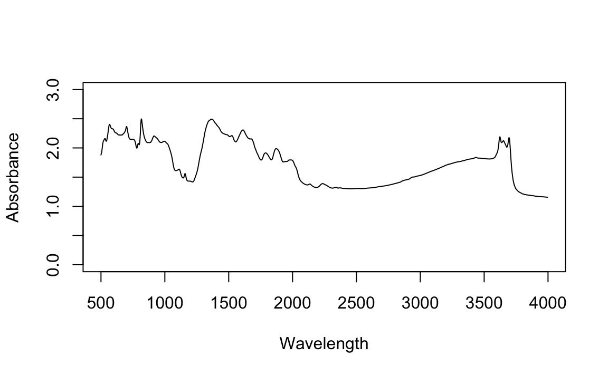
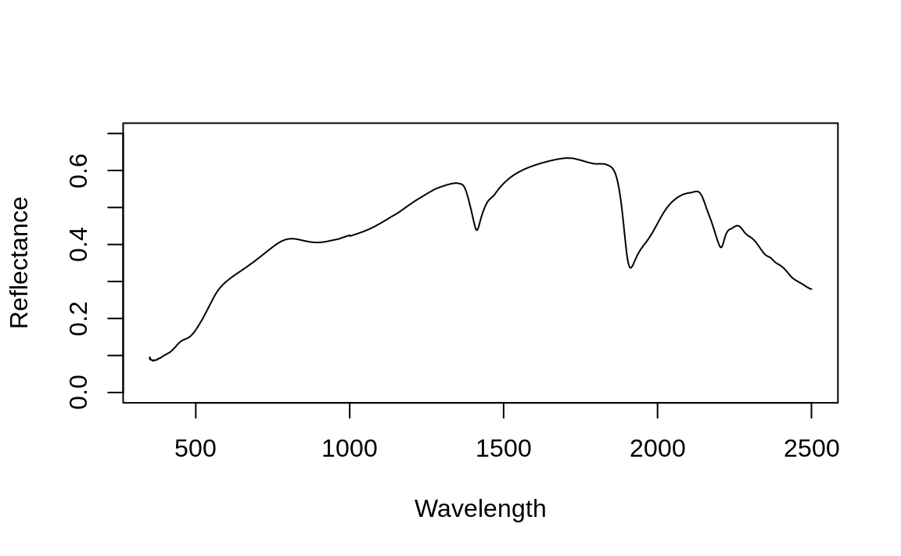

::: {.rmdnote}
You are reading the work-in-progress of the SoilSpec4GG manual. This chapter is currently draft version, a peer-review publication is pending. You can find the polished first edition at <https://soilspectroscopy.github.io/ossl-manual/>.
:::
# Reference soil spectroscopy models

The current reference models were fitted using OSSL database v1.0. We have received important feedback from people that said the current models are doing a great job, but for others not that much. This can be due to the specific soil types not being well represented or due to the spectra not being well aligned with the OSSL. A review is planned to conduct a systematic analysis of learning algorithms, global vs local fitting, compression methods and preprocessing using the new version of the OSSL database.

The following sections describe steps used to produce OSSL models, which 
are used in the OSSL calibration service and API. For more in-depth insight of 
the modeling steps please refer to the [ossl-models](https://github.com/soilspectroscopy/ossl-models) repository.

## OSSL global soil spectroscopy callibrarion models

We have fitted a number of calibration models using OSSL MIR and VisNIR spectra 
and combination of additional covariates, and which are now publicly available 
for use under the CC-BY license. For modeling we use the Ensemble Machine Learning 
framework as implemented in the R [mlr](https://mlr.mlr-org.com/) programming environment 
with the following parameters:

1. Regression on first 60 Principal Component Analysis PC's of the raw spectra;  
2. Four base learners: Random Forest, Gradient Boosting, Cubist and Lasso and Elastic-Net Regularized GLM;  
3. Ensemble Machine Learning by [stacking / meta-learner](https://mlr.mlr-org.com/reference/makeStackedLearner.html) through 5-fold Cross-Validation;  
4. Blocking using 100×100-km spatial grid to avoid possible overfitting;  
5. [Feature selection](https://mlr.mlr-org.com/articles/tutorial/feature_selection.html) and model-parameter fine-tuning using random and sequential backward search;  

For more details on how were the models fitted refer to: <https://github.com/soilspectroscopy/ossl-models>.

For standard global soil spectral calibration models we use various calibration frameworks including:

1. Using only MIR spectra for calibration.  
2. Using only VisNIR spectra for calibration.  
3. Using combination of MIR and VisNIR spectra.  
4. Using combination of MIR and VisNIR spectra + geographic covariates.  

The methods 1 & 2 are standard methods described in literature [@malone2021soil]. The methods 
3 & 4 are referred to as the _"MIR-VisNIR fusion"_ approach [@vohland2022quantification].
The method 4 is the _"field-specific calibration approach"_; we refer to it here 
as the _"bundle approach"_ as we basically use all information available 
to help produce best predictions of targeted soil properties.

Users can choose to opt for one of the multiple calibration models, which also 
depends on the type of data (VisNIR, MIR, coordinates and depths known yes/no) used of course.
The online callibration service (<https://engine.soilspectroscopy.org>) and the API 
can be used for predicting values of soil properties for smaller datasets (<1000 rows). 

Soil spectral scans obtained by different spectroscopic instruments often cannot be 
modeled or analyzed together i.e. they require some kind of calibration [@lei2022achieving] 
before one can fit cross-instrument / cross-dataset calibration models.
In the OSSL library we thus use also instrument / dataset code as the indicator variable. 
The most complex models currently in the OSSL are, thus, one with which users need to define both:

1. Input MIR spectra,
2. Input VisNIR spectra (same samples),
3. Geographical location and soil depth,
4. Instrument code / dataset code;


## Using default OSSL models to predict soil properties

OSSL model registry (RDS) S3 file services currently includes large number of 
prediction models fitted for a list of soil properties. The complete list is available in the file **[OSSL_models_meta.csv](https://github.com/soilspectroscopy/ossl-models)**.


### Predicting soil properties using MIR spectra

For example, to predict [soil organic carbon weight percent](https://soilspectroscopy.github.io/ossl-manual/database.html#oc_usda.calc_wpct) (`oc_usda.calc_wpct`) using MIR spectra, we need to load 
two models (1) principal component model `mpca_mir_kssl_v1.rds`, 
(2) mlr model for predicting `oc_usda.calc_wpct`:


```r
source('./R/ossl_functions.R')
rep = "http://s3.us-east-1.wasabisys.com/soilspectroscopy/ossl_models/"
pcm1 = url(paste0(rep, "pca.ossl/mpca_mir_kssl_v1.rds"), "rb")
eml1 = url(paste0(rep, "log..oc_usda.calc_wpct/mir_mlr..eml_kssl_na_v1.rds"), "rb")
ossl.pca.mir = readRDS(pcm1)
ossl.model = readRDS(eml1)
```

Note that the models (RDS files) can be between 10 to 200 MB in size, depending on complexity of models 
and the size of the training data used. 

The Principal Component Analysis is described in the [OSSL models repository](https://github.com/soilspectroscopy/ossl-models/). 
It is a standard way of compressing 1000+ spectral bands before predictive modeling [@chang2001near].
We use the first 60 PCA components for further modeling, which is an arbitrary decisions.

We can look at the summary of model by typing:


```r
summary(ossl.model$learner.model$super.model$learner.model)
```

```
Residuals:
    Min      1Q  Median      3Q     Max 
-3.4601 -0.0535 -0.0038  0.0442  3.2730 

Coefficients:
                Estimate Std. Error t value Pr(>|t|)    
(Intercept)   -0.0099587  0.0008464 -11.766  < 2e-16 ***
regr.ranger    0.1507935  0.0048442  31.129  < 2e-16 ***
regr.xgboost  -0.0231490  0.0034214  -6.766 1.34e-11 ***
regr.cvglmnet  0.4153936  0.0049604  83.742  < 2e-16 ***
regr.cubist    0.4674533  0.0044788 104.371  < 2e-16 ***
---
Signif. codes:  0 ‘***’ 0.001 ‘**’ 0.01 ‘*’ 0.05 ‘.’ 0.1 ‘ ’ 1

Residual standard error: 0.1501 on 72246 degrees of freedom
Multiple R-squared:  0.9776,	Adjusted R-squared:  0.9776 
F-statistic: 7.891e+05 on 4 and 72246 DF,  p-value: < 2.2e-16
```

This shows that the model is an ensemble Machine Learning model based on stacking of 
four individual models: `regr.ranger` (Random Forest) [@wright2017ranger], `regr.xgboost` (Gradient Boosting) [@chen2015xgboost], 
`regr.cvglmnet` (Lasso and Elastic-Net Regularized GLM) [@friedman2010] and `regr.cubist` (Cubist) [@kuhn2012cubist]. The RMSE 
of the model is 0.150 (R-square = 0.978), based on 5-fold Cross Validation with spatial blocking (global grid with 100 km blocks). 
Model is based on 72,246 training points.

We can take a look at the accuracy plot for this model:

<div class="figure" style="text-align: center">

<p class="caption">(\#fig:ac-soc1)Accuracy plot for `log..oc_usda.calc_wpct/mir_mlr..eml_kssl_na_v1.rds`.</p>
</div>

Next, we load the sample MIR data that we can use to predict soil organic carbon:


```r
mir.raw = read.csv("./sample-data/sample_mir_data.csv")[,-1]
```

This is a simple table with raw MIR spectral data (absorbances) prepared as a table. 
The column names contain the wavelengths / MIR channels:


```r
dim(mir.raw)
## 20  1765
str(mir.raw[,1:10])
```

```
'data.frame':	20 obs. of  10 variables:
 $ X4001.656: num  0.411 0.357 0.296 0.152 0.238 ...
 $ X3999.728: num  0.411 0.357 0.297 0.152 0.239 ...
 $ X3997.799: num  0.411 0.357 0.297 0.153 0.239 ...
 $ X3995.871: num  0.411 0.357 0.298 0.153 0.24 ...
 $ X3993.942: num  0.411 0.357 0.298 0.153 0.24 ...
 $ X3992.014: num  0.411 0.357 0.299 0.154 0.241 ...
 $ X3990.085: num  0.411 0.358 0.299 0.154 0.242 ...
 $ X3988.156: num  0.412 0.358 0.299 0.154 0.242 ...
 $ X3986.228: num  0.412 0.358 0.3 0.154 0.243 ...
 $ X3984.3  : num  0.411 0.358 0.3 0.155 0.243 ...
```

We can generate predictions by using:


```r
pred.oc = predict.ossl(t.var="log..oc_usda.calc_wpct", mir.raw=mir.raw, 
                       ossl.model=ossl.model, ylim=c(0,100),
                       ossl.pca.mir=ossl.pca.mir)
str(pred.oc$pred)
```

where `ylim=c(0,100)` specifies that the prediction values need to be in the range 0 to 100 (values out of these range will be replaced with either 0 or 100).
The output of this model consists of four parts:

```
List of 4
 $ pred :'data.frame':	20 obs. of  5 variables:
 $ x    :'data.frame':	20 obs. of  68 variables:
 $ model:'data.frame':	72251 obs. of  5 variables:
 $ cf   : num 1.38
```

1. Predictions with back-transformed value and lower and upper prediction intervals (1 std.);
2. Data frame with all covariate layers needed to generate predictions;
3. Summary meta-learner with predicted and observed values;
4. Ratio between variance in predictions produced using base learners and MSE;

The predictions are in the format:


```r
str(pred.oc$pred)
```

```
'data.frame':	20 obs. of  5 variables:
 $ pred.mean : num  0.0496 0.1128 0.3848 0.776 -0.0608 ...
 $ pred.error: num  0.115 0.248 0.085 0.151 0.168 ...
 $ tpred.mean: num  0.0509 0.1194 0.4693 1.1728 0 ...
 $ lower.1std: num  0 0 0.35 0.868 0 ...
 $ upper.1std: num  0.179 0.435 0.6 1.527 0.113 ...
 ```

which means that the predicted `oc_usda.calc_wpct` for first row is 0 etc. The 
`lower.1std` and `upper.1std` indicate standard prediction interval based on the 
prediction error derived in the log-space. For higher values of `oc_usda.calc_wpct` 
prediction interval gets thus proportionally higher for larger absolute values e.g. for row 14 it is between 24% and 39%:

```
#pred.oc$pred[14,]
   pred.mean pred.error tpred.mean lower.1std upper.1std
14  3.464914  0.2329579    30.9737   24.32914    39.3613
```

Finally, we can check how well does the new data (MIR scans) reflect the training 
data used to build the calibration models:


```r
library(hexbin)
library(grid)
ossl.pcax.mir = readRDS(url(paste0(rep, "pca.ossl/pca_mir_kssl_v1.rds"), "rb"))
reds = colorRampPalette(RColorBrewer::brewer.pal(9, "YlOrRd")[-1])
hb <- hexbin(ossl.pcax.mir$x[,1:2], xbins=60)
p <- plot(hb, colramp = reds, main='PCA MIR KSSL')
pushHexport(p$plot.vp)
grid.points(pred.oc$x$mir.PC1, pred.oc$x$mir.PC2, pch=17)
```

<div class="figure" style="text-align: center">

<p class="caption">(\#fig:pca-sim)Similary plot new spectra vs training spectra (PC biplot).</p>
</div>

Based on the plot shown above, it appears that some of scans used are less typical 
and hence prediction results should be taken with caution.

### Predicting soil properties using MIR spectra and geographical covariates

Next, we can also predict values at new location using  calibration model that is 
field-specific i.e. we use MIR spectra in combination with geographic covariates. 
To predict with such data we also need to load geographical locations for the same 
MIR scans:


```r
new.soil = read.csv("./sample-data/sample_soilsite_data.csv")
lon = new.soil$longitude.std.decimal.degrees
lat = new.soil$latitude.std.decimal.degrees
hzn_depth = new.soil$lay_depth_to_top + (new.soil$lay_depth_to_bottom - new.soil$lay_depth_to_top)/2
```

This now comes with three additional columns `lon` and `lat` and soil depth `hzn_depth`, which is 
the middle of the top and bottom depth of the soil horizon. To predict with then specify also the additional 
arguments in the function:


```r
eml2 = url(paste0(rep, "log..oc_usda.calc_wpct/mir_mlr..eml_kssl_ll_v1.rds"), "rb")
ossl.model = readRDS(eml2) 
pred.oc2 = predict.ossl(t.var="log..oc_usda.calc_wpct", mir.raw=mir.raw, ossl.model=ossl.model, ylim=c(0,100),
             ossl.pca.mir=ossl.pca.mir, geo.type="ll", lon=lon, lat=lat, hzn_depth=hzn_depth, cog.dir="/data/WORLDCLIM/")
```

This type of prediction is somewhat more complex as the function `predict.ossl` needs also to overlay 
points (`lon` and `lat`) vs some [60+ GeoTIFFs](https://github.com/soilspectroscopy/ossl-models/blob/main/out/global_layers1km.csv) (containing [WorldClim2.1](https://www.worldclim.org/data/worldclim21.html) layers and [MODIS LST](https://doi.org/10.5281/zenodo.1420114) layers). In this case the layers are located on a local machine, which significantly speeds up predictions function. 

We can look at the variable importance table to try to understand how much the 
additional geographical covariate layers help with producing predictions:


```r
xl <- data.frame(importance = ossl.model$learner.model$base.models[[1]]$learner.model$variable.importance)
xl$relative_importance = 100*xl$importance/sum(xl$importance)
xl = xl[order(xl$importance, decreasing = TRUE),]
xl[1:20,]
```

```
                                                      importance relative_importance
mir.PC3                                               6511.36634          27.9140468
mir.PC2                                               3603.29854          15.4472409
hzn_depth                                             2936.76269          12.5898202
mir.PC5                                               2570.81057          11.0209936
mir.PC10                                              1767.58676           7.5775954
mir.PC1                                               1276.53105           5.4724532
mir.PC4                                                925.96202           3.9695735
mir.PC11                                               416.65775           1.7862002
mir.PC24                                               226.11697           0.9693572
mir.PC26                                               158.90309           0.6812131
mir.PC8                                                116.63143           0.4999957
mir.PC16                                               102.35918           0.4388110
mir.PC7                                                 98.52643           0.4223801
clm_lst_mod11a2.jul.day_m_1km_s0..0cm_2000..2017_v1.0   65.31996           0.2800248
mir.PC12                                                62.31378           0.2671374
mir.PC28                                                60.13722           0.2578066
mir.PC15                                                59.47144           0.2549524
clm_lst_mod11a2.jun.day_m_1km_s0..0cm_2000..2017_v1.0   59.17326           0.2536741
mir.PC6                                                 49.88579           0.2138590
mir.PC17                                                49.37638           0.2116752
```

here `hzn_depth` comes as an important covariate and so is `lst_mod11a2.jul.day` 
(MOD11A long-term meand daily temperature for July). The original MIR PCA components, however, 
dominate the prediction model.

The global layers (global land mask at 1-km spatial resolution) are listed at <https://github.com/soilspectroscopy/ossl-models> and are available as a Cloud-service / Cloud-Optimized GeoTIFFs. The process of spatial overlay for new prediction locations, however, can significantly increase 
prediction time, so something to be aware of.

### Predicting soil properties using VisNIR spectra

We can also load VisNIR spectra (reflectances) and predict values using the same function:


```r
visnir.raw = read.csv("./sample-data/sample_visnir_data.csv")[,-c(1:2)]
str(visnir.raw[,1:5])
```

```
'data.frame':	20 obs. of  5 variables:
 $ X350: num  0.0855 0.0677 0.2319 0.3179 0.25 ...
 $ X351: num  0.0839 0.0666 0.2305 0.3195 0.2504 ...
 $ X352: num  0.0816 0.0647 0.2277 0.3184 0.2508 ...
 $ X353: num  0.0811 0.0658 0.2261 0.3134 0.2489 ...
 $ X354: num  0.082 0.0674 0.2258 0.3124 0.2464 ...
 ```

We load another PCA model that we prepared using global VisNIR data and the 
mlr-model that was fitted using VisNIR data:
 

```r
pmc3 = url(paste0(rep, "pca.ossl/mpca_visnir_kssl_v1.rds"), "rb")
eml3 = url(paste0(rep, "log..oc_usda.calc_wpct/visnir_mlr..eml_ossl_na_v1.rds"), "rb")
ossl.pca.visnir = readRDS(pmc3)
ossl.model = readRDS(eml3)
pred.oc3 = predict.ossl(t.var="log..oc_usda.calc_wpct", visnir.raw=visnir.raw, ossl.model=ossl.model,
                        ylim=c(0,100), spc.type = "visnir", ossl.pca.visnir = ossl.pca.visnir)
```

This model is similar to the MIR model, but the accuracy plot indicates that the accuracy 
might be significantly lower:

<div class="figure" style="text-align: center">

<p class="caption">(\#fig:ac-soc2)Accuracy plot for `log..oc_usda.calc_wpct/visnir_mlr..eml_ossl_na_v1.rds`.</p>
</div>

### Importing soil spectral scans using raw data formats

The examples shown above demonstrate prediction results based on using sample 
MIR and VisNIR data (csv files). If you only have raw spectral scan data such as 
[ASD](http://support.asdi.com/Document/Viewer.aspx?id=95) (PAN Analytics Inc.) and/or 
[OPUS files](https://www.bruker.com/en/products-and-solutions/infrared-and-raman/opus-spectroscopy-software.html) (Bruker Inc.), 
you can use various R packages to read files and prepare them for prediction required by OSSL.

Consider for example a sample OPUS file from the [AfSIS-1 project](https://registry.opendata.aws/afsis/), 
which is an original file from the Bruker_Alpha_ZnSe instrument. We can read this file 
thanks to the [simplerspec package](https://philipp-baumann.github.io/simplerspec) by using:


```r
mir.x = simplerspec::read_opus_bin_univ('sample-data/icr056141.0')
#> Extracted spectra data from file: <icr056141.0>
names(mir.x)
#>  [1] "metadata"          "spc"               "spc_nocomp"       
#>  [4] "sc_sm"             "sc_rf"             "ig_sm"            
#>  [7] "ig_rf"             "wavenumbers"       "wavenumbers_sc_sm"
#> [10] "wavenumbers_sc_rf"
```

which gives a list of object including `spc` which are the spectral bands:


```r
dim(mir.x[["spc"]])
#> [1]    1 1715
```

we can plot the MIR absorbance curve for this scan by using:


```r
x = as.numeric(names(mir.x[["spc"]]))
matplot(y=as.vector(t(mir.x[["spc"]])), x=x,
        ylim = c(0,3),
        type = 'l', 
        xlab = "Wavelength", 
        ylab = "Absorbance"
        )
```

<div class="figure" style="text-align: center">

<p class="caption">(\#fig:plot-opus)Spectral absorbances plot using MIR data.</p>
</div>

This dataset is hence ready to generate predictions using global OSSL models. We can, 
for example generate prediction of soil pH using the following model:

<div class="figure" style="text-align: center">

<p class="caption">(\#fig:ac-ph1)Accuracy plot for `log..oc_usda.calc_wpct/mir_mlr..eml_ossl_ll_v1.rds`.</p>
</div>

in this case we need to add also lon-lat coordinates and specify the soil depth:


```r
pcm3 = url(paste0(rep, "pca.ossl/mpca_mir_ossl_v1.rds"), "rb")
eml3 = url(paste0(rep, "log..oc_usda.calc_wpct/mir_mlr..eml_ossl_ll_v1.rds"), "rb")
ossl.pca.mir = readRDS(pcm3)
ossl.model = readRDS(eml3)
pred.oc1 = predict.ossl(t.var="log..oc_usda.calc_wpct", mir.raw=mir.x[["spc"]], ossl.model=ossl.model, 
             ossl.pca.mir=ossl.pca.mir, geo.type="ll", lon=28.50299833, lat=-13.10194667, hzn_depth=10, 
             cog.dir="/data/WORLDCLIM/", dataset.code_ascii_c="AFSIS1.SSL", ylim=c(0,100))
```

which gives us predictions of `log..oc_usda.calc_wpct`:


```r
pred.oc1$pred
```

```
    pred.mean pred.error tpred.mean lower.1std upper.1std
1 -0.02636144  0.2813155          0          0  0.2904023
```

Note that we had to now specify that this MIR data is from AfSIS project via the 
`AFSIS1.SSL` argument.

Likewise, we can also read the ASD files using the [asdreader package](https://github.com/pierreroudier/asdreader), so we can 
generate predictions using VisNIR spectra. Consider for example the sample data 
from the KSSL VisNIR repository:


```r
asd.raw = as.data.frame(asdreader::get_spectra("sample-data/101453MD01.asd"))
dim(asd.raw)
#> [1]    1 2151
```


```r
x = as.numeric(names(asd.raw))
matplot(y=as.vector(t(asd.raw)), x=x,
        ylim = c(0,0.7),
        type = 'l', 
        xlab = "Wavelength", 
        ylab = "Reflectance"
        )
```

<div class="figure" style="text-align: center">

<p class="caption">(\#fig:plot-ads)Spectral reflectance plot using VisNIR data.</p>
</div>

we can also directly predict `ph.h2o_usda.4c1_index` by using:


```r
pmc3 = url(paste0(rep, "pca.ossl/mpca_visnir_kssl_v1.rds"), "rb")
eml4 = url(paste0(rep, "ph.h2o_usda.4c1_index/visnir_mlr..eml_ossl_na_v1.rds"), "rb")
ossl.pca.visnir = readRDS(pmc3)
ossl.model = readRDS(eml4)
pred.ph2 = predict.ossl(t.var="ph.h2o_usda.4c1_index", visnir.raw=asd.raw, 
        ossl.model=ossl.model, spc.type="visnir", ossl.pca.visnir=ossl.pca.visnir)
pred.ph2$pred
```

```
  pred.mean pred.error lower.1std upper.1std
1  6.292328  0.9341607   5.358167   7.226489
```

We are currently building an API that will work directly with standard raw files 
coming directly from the instruments. This should help make the OSSL more robust 
and applicable to thousands of requests on a daily basis.

Wrongly formatted spectral scans can lead to artifacts and should be used with care. 
Note that complexity of soil spectral scans remains high, including the file sizes that are 
difficult to open and read (few thousands of columns) 
and are often not supported in standard tabular software e.g. LibreOffice or similar. 
We recommend thus to report any issues you might have via our [project GitHub](https://github.com/soilspectroscopy) so we 
can all help each other produce more accurate primary soil data.

### The bundle approach to soil spectroscopy calibration

One of the approaches used to calibrate soil spectroscopy data in the Soil Spectroscopy 
for Global Good project is to use a combination of VisNIR, MIR, spatial location 
and Earth Observation data, basically any additional information that could potentially 
help with calibration. We refer to this as the _"bundle approach"_. The key 
assumption of the bundle approach is that accuracy of predictions could be somewhat 
improved, which is especially important for soil organic carbon monitoring and similar. 
Some previous research e.g. by @hong2022fusion and @vohland2022quantification indicate 
that such fusion techniques could help improve accuracy of, especially, _in-situ_ methods.

Because several of the training data sets, especially the KSSL and ICRAF-ISRIC, 
come with both VisNIR and MIR scans, and are documented in detail, we were able 
to fit global calibration models that can now be used to predict soil properties from a combination of data.
Consider for example a sample from North Dakota with a profile code `S2014ND095001`, and 
sample code `235157` (classified as _"Fine-loamy, mixed, superactive, frigid Calcic Hapludoll"_). 
This sample was taken at location lon=-99.2064444; lat=48.8000056; and covers 
the depth interval 101--125 cm (B2 horizon). We can predict value of soil pH by 
using both VisNIR and MIR scans for the same sample:


```r
mir.x = simplerspec::read_opus_bin_univ('sample-data/235157XS01.0')
#> Extracted spectra data from file: <235157XS01.0>
asd.raw = as.data.frame(asdreader::get_spectra("sample-data/235157MD01.asd"))
```

This time we need to load 2 PCA models (1) for VisNIR and (2) MIR spectra, and one 
model for the bundle calibration `visnir.mir_mlr..eml_ossl_na_v1.rds`: 

To make the prediction, we need to specify multiple inputs:


```r
pcm.m = url(paste0(rep, "pca.ossl/mpca_mir_ossl_v1.rds"), "rb")
pcm.v = url(paste0(rep, "pca.ossl/mpca_visnir_ossl_v1.rds"), "rb")
eml.b = url(paste0(rep, "log..oc_usda.calc_wpct/visnir.mir_mlr..eml_ossl_na_v1.rds"), "rb")
ossl.pca.mir = readRDS(pcm.m)
ossl.pca.visnir = readRDS(pcm.v)
ossl.model = readRDS(eml.b)
pred.ph.b = predict.ossl(t.var="log..oc_usda.calc_wpct", spc.type="visnir.mir", 
             mir.raw=mir.x[["spc"]], visnir.raw=asd.raw, 
             ossl.model=ossl.model, ossl.pca.mir=ossl.pca.mir,  
             ossl.pca.visnir=ossl.pca.visnir, hzn_depth=113)
```

which gives:


```r
pred.ph.b$pred
```

```
  pred.mean pred.error tpred.mean lower.1std upper.1std
1 0.2532955 0.02471756  0.2882639  0.2568115  0.3205034
```

We can look at the model prediction accuracy based on 5-fold cross-validation:

```
Residuals:
    Min      1Q  Median      3Q     Max 
-3.1514 -0.0625 -0.0015  0.0571  3.1702 

Coefficients:
               Estimate Std. Error t value Pr(>|t|)    
(Intercept)   -0.019667   0.001207 -16.297   <2e-16 ***
regr.ranger    0.213650   0.006611  32.319   <2e-16 ***
regr.xgboost  -0.012230   0.005358  -2.283   0.0225 *  
regr.cvglmnet  0.479673   0.006236  76.923   <2e-16 ***
regr.cubist    0.337446   0.005674  59.470   <2e-16 ***
---
Signif. codes:  0 ‘***’ 0.001 ‘**’ 0.01 ‘*’ 0.05 ‘.’ 0.1 ‘ ’ 1

Residual standard error: 0.1577 on 37312 degrees of freedom
Multiple R-squared:  0.9767,	Adjusted R-squared:  0.9767 
F-statistic: 3.91e+05 on 4 and 37312 DF,  p-value: < 2.2e-16
```

This shows that the model has an RMSE of 0.156 (in log-scale), which seems to be the [among the best performing models](https://github.com/soilspectroscopy/ossl-models) 
for predicting soil organic carbon content in % from spectral scans. Thus, in this specific case, also the 
prediction error shows relatively narrow range of uncertainty.

<div class="figure" style="text-align: center">

<p class="caption">(\#fig:ac-phm)Accuracy plot for `log..oc_usda.calc_wpct/visnir.mir_mlr..eml_ossl_na_v1.rds` the VisNIR-MIR combination. As compared with other calibration models this seems to be most accurate, although difference with the pure MIR model is not significant.</p>
</div>

The bundle approach in the OSSL is used at the moment by default for all soil 
variables, although one should keep in mind that the training points are more 
patchy i.e. are less representative of the global conditions. As more and more 
training data is added to the OSSL, we should be able to serve more representative 
calibration models.

The bundle approach could be further extended to using also e.g.: 

- spatial covariates (e.g. WorldClim layers),  
- bare-Earth Spectra [@dematte2020bare],  
- soil moisture daily estimates (matching the date of soil sampling) [@brocca2019sm2rain], 

<div class="figure" style="text-align: center">

<p class="caption">(\#fig:map-bareearth)Example of a satellite-based bare-earth spectral product based on @dematte2020bare. The global data is available at 250-m spatial resolution.</p>
</div>

More and more layers will be gradually added to the OSSL registry to enable users to 
increase accuracy of their predictions. For updates in the OSSL model library 
please subscribe to [our channels](https://soilspectroscopy.org) to stay up-to-date.

## Registering your own model

### Access OSSL data to fit your own models

To load the complete analysis-ready OSSL regression-matrix dataset (486MB) as a 
single table in R and run predictive modeling please use:


```r
rep2 = "http://s3.us-east-1.wasabisys.com/soilspectroscopy/ossl_import/"
rm.ossl = readRDS(url(paste0(rep2, "rm.ossl_v1.rds"), "rb"))
```

```
dim(rm.ossl)
## 152,146 obs. of 2962 variables
```

The compilation currently contains training MIR (70k) and VisNIR (70k) spectral 
scans + soil calibration data (51,732 unique locations).

We are now fitting [globally-applicable prediction models](https://github.com/soilspectroscopy/ossl-models) 
to enable free and open production of primary soil data. [The output models](https://doi.org/10.5281/zenodo.5759693) are available via the S3 cloud-service 
and/or API under CC-BY license. If you fit your own models and/or if you are interested in contributing 
to this project please contact us and help us make better open soil data for global good!

### Registering and hosting models

If you plan to contribute your own models to the Soil Spectroscopy for Global Good project 
please follow these steps:

1. We recommend registering and sharing new models via S3 file 
    service system (e.g. via OpenGeoHub's Wasabi.com cloud-service) with RDS files produced using 
    [Dockerized solution for full scientific reproducibility](https://github.com/nuest/docker-reproducible-research).  
2. For each model the following metadata need to be supplied:
    - Registered [docker image](https://hub.docker.com/r/opengeohub/r-geo); which should specify in detail: software in 
    use, R package versions etc;
    - DOI of the zenodo repository with a back-up for the data (i.e. how to cite your models);
    - URL for accessing the RDS file via S3; 

We can host your models on our infrastructure at no additional costs. Please 
[contact us](https://soilspectroscopy.org/contact/) and apply for registering your models via soilspectroscopy.org.
