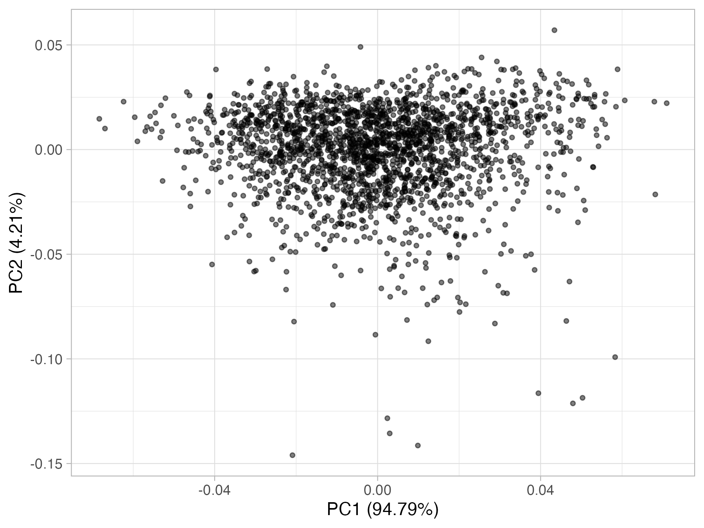

# Neospectra database

::: {.rmdnote}
You are reading the work-in-progress of the SoilSpec4GG manual. This chapter is currently draft version, a peer-review publication is pending.
:::

A persistent copy of the database is hosted on [Zenodo](https://doi.org/10.5281/zenodo.7586622). Please use the following reference when using the Neospectra database:

>Sanderman, J., Smith, C., Safanelli, J. L., Mitu, S. M., Ge, Y., Murad, O., & Shepherd, K. (2023). Near-infrared (NIR) soil spectral library using the NeoSpectra Handheld NIR Analyzer by Si-Ware. doi:10.5281/ZENODO.7586622.

## Overview

Recent advances in hardware technology have enabled the development of handheld sensors with similar performance specifications as laboratory-grade near-infrared (NIR) spectrometers.

We have compiled a hand-held NIR spectral library (1350-2550 nm) using the NeoSpectra Handheld NIR Analyzer developed by [Si-Ware](https://www.si-ware.com/). Each scanner is fitted with Fourier-Transform technology based on the semiconductor Micro Electromechanical Systems (MEMS) manufacturing technique, promising accuracy, and consistency between devices.

This library includes 2,106 distinct mineral soil samples scanned across 9 of these portable low-cost NIR spectrometers (indicated by serial no). 2,016 of these soil samples were selected to represent the diversity of mineral soils found in the United States, and 90 samples were selected across Ghana, Kenya, and Nigeria.

519 of the US samples were selected and scanned by [Woodwell Climate Research Center](https://www.woodwellclimate.org/). These samples were queried from the [USDA NRCS NSSC-KSSL Soil Archives](https://ncsslabdatamart.sc.egov.usda.gov/) as having a complete set of eight measured properties (TC, OC, TN, CEC, pH, clay, sand, and silt). They were stratified based on the major horizon and taxonomic order, omitting the categories with less than 500 samples. Three percent of each stratum (i.e., a combination of major horizon and taxonomic order) was then randomly selected as the final subset retrieved from KSSL's physical soil archive as 2-mm sieved samples.

The remaining 1,604 US samples were queried from the USDA NRCS NSSC-KSSL Soil Archives by the [University of Nebraska - Lincoln](University of Nebraska - Lincoln) to meet the following criteria: Lower depth <= 30 cm, pH range 4.0 to 9.5, Organic carbon <10%, Greater than lower detection limits, Actual physical samples available in the archive, Samples collected and analyzed from 2001 onwards, Samples having complete analyses for high-priority properties (Sand, Silt, Clay, CEC, Exchangeable Ca, Exchangeable Mg, Exchangeable K, Exchangeable Na, CaCO3, OC, TN), & MIR scanned.

All samples were scanned dry 2mm sieved. ~20g of sample was added to a plastic weighing boat where the NeoSpectra scanner would be placed down to make direct contact with the soil surface. The scanner was gently moved across the surface of the sample as 6 replicate scans were taken. These replicates were then averaged so that there is one spectra per sample per scanner in the resulting database.




## Database access

### Google Cloud Bucket

Use the following URLs to access the whole database levels:

**Compressed csv**  
<https://storage.googleapis.com/soilspec4gg-public/neospectra_soillab_v1.2.csv.gz>  
<https://storage.googleapis.com/soilspec4gg-public/neospectra_soilsite_v1.2.csv.gz>  
<https://storage.googleapis.com/soilspec4gg-public/neospectra_nir_v1.2.csv.gz>  
<https://storage.googleapis.com/soilspec4gg-public/neospectra_mir_v1.2.csv.gz>  

**qs format (preferred on R)**  
<https://storage.googleapis.com/soilspec4gg-public/neospectra_soillab_v1.2.qs>  
<https://storage.googleapis.com/soilspec4gg-public/neospectra_soilsite_v1.2.qs>  
<https://storage.googleapis.com/soilspec4gg-public/neospectra_nir_v1.2.qs>  
<https://storage.googleapis.com/soilspec4gg-public/neospectra_mir_v1.2.qs>  

Example with R.

```r
## Packages
library("tidyverse")
library("curl")
library("qs")

## Separate files
soil <-  "https://storage.googleapis.com/soilspec4gg-public/neospectra_soillab_v1.2.qs"
soil <- curl_fetch_memory(soil)
soil <- qdeserialize(soil$content)

nir <- "https://storage.googleapis.com/soilspec4gg-public/neospectra_nir_v1.2.qs"
nir <- curl_fetch_memory(nir)
nir <- qdeserialize(nir$content)

## Join
neospectra <- right_join(soil, nir, by = c("id.sample_local_c"))
```

### MongoDB

Available collections:  

- **neospectra_soilsite**: site information, e.g., coordinates, pedons, layers, etc.  
- **neospectra_soillab**: soil laboratory data (wet chemistry), e.g., soil texture, carbon, etc.  
- **neospectra_nir**: Near-infrared (NIR) spectral data in the 1350-2550 nm range with metadata.  
- **neospectra_mir**: Middle-infrared (MIR) spectral data in the 600-4000 cm<sup>-1</sup> range with metadata.  

>**<span style="color:orange;">NOTE: Within the MongoDB, all the dots in column names are replaced by underscore.</span>**

Accessing in R:

```r
## Packages and helping functions
library(mongolite)
library(jsonify)

soilspec4gg.db = list(
  host = 'api.soilspectroscopy.org',
  name = 'soilspec4gg',
  user = 'soilspec4gg',
  pw = 'soilspec4gg'
)

soilspec4gg.db$url <- paste0(
  'mongodb://', soilspec4gg.db$user, ':', 
  soilspec4gg.db$pw, '@', 
  soilspec4gg.db$host, '/', 
  soilspec4gg.db$name, '?ssl=true'
)

soilspec4gg.init <- function() {
  print('Creating the access for mongodb collections.')
  soilspec4gg.db$collections <<- list(
    neospectra_soilsite = mongo(collection = 'neospectra_soilsite', url = soilspec4gg.db$url, verbose = TRUE),
    neospectra_soillab = mongo(collection = 'neospectra_soillab', url = soilspec4gg.db$url, verbose = TRUE),
    neospectra_nir = mongo(collection = 'neospectra_nir', url = soilspec4gg.db$url, verbose = TRUE),
    neospectra_mir = mongo(collection = 'neospectra_mir', url = soilspec4gg.db$url, verbose = TRUE)
  ) 
}

## Accessing the database

# Initialization
soilspec4gg.init()

# Checking available collections
names(soilspec4gg.db$collections)

# Get all records for neospectra_soilsite table
soilspec4gg.db$collections$neospectra_soilsite$count("{}")

# Read all data from a collection back to the R environment
neospectra_soilsite <- soilspec4gg.db$collections$neospectra_soilsite$find('{}')

# Getting unique values for a field
soilspec4gg.db$collections$neospectra_soilsite$distinct(key = "scan_nir_model_name_utf8_txt")

# Getting column names
names(soilspec4gg.db$collections$neospectra_soilsite$find('{}', limit = 1))
names(soilspec4gg.db$collections$neospectra_soillab$find('{}', limit = 1))
names(soilspec4gg.db$collections$neospectra_nir$find('{}', limit = 1))
names(soilspec4gg.db$collections$neospectra_mir$find('{}', limit = 1))

# Query a specific device
nir.neo1 <- soilspec4gg.db$collections$neospectra_nir$find('{"scan_nir_model_name_utf8_txt" : "NEO1"}')

# Filtering by ID
soilspec4gg.db$collections$neospectra_soillab$find('{"id_sample_local_c": "30747"}')
```

## Database description
