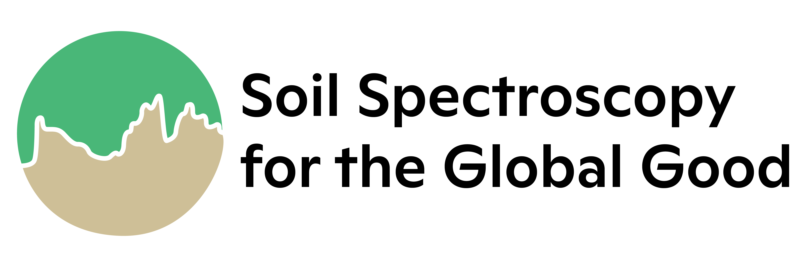
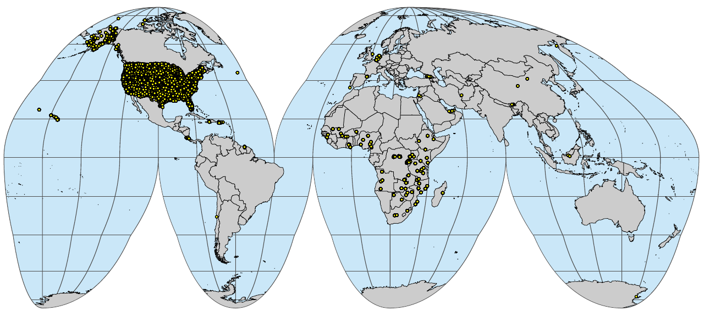

# About

<span style="background-color: #FFFF00">This document is **UNDER CONSTRUCTION**.</span>

```{r ossl-logo, echo=FALSE, out.width="60%"}

```

> "Man’s most human characteristic is not his ability to learn, which he shares 
> with many other species, but his ability to teach and store what others have 
> developed and taught him."
> Margaret Mead, Culture and Commitment: The New Relationships Between the Generations in the 1970s

## Soil Spectroscopy for Global Good

[**SoilSpec4GG**](https://soilspectroscopy.org/) is a USDA-funded [Food and Agriculture Cyberinformatics
Tools Coordinated Innovation Network NIFA Award #2020-67021-32467](https://nifa.usda.gov/press-release/nifa-invests-over-7-million-big-data-artificial-intelligence-and-other) project. It brings together soil
scientists, spectroscopists, informaticians, data scientists and
software engineers to overcome some of the current bottlenecks
preventing wider and more efficient use of soil spectroscopy. A series
of working groups will be formed to address topics including calibration
transfer, model choice, outreach & demonstration, and use of
spectroscopy to inform global carbon cycle modeling. For more info refer
to: <https://soilspectroscopy.org/>.

R tutorials and software developed to implement OSSL is available via: <https://github.com/soilspectroscopy>.

Soil spectroscopy for global good project works with other global initiatives including the **[FAO Global Soil Partnership](https://www.fao.org/global-soil-partnership/glosolan/en/)** and the **[IEEE P4005 Standards and Protocols for Soil Spectroscopy](https://sagroups.ieee.org/4005/)** Working Group.

## What is soil spectroscopy? 

Soil spectroscopy is the measurement of light absorption when light in the [visible, near infrared or mid 
infrared (Vis–NIR–MIR) regions of the electromagnetic spectrum](https://en.wikipedia.org/wiki/Electromagnetic_spectrum) is applied to a soil surface. The proportion 
of the incident radiation reflected by soil is sensed through Vis–NIR–MIR reflectance spectroscopy. 
These characteristic spectra (see Fig. below) can then be used to estimate numerous soil attributes including: minerals, organic compounds and water. 

```{r soil-pnts, echo=FALSE, fig.cap="Schematic explanation of the soil spectroscopy. For more info see: https://soilspectroscopy.org/.", out.width="100%"}
knitr::include_graphics("img/Spectroscopy-Schematic.jpeg")
```

```{r soil-visnir, echo=FALSE, fig.cap="Example of spectral signatures for large number of VisNIR scans (KSSL).", out.width="80%"}
knitr::include_graphics("img/VNIR_Raw_Spectra.png")
```

## Open Soil Spectral Library

[](https://doi.org/10.5281/zenodo.5759693)

**Open Soil Spectral Library** (OSSL) is a suite of datasets, web-services, software and tutorials.
It includes (see also <https://github.com/soilspectroscopy>):

- A soil spectral DB (mongoDB),  
- API calibration service available from <https://api.soilspectroscopy.org>,  
- Front-end solutions: **OSSL [Engine](https://engine.soilspectroscopy.org/)** and **[Explorer](https://explorer.soilspectroscopy.org/)**,  
- An R package `ossl` with all functionality used by the API,  
- Registry of global and local calibration models (<https://github.com/soilspectroscopy/>),  
- Tutorials included in this book,  

The OSSL-DB has been prepared following the OSSL schema which is available at:

As a general rule of thumb we recommend all contributors to use the following 
general OSSL scheme to organize Soil Observations & Measurements with four main tables 
and metadata + legends organized in other tables:

```{r soil-db, echo=FALSE, fig.cap="Recommended OSSL database schema.", out.width="100%"}
knitr::include_graphics("img/design_soil_om_sheme.png")
```

To access global compilation of soil legacy point data sets refer to <https://github.com/OpenGeoHub/SoilSamples> repository.
To access and use Soil Spectroscopy tools also refer to <https://soilspectroscopy.org/>.

```{r pnts-vnir, echo=FALSE, fig.cap="Up-to-date distribution of points with VisNIR scans.", out.width="100%"}
knitr::include_graphics("img/visnir.pnts_sites.png")
```


```{r pnts-mir, echo=FALSE, fig.cap="Up-to-date distribution of points with MIR scans.", out.width="100%"}

```

## OSSL mongoDB

[MongoDB](https://www.mongodb.com/) is an Open Source noSQL DB hence fast and fully scalable and extendable 
(affordable costs for cloud solutions such as [MongoDB Atlas](https://www.mongodb.com/cloud/atlas) and similar). 
TensorFlow and other cutting-edge ML algorithms can be easily integrated and served through a GUI.

To access OSSL DB best use the mongoDB either through a graphical user 
interface using [Robo 3T](https://robomongo.org/download), or by using the [mongodb via R](https://www.mongodb.com/languages/mongodb-and-r-example). 
The following parameters (database credentials) allow ready only access to DB:

- Name: soilspec4gg  
- Address: api.soilspectroscopy.org  
- Database: soilspec4gg  
- Username: soilspec4gg  
- Password: soilspec4gg  

```{r, echo=FALSE, message=FALSE, results='hide'}
ls <- c("mongolite", "jsonify")
new.packages <- ls[!(ls %in% installed.packages()[,"Package"])]
if(length(new.packages)) install.packages(new.packages)
x = lapply(ls, require, character.only = TRUE)
```

```{r mongodb-gui, echo=FALSE, fig.cap="Accessing the OSSL DB using [MongoDB GUI](https://robomongo.org/download).", out.width="90%"}
knitr::include_graphics("img/mongodb_gui.png")
```

First, we need to specify the parameters:

```{r}
library(mongolite)
library(jsonify)
source("R/ossl_functions.R")
soilspec4gg.db = list(
  host = 'api.soilspectroscopy.org',
  name = 'soilspec4gg',
  user = 'soilspec4gg',
  pw = 'soilspec4gg'
)
soilspec4gg.db$url <- paste0(
  'mongodb://', soilspec4gg.db$user, ':', 
  soilspec4gg.db$pw, '@', 
  soilspec4gg.db$host, '/', 
  soilspec4gg.db$name, '?ssl=true'
)
```

Next, we can initiate connection:

```{r}
soilspec4gg.init()
```

and now we can query and load data directly into R, for example to get a sample from AfSIS1:

```{r}
id = "icr006475" 
soilspec.sample = soilspec4gg.samplesById(id)
dim(soilspec.sample)
```


## Target variables of interest

Soil spectral scan, through the calibration procedure, are used to determine various soil variables. 
[GLOSOLAN's Standard Operating Procedures (SOPs)](http://www.fao.org/global-soil-partnership/glosolan/soil-analysis/standard-operating-procedures/en/#c763834) list four groups of soil variables of interest to international soil spectroscopy projects:

Soil chemical variables:

- pH,  
- Carbon,  
- Phosphorous,  
- Potassium,  
- Nitrogen,  
- Exchangeable cations and CEC,  
- Extractable microelements,  
- Trace and major element analyses,  
- Gypsum,  
- Electrical conductivity and total soluble salt content,  
- Soluble sulfate and chloride analysis,  
- Special analysis for peats, mineral and organic soils, agriculture and forest,  

Soil physical variables:

- Bulk density,  
- Coarse fragments,  
- Particle-size distribution,  
- Water retention curve,  
- Porosity,  
- Hydraulic conductivity function,  
- Aggregate stability,  
- Moisture content,  

Soil biological variables:

- Microbial biomass,  
- Soil Respiration,  
- Enzyme activity,  
- Microbial identification,  

Soil contaminants:

- Heavy metal elements: As, Hg, Cu, Cd, Pb and similar,  
- Other soil pollutants,  

This list is constantly updated. In the OSSL we focus on soil variables for which 
there is enough global calibration measurements to fit reasonable models. Currently, 
the largest component of the OSSL is the [USDA's KSSL](https://www.nrcs.usda.gov/wps/portal/nrcs/main/soils/research/) data that list about 60 variables for which 
there is enough data to fit calibration models.

## Contributing data

We encourage public and private entities to help this project and share SSL data. 
The following four modes of data sharing are especially encouraged:

1. Open your data by releasing it under Creative Commons ([CC-BY](https://creativecommons.org/licenses/by/4.0/), [CC-BY-SA](https://creativecommons.org/licenses/by-sa/4.0/))  
or Open Data Commons Open Database License ([ODbL](https://opendatacommons.org/licenses/odbl/)). 
This data can then directly imported into the OSSL.  
2. Donate a small part (e.g. 5%) of your data (release under [CC-BY](https://creativecommons.org/licenses/by/4.0/), [CC-BY-SA](https://creativecommons.org/licenses/by-sa/4.0/) and/or [ODbL](https://opendatacommons.org/licenses/odbl/)). 
This data can then directly imported into the OSSL.  
2. Allow SoilSpectroscopy.org project direct access to your data so that we can run data mining 
and then release ONLY results of data mining under some Open Data license.  
3. Use OSSL data to produce new derivative products, then share them through own 
infrastructures OR contact us for providing hosting support.  

We can sign professional **Data Sharing Agreements** with data producers 
that specify in detail how will the data be used. Our primary interest is in enabling research, 
sharing and use of models (calibration and prediction) and collaboration of groups 
across borders.

We take especial care that your data is secured, encrypted where necessary, 
and kept safely, closely following our [privacy policy and terms of use](https://www.woodwellclimate.org/privacy-policy/).

## Contributing documentation

Please feel free to contribute technical documentation. See [GitHub
repository](https://github.com/soilspectroscopy/ossl-manual) for more detailed
instructions.

Information outdated or missing? Please [open an issue](https://github.com/soilspectroscopy/ossl-manual/issues) or best do a
correction in the text and then make a [pull
request](https://docs.github.com/en/github/collaborating-with-issues-and-pull-requests/creating-a-pull-request).

## Contributors

If you've contribute, add also your name and Twitter, ORCID or blog link
below:

[Jonathan Sanderman](https://twitter.com/sandersoil), 
[Tomislav Hengl](https://twitter.com/tom_hengl),
[Katherine Todd-Brown](https://www.essie.ufl.edu/people/name/kathe-todd-brown/), 
[Leandro L. Parente](https://www.linkedin.com/in/leal-parente/), 
[Wanderson de Sousa Mendes](https://www.linkedin.com/in/wanderson-de-sousa-mendes-75a16195/)  

## Disclaimer

Whilst utmost care has been taken by the Soil Spectroscopy project and data authors while
collecting and compiling the data, the data is provided _"as is"_. [Woodwell Climate Research Center](https://www.woodwellclimate.org/), [University of Florida](https://faculty.eng.ufl.edu/ktoddbrown/), [OpenGeoHub foundation](https://opengeohub.org/about) and its 
suppliers and licensors hereby disclaim all warranties of any kind, express or implied, 
including, without limitation, the warranties of merchantability, fitness for a particular 
purpose and non-infringement. Neither [Woodwell Climate Research Center](https://www.woodwellclimate.org/), [University of Florida](https://faculty.eng.ufl.edu/ktoddbrown/), [OpenGeoHub foundation](https://opengeohub.org/about) nor its suppliers and licensors, 
makes any warranty that the Website will be error free or that access thereto will be 
continuous or uninterrupted. You understand that you download from, or otherwise obtain 
content or services through, the Website at your own discretion and risk.

In no event shall the data authors, the Soil Spectroscopy project, or relevant funding
agencies be liable for any actual, incidental or consequential damages arising from use of the data.
By using the Soil Spectroscopy project data, the user expressly acknowledges that the Data
may contain some nonconformities, defects, or errors. No warranty is given that the data will meet
the user's needs or expectations or that all nonconformities, defects, or errors can or will be
corrected. The user should always verify actual data; therefore the user bears all responsibility in
determining whether the data is fit for the user’s intended use.

This document is **under construction**. If you notice an error or outdated information, 
please submit a correction / pull request or **[open an issue](https://github.com/soilspectroscopy/ossl-manual/issues)**.  

This is a community project. No profits are being made from building and serving 
Open Spectral Library. If you would like to become a sponsor of the project, please 
contact us via: <https://soilspectroscopy.org/contact/>.  

## Licence

This website/book and attached software is free to use, and is licensed under [the MIT License](https://en.wikipedia.org/wiki/MIT_License). The OSSL training data and models, 
if not otherwise indicated, is available either under the [Creative Commons Attribution 4.0 International CC-BY](https://creativecommons.org/licenses/by/4.0/legalcode) 
and/or [CC-BY-SA](https://creativecommons.org/licenses/by-sa/4.0/legalcode) license / [Open Data Commons Open Database License (ODbL) v1.0](https://opendatacommons.org/licenses/odbl/1-0/).

## Suggested literature

Some other connected publications and initiatives describing collation, 
import and use of soil spectroscopy data:

- Angelopoulou, T., Balafoutis, A., Zalidis, G., & Bochtis, D. (2020). [From laboratory to proximal sensing spectroscopy for soil organic carbon estimation—a review](https://doi.org/10.3390/su12020443). Sustainability, 12(2), 443. <https://doi.org/10.3390/su12020443>  
- Ayres, E. (2019). [Quantitative Guidelines for Establishing and Operating Soil Archives](https://doi.org/10.2136/sssaj2019.02.0050). Soil Science Society of America Journal, 83(4), 973-981. <https://doi.org/10.2136/sssaj2019.02.0050>  
- Benedetti, F. and van Egmond, F. (2021). [Global Soil Spectroscopy Assessment](https://doi.org/10.4060/cb6265en). Spectral soil data – Needs and capacities. Rome, FAO. <https://doi.org/10.4060/cb6265en>  
- Dudek, M., Kabała, C., Łabaz, B., Mituła, P., Bednik, M., & Medyńska-Juraszek, A. (2021). [Mid-Infrared Spectroscopy Supports Identification of the Origin of Organic Matter in Soils](https://doi.org/10.3390/land10020215). Land, 10(2), 215. <https://doi.org/10.3390/land10020215>  
- [GLOSOLAN's Standard Operating Procedures (SOPs)](http://www.fao.org/global-soil-partnership/glosolan/soil-analysis/standard-operating-procedures/en/#c763834);  
- Nocita, M., Stevens, A., van Wesemael, B., Aitkenhead, M., Bachmann, M., Barthès, B., ... & Wetterlind, J. (2015). [Soil spectroscopy: An alternative to wet chemistry for soil monitoring](https://doi.org/10.1016/bs.agron.2015.02.002). Advances in agronomy, 132, 139-159. <https://doi.org/10.1016/bs.agron.2015.02.002>  
- Sanderman, J., Savage, K., Dangal, S. R., Duran, G., Rivard, C., Cavigelli, M. A., ... & Stewart, C. (2021). [Can Agricultural Management Induced Changes in Soil Organic Carbon Be Detected Using Mid-Infrared Spectroscopy?](https://doi.org/10.3390/rs13122265). Remote Sensing, 13(12), 2265. <https://doi.org/10.3390/rs13122265>  
- Sanderman, J., Savage, K., & Dangal, S. R. (2020). [Mid-infrared
spectroscopy for prediction of soil health indicators in the United
States](https://doi.org/10.1002/saj2.20009). Soil Science Society of America Journal, 84(1), 251–261.
<https://doi.org/10.1002/saj2.20009>  
- Wijewardane, N. K., Ge, Y., Wills, S., & Libohova, Z. (2018). [Predicting
physical and chemical properties of US soils with a mid-infrared
reflectance spectral library](https://doi.org/10.2136/sssaj2017.10.0361). Soil Science Society of America Journal,
82(3), 722–731. <https://doi.org/10.2136/sssaj2017.10.0361>  
- Wadoux, A.M.J.-C., Malone, B., McBratney, A.B., Fajardo, M., Minasny, B., (2021). [Soil Spectral Inference with R: Analysing Digital Soil Spectra Using the R Programming Environment](https://books.google.nl/books?id=4kQgEAAAQBAJ). Progress in Soil Science, Springer Nature, ISBN: 9783030648961, 274 pp.  

## Acknowledgments

Open Soil Spectral Library was possible due to the kind contributions by public and private 
organizations. Listed based on the date of import:

- **[USDA-NRCS Kellogg Soil Survey Laboratory](https://www.nrcs.usda.gov/wps/portal/nrcs/main/soils/research/)** mid-infrared (MIR) spectral library [@wijewardane2018predicting;@sanderman2020mid] was used as the basis for this data set and corresponding services; we are especially grateful to **Rich Ferguson & Scarlett Murphy (NRCS USDA)** for their help with 
importing and using the KSSL Soil Spectral Library;  
- **[ICRAF-ISRIC Soil VNIR Spectral Library](https://doi.org/10.34725/DVN/MFHA9C)** [@garrity2004globally; @aitkenhead2018exploring] 785 soil profiles (4,438 samples) selected from the Soil Information System (ISIS) of the International Soil Reference and Information Centre (ISRIC) <https://doi.org/10.34725/DVN/MFHA9C>;  
- **[AfSIS-I Soil Spectral Library](https://doi.org/10.34725/DVN/QXCWP1)** Mid-Infrared Spectra (MIRS) from ICRAF Soil and Plant Spectroscopy Laboratory Africa Soil Information Service (AfSIS) Phase I 2009-2013 [@Vagen_2020], a collaborative project funded by the Bill and Melinda Gates Foundation (BMGF). Partners included: CIAT-TSBF, ISRIC, CIESIN, The Earth Institute at Columbia University and World Agroforestry (ICRAF) <https://doi.org/10.34725/DVN/QXCWP1>;  
- **[LUCAS topsoil (VisNIR) Soil Spectral Library](http://esdac.jrc.ec.europa.eu/)** [@orgiazzi2018lucas] was made available by the European Commission through the European Soil Data Centre managed by the Joint Research Centre (JRC), <http://esdac.jrc.ec.europa.eu/>; we have degraded location accuracy of points so that exact locations are about 1-km off;  
- **[The Central African Soil Spectral Library](https://github.com/laura-summerauer/ssl-central-africa)** described in detail in @Summerauer2021 contains limited number of samples representing Central Africa <https://doi.org/10.5281/zenodo.4320395>;  
- **The National Ecological Observatory Network (NEON) Soil Spectral** is based on the NEON soil data [@ayres2019quantitative], which were scanned by the Woodwell Climate Research and USDA-NRCS Kellogg Soil Survey Laboratory; the [(NEON) Megapit Soil Archive](https://www.neonscience.org/samples/soil-archive) is a program sponsored by the National Science Foundation and operated under cooperative agreement by Battelle;  

We are grateful to **[Wanderson de Sousa Mendes (Leibniz Centre for Agricultural Landscape Research (ZALF))](https://www.linkedin.com/in/wanderson-de-sousa-mendes-75a16195/)** for 
help with initial screening of the data for the development of the R code for processing soil spectroscopy data.

For more advanced uses of the soil spectral libraries **we advise to contact the original data producers** 
especially to get help with using, extending and improving the original SSL data.

We are also grateful to **[USDA National Institute of Food and Agriculture #2020-67021-32467](https://nifa.usda.gov/press-release/nifa-invests-over-7-million-big-data-artificial-intelligence-and-other)** for providing funding for this project.
