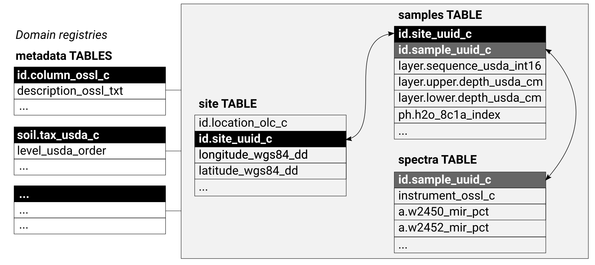

# About

<span style="background-color: #FFFF00">This document is **UNDER CONSTRUCTION**.</span>

## Soil Spectroscopy for Global Good

[**SoilSpec4GG**](https://soilspectroscopy.org/) is a USDA-funded [Food and Agriculture Cyberinformatics
Tools Coordinated Innovation Network NIFA Award #2020-67021-32467](https://nifa.usda.gov/press-release/nifa-invests-over-7-million-big-data-artificial-intelligence-and-other) project. It brings together soil
scientists, spectroscopists, informaticians, data scientists and
software engineers to overcome some of the current bottlenecks
preventing wider and more efficient use of soil spectroscopy. A series
of working groups will be formed to address topics including calibration
transfer, model choice, outreach & demonstration, and use of
spectroscopy to inform global carbon cycle modeling. For more info refer
to: <https://soilspectroscopy.org/>.

Soil spectroscopy for global good project works closely in collaboration with 
[FAO Global Soil Partnership](http://www.fao.org/global-soil-partnership/pillars-action/5-harmonization/glosolan/en/), who also aim at building and providing 
a [GSP Soil Spectral Calibration Library and Estimation Service](http://www.fao.org/3/ca8431en/ca8431en.pdf).

## What is soil spectroscopy? 

Soil spectroscopy is the measurement of light absorption when light in the [visible, near infrared or mid 
infrared (Vis–NIR–MIR) regions of the electromagnetic spectrum](https://en.wikipedia.org/wiki/Electromagnetic_spectrum) is applied to a soil surface. The proportion 
of the incident radiation reflected by soil is sensed through Vis–NIR–MIR reflectance spectroscopy. 
These characteristic spectra (see Fig. below) can then be used to estimate numerous soil attributes including: minerals, organic compounds and water. 

```{r soil-pnts, echo=FALSE, fig.cap="Schematic explanation of the soil spectroscopy. For more info see: https://soilspectroscopy.org/.", out.width="100%"}
knitr::include_graphics("img/Spectroscopy-Schematic.jpeg")
```

## Open Soil Spectral Library

**Open Soil Spectral Library** (OSSL) is a suite of datasets, web-services, software and tutorials.
It includes:

- A soil spectral DB available from <https://db.soilspectroscopy.org>,  
- API calibration service available from <https://api.soilspectroscopy.org>,  
- Front-end solutions,  
- An R package `ossl` with all functionality used by the API,  
- Registry of global and local calibration models,  
- Tutorials included in this book,  

The OSSL-DB has been prepared following the OSSL schema which is available at:

As a general rule of thumb we recommend all contributors to use the following 
general scheme to organize Soil Observations & Measurements with three main tables 
and metadata + legends organized in other tables:

```{r soil-db, echo=FALSE, fig.cap="Recommended soil profiles and soil samples database schema.", out.width="100%"}

```

To access global compilation of soil legacy point data sets refer to <https://github.com/OpenGeoHub/SoilSamples> repository.
To access and use Soil Spectroscopy tools also refer to <https://soilspectroscopy.org/>.

## Target variables of interest

Soil spectral scan, through the calibration procedure, are used to determine various soil variables. 
[GLOSOLAN's Standard Operating Procedures (SOPs)](http://www.fao.org/global-soil-partnership/glosolan/soil-analysis/standard-operating-procedures/en/#c763834) list four groups of soil variables of interest to international soil spectroscopy projects:

Soil chemical variables:

- pH,  
- Carbon,  
- Phosphorous,  
- Potassium,  
- Nitrogen,  
- Exchangeable cations and CEC,  
- Extractable microelements,  
- Trace and major element analyses,  
- Gypsum,  
- Electrical conductivity and total soluble salt content,  
- Soluble sulfate and chloride analysis,  
- Special analysis for peats, mineral and organic soils, agriculture and forest,  

Soil physical variables:

- Bulk density,  
- Coarse fragments,  
- Particle-size distribution,  
- Water retention curve,  
- Porosity,  
- Hydraulic conductivity function,  
- Aggregate stability,  
- Moisture content,  

Soil biological variables:

- Microbial biomass,  
- Soil Respiration,  
- Enzyme activity,  
- Microbial identification,  

Soil contaminants:

- Heavy metal elements: As, Hg, Cu, Cd, Pb and similar,  
- Other soil pollutants,  

This list is constantly updated. In the OSSL we focus on soil variables for which 
there is enough global calibration measurements to fit reasonable models. Currently, 
the largest component of the OSSL is the [USDA's KSSL](https://www.nrcs.usda.gov/wps/portal/nrcs/main/soils/research/) data that list about 60 variables for which 
there is enough data to fit calibration models.

## Contributing data

We encourage public and private entities to help this project and share SSL data. 
The following four modes of data sharing are especially encouraged:

1. Open your data by releasing it under Creative Commons ([CC-BY](https://creativecommons.org/licenses/by/4.0/), [CC-BY-SA](https://creativecommons.org/licenses/by-sa/4.0/))  
or Open Data Commons Open Database License ([ODbL](https://opendatacommons.org/licenses/odbl/)). 
This data can then directly imported into the OSSL.  
2. Donate a small part (e.g. 5%) of your data (release under [CC-BY](https://creativecommons.org/licenses/by/4.0/), [CC-BY-SA](https://creativecommons.org/licenses/by-sa/4.0/) and/or [ODbL](https://opendatacommons.org/licenses/odbl/)). 
This data can then directly imported into the OSSL.  
2. Allow SoilSpectroscopy.org project direct access to your data so that we can run data mining 
and then release ONLY results of data mining under some Open Data license.  
3. Use OSSL data to produce new derivative products, then share them through own 
infrastructures OR contact us for providing hosting support.  

We can sign professional **Data Sharing Agreements** with data producers 
that specify in detail how will the data be used. Our primary interest is in enabling research, 
sharing and use of models (calibration and prediction) and collaboration of groups 
across borders.

We take especial care that your data is secured, encrypted where necessary, 
and kept safely, closely following our [privacy policy and terms of use](https://www.woodwellclimate.org/privacy-policy/).

## Contributing documentation

Please feel free to contribute technical documentation. See [GitHub
repository](https://gitlab.com/soilspectroscopy) for more detailed
instructions.

Information outdated or missing? Please open an issue or best do a
correction in the text and then make a [pull
request](https://docs.github.com/en/github/collaborating-with-issues-and-pull-requests/creating-a-pull-request).

## Contributors

If you've contribute, add also your name and Twitter, ORCID or blog link
below:

[Jonathan Sanderman](https://twitter.com/sandersoil), [Tomislav Hengl](https://twitter.com/tom_hengl),
[Katherine Todd-Brown](https://www.essie.ufl.edu/people/name/kathe-todd-brown/),  

## Disclaimer

The data is provided "as is". [Woodwell Climate Research Center](https://www.woodwellclimate.org/), [University of Florida](https://faculty.eng.ufl.edu/ktoddbrown/), [OpenGeoHub foundation](https://opengeohub.org/about) and its 
suppliers and licensors hereby disclaim all warranties of any kind, express or implied, 
including, without limitation, the warranties of merchantability, fitness for a particular 
purpose and non-infringement. Neither [Woodwell Climate Research Center](https://www.woodwellclimate.org/), [University of Florida](https://faculty.eng.ufl.edu/ktoddbrown/), [OpenGeoHub foundation](https://opengeohub.org/about) nor its suppliers and licensors, 
makes any warranty that the Website will be error free or that access thereto will be 
continuous or uninterrupted. You understand that you download from, or otherwise obtain 
content or services through, the Website at your own discretion and risk.

This document is **under construction**. If you notice an error or outdated information, 
please submit a correction / pull request or open an issue.  

This is a community project. No profits are being made from building and serving 
Open Spectral Library. If you would like to become a sponsor of the project, please 
contact us via: <https://soilspectroscopy.org/contact/>.

## Licence

This website/book and attached software is free to use, and is licensed under [the MIT License](https://en.wikipedia.org/wiki/MIT_License).

## Suggested literature

Some other connected publications and initiatives describing collation 
and import of soil spectroscopy data:

- Benedetti, F. and van Egmond, F. 2021. Global Soil Spectroscopy Assessment. Spectral soil data – Needs and capacities. Rome, FAO. <https://doi.org/10.4060/cb6265en>  
- Dudek, M., Kabała, C., Łabaz, B., Mituła, P., Bednik, M., & Medyńska-Juraszek, A. (2021). Mid-Infrared Spectroscopy Supports Identification of the Origin of Organic Matter in Soils. Land, 10(2), 215. <https://doi.org/10.3390/land10020215>  
- [GLOSOLAN's Standard Operating Procedures (SOPs)](http://www.fao.org/global-soil-partnership/glosolan/soil-analysis/standard-operating-procedures/en/#c763834); 
- Sanderman, J., Savage, K., Dangal, S. R., Duran, G., Rivard, C., Cavigelli, M. A., ... & Stewart, C. (2021). [Can Agricultural Management Induced Changes in Soil Organic Carbon Be Detected Using Mid-Infrared Spectroscopy?](https://doi.org/10.3390/rs13122265). Remote Sensing, 13(12), 2265. <https://doi.org/10.3390/rs13122265>  
- Sanderman, J., Savage, K., & Dangal, S. R. (2020). [Mid-infrared
spectroscopy for prediction of soil health indicators in the United
States](https://doi.org/10.1002/saj2.20009). Soil Science Society of America Journal, 84(1), 251–261.
<https://doi.org/10.1002/saj2.20009>  
- Wijewardane, N. K., Ge, Y., Wills, S., & Libohova, Z. (2018). [Predicting
physical and chemical properties of US soils with a mid-infrared
reflectance spectral library](https://doi.org/10.2136/sssaj2017.10.0361). Soil Science Society of America Journal,
82(3), 722–731. <https://doi.org/10.2136/sssaj2017.10.0361>   
- Wadoux, A.M.J.-C., Malone, B., McBratney, A.B., Fajardo, M., Minasny, B., (2021). [Soil Spectral Inference with R: Analysing Digital Soil Spectra Using the R Programming Environment](https://books.google.nl/books?id=4kQgEAAAQBAJ).  
Progress in Soil Science, Springer Nature, ISBN: 9783030648961, 274 pp.  
