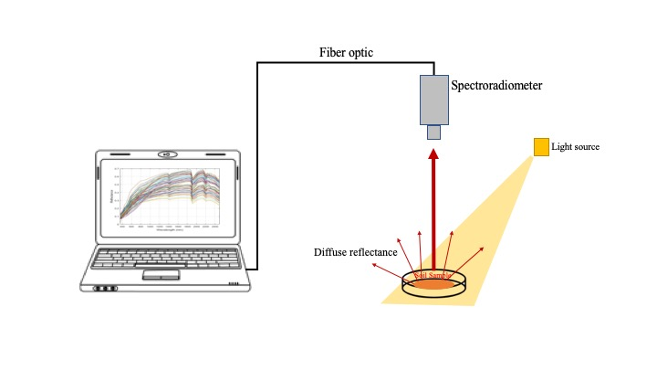
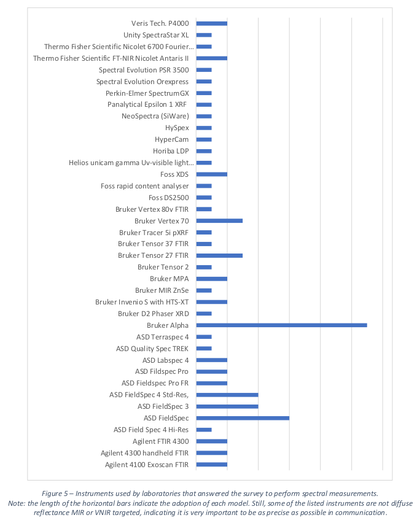

# Soil spectroscopy {#sec-soilspec}

## What is soil spectroscopy

Soil spectroscopy refers to the measurement of light interaction with soil. Various methods exist to measure this interaction with the goal of understanding the mineral and organic composition of soils. The most common technique is to measure the absorption when a non-collimated flux of light from the [visible and infrared region of the electromagnetic spectrum](https://en.wikipedia.org/wiki/Electromagnetic_spectrum) is applied to a soil surface. The proportion of the incident radiation reflected by the soil compared to a reference material is measured, forming the basis of [diffuse reflectance spectroscopy](https://en.wikipedia.org/wiki/Diffuse_reflectance_spectroscopy). Distinct characteristic spectra can then be used to estimate various soil properties, including particle size distribution, minerals, and organic compounds. The OSSL is composed of diffuse reflectance spectra collected across the visible (Vis), near- (NIR), and mid-infrared (MIR) regions.

::: {.callout-tip}
## Spectral regions
Visible and near-infrared (VisNIR) is typically represented between 350–2500 nm, while the mid-infrared (MIR) ranges between 2500–25000 nm (formally described as 4000–400 cm^-1^). In the OSSL, we have also imported a specific near-infrared library built with the Neospectra scanner (Si-Ware), with its range covering the 1350-2550 nm region. 
:::

With a collection of soil spectra and corresponding soil properties measured by conventional methods, one can fit [predictive models](https://soilspectroscopy.github.io/soilspec-workshop/intro.html) to quantitatively estimate various soil properties on new scanned soil samples. This method is cost-effective, faster, does not produce chemical residues, and is more scalable than traditional soil analysis techniques. A soil spectral library, such as the OSSL, provides the training data for building and testing predictive models, which are typically developed using machine learning or chemometric algorithms. The effectiveness of these predictive models depends significantly on how well the library represents the variability and diversity of both current and new soil samples intended for prediction.

## Estimating soil properties

Given that each soil spectral library that was imported into the OSSL used distinct procedures for analytically determining reference values, the incompatibility has been a subject of internal discussion in this project. Some global initiatives have been facing this same issue in their soil databases but there still no clear or full consensus on how to harmonize those different methods. This has been a topic of great discussion and research development at the [Global Soil Partnership’s Global Soil Laboratory Network (GLOSOLAN)](https://www.fao.org/global-soil-partnership/glosolan/en/).

In order to maximize transparency, for now, we have decided to produce two different levels for the OSSL database. `Level 0` takes into account the original methods employed in each dataset but tries to initially fit them to two reference lists: [KSSL Guidance – Laboratory Methods and Manuals](https://www.nrcs.usda.gov/resources/guides-and-instructions/kssl-guidance) and ISO standards. A copy of the KSSL procedures and coding scheme is archived in [ossl-imports](https://github.com/soilspectroscopy/ossl-imports/blob/main/out/kssl_procedures.csv).

If a reference method does not fall in any previous method, then we create a new variable sharing at least a common property and unit. A final harmonization takes place in the OSSL `Level 1`, where those common properties sharing different methods are converted to a target method using some publicly available transformation rule, or in the worst scenario, they are naively binded or kept separated to produce its specific model. All the implementations are documented in the [ossl-import/ossl_level0_to_level1_soillab_harmonization.csv](https://github.com/soilspectroscopy/ossl-imports/blob/main/out/ossl_level0_to_level1_soillab_harmonization.csv) repository.

In addition, [GLOSOLAN's Standard Operating Procedures (SOPs)](http://www.fao.org/global-soil-partnership/glosolan/soil-analysis) list four groups of soil variables of interest to international soil spectroscopy projects:

Soil chemical variables:

- pH,  
- Carbon,  
- Phosphorous,  
- Potassium,  
- Nitrogen,  
- Exchangeable cations and CEC,  
- Extractable microelements,  
- Trace and major element analyses,  
- Gypsum,  
- Electrical conductivity and total soluble salt content,  
- Soluble sulfate and chloride analysis,  
- Special analysis for peats, mineral and organic soils, agriculture and forest. 

Soil physical variables:

- Bulk density,  
- Coarse fragments,  
- Particle-size distribution,  
- Water retention curve,  
- Porosity,  
- Hydraulic conductivity function,  
- Aggregate stability,  
- Moisture content,  

Soil biological variables:

- Microbial biomass,  
- Soil Respiration,  
- Enzyme activity,  
- Microbial identification,  

Soil contaminants:

- Heavy metal elements: As, Hg, Cu, Cd, Pb and similar,  
- Other soil pollutants,  

## Predictive modeling

From initial findings with the OSSL @Safanelli2025, on average, the MIR range appears to be the best spectral region for developing spectral prediction models, followed by VisNIR and NIR (Neospectra). This happens because the MIR contains several fundamental and resolved absorption features from mineral and organic functional groups that translate to better prediction capacity, despite challenges in the interpretation that stem from chemical heterogeneity. VisNIR and NIR spectra, in turn, are made of overtones from the fundamental vibrations of the MIR range, hence, are less sensitive to soil constituents and may result in inferior performance. In addition, we found good performance for some soil properties that may not directly affect soil spectra but can be indirectly inferred and quantified (secondary properties), such as cation exchange capacity, pH, soil contaminants, etc. However, understanding both primary and secondary components in the soil helps to better understand the factors that contribute to the improvement of spectral predictive models within the complex context of soil systems and also to select the spectral range, where they are most pronounced.

We recommend visiting a [**dedicated tutorial**](https://soilspectroscopy.github.io/soilspec-workshop/) where we present and walk through the modeling framework employed with the OSSL. We recommend checking the introduction section to understand why soil spectroscopy is a **fit-for-purpose technology**, why **good predictions flow only from good data**, and the **best practices for model calibration**.

The OSSL paper @Safanelli2025 also describes and validates in detail the OSSL models.

## Instruments

A [Global Soil Spectroscopy Assessment](https://openknowledge.fao.org/items/43aca83e-f3eb-4648-9f61-e3acdc7e62a3) was published in 2021 by FAO @BenedettiEgmond2021, where a number of instruments were identified in soil spectroscopy laboratories. Within the SS4GG initiative, we published a paper on the spectral dissimilarity of 20 MIR instruments @Safanelli2023 providing clear recommendations to overcome this problem. A second analysis of VisNIR instruments is being developed in collaboration with the [IEEE P4005 working group](https://sagroups.ieee.org/4005/).

## Software

There are many proprietary and open source software used to process spectral measurements. We provide below a list (not exhaustive) of the most common packages/modules that can be used in R or Python (both FOSS) for importing, preprocessing, and analyzing soil spectral data:

### SoilSpecData

- `r emoji::emoji("name_badge")` Name: SoilSpecData  
- `r emoji::emoji("briefcase")` Specialty: A Python package for handling soil spectroscopy data, with a focus on the Open Soil Spectral Library (OSSL) in Python.  
- `r emoji::emoji("computer")` Programming language: Python    
- `r emoji::emoji("link")` Homepage: [Website](https://fr.anckalbi.net/soilspecdata/), [GitHub](https://github.com/franckalbinet/soilspecdata)  
- `r emoji::emoji("closed_book")` Albinet, F. SoilSpecData: A Python package for handling soil spectroscopy data, with a focus on the Open Soil Spectral Library (OSSL). Python package. Available in: <https://fr.anckalbi.net/soilspecdata/>.    
- `r emoji::emoji("copyright")` License: [Apache-2.0 license](https://github.com/franckalbinet/soilspecdata?tab=Apache-2.0-1-ov-file#readme)
- `r emoji::emoji("e-mail")` Maintainer: [Franck Albinet](https://github.com/franckalbinet)

### SoilSpecTfm

- `r emoji::emoji("name_badge")` Name: SoilSpecTfm  
- `r emoji::emoji("briefcase")` Specialty: A Python package for handling soil spectroscopy data, with a focus on the Open Soil Spectral Library (OSSL) in Python.  
- `r emoji::emoji("computer")` Programming language: Python    
- `r emoji::emoji("link")` Homepage: [Website](https://fr.anckalbi.net/soilspectfm/), [GitHub](https://github.com/franckalbinet/soilspecdata)  
- `r emoji::emoji("closed_book")` Albinet, F. SoilSpecTfm: Provides Scikit-Learn compatible transforms for spectroscopic data preprocessing. Python package. Available in: <https://github.com/franckalbinet/soilspectfm>.    
- `r emoji::emoji("copyright")` License: [Apache-2.0 license](https://github.com/franckalbinet/soilspectfm#Apache-2.0-1-ov-file)
- `r emoji::emoji("e-mail")` Maintainer: [Franck Albinet](https://github.com/franckalbinet)

### opusreader2

- `r emoji::emoji("name_badge")` Name: opusreader2  
- `r emoji::emoji("briefcase")` Specialty: Read OPUS binary files from Fourier-Transform Infrared (FT-IR) spectrometers of the company Bruker Optics GmbH & Co. in R
- `r emoji::emoji("computer")` Programming language: R    
- `r emoji::emoji("link")` Homepage: [GitHub](https://github.com/spectral-cockpit/opusreader2)  
- `r emoji::emoji("closed_book")` Baumann P, Knecht T, Roudier P (2023). opusreader2: Read spectroscopic data
  from Bruker OPUS binary Files. R package version 0.6.3.  
- `r emoji::emoji("copyright")` License: [MIT](https://github.com/spectral-cockpit/opusreader2/blob/main/LICENSE)
- `r emoji::emoji("e-mail")` Maintainer: [spectral-cockpit](https://github.com/spectral-cockpit)

### asdreader

- `r emoji::emoji("name_badge")` Name:   asdreader
- `r emoji::emoji("briefcase")` Specialty: Reading ASD binary files in R  
- `r emoji::emoji("computer")` Programming language: R  
- `r emoji::emoji("link")` Homepage: [GitHub](https://github.com/pierreroudier/asdreader)  
- `r emoji::emoji("closed_book")` Roudier, P. (2020). asdreader: reading ASD binary files in R. R package version 0.1-3 CRAN.  
- `r emoji::emoji("copyright")` License: GPL  
- `r emoji::emoji("e-mail")` Maintainer: [Pierre Roudier](https://github.com/pierreroudier)

### prospectr

- `r emoji::emoji("name_badge")` Name: prospectr  
- `r emoji::emoji("briefcase")` Specialty: Signal processing, resampling  
- `r emoji::emoji("computer")` Programming language: R  
- `r emoji::emoji("link")` Homepage: [GitHub](https://github.com/l-ramirez-lopez/prospectr)  
- `r emoji::emoji("closed_book")` Stevens, A., & Ramirez-Lopez, L. (2022). An introduction to the prospectr package. R Package Vignette. R Package Version 0.2.6.  
- `r emoji::emoji("copyright")` License: [MIT](https://cran.r-project.org/web/licenses/MIT) + [file LICENSE](https://cran.r-project.org/web/packages/prospectr/LICENSE)  
- `r emoji::emoji("e-mail")` Maintainer: [Leornardo Ramirez-Lopez](https://github.com/l-ramirez-lopez)

### simplerspec

- `r emoji::emoji("name_badge")` Name: simplerspec  
- `r emoji::emoji("briefcase")` Specialty: Soil and plant spectroscopic model building and prediction  
- `r emoji::emoji("computer")` Programming language: R  
- `r emoji::emoji("link")` Homepage: [GitHub](https://philipp-baumann.github.io/simplerspec)  
- `r emoji::emoji("closed_book")` Baumann, P. (2020). simplerspec: Soil and plant spectroscopic model building and prediction. Packages R CRAN.  
- `r emoji::emoji("copyright")` License: [GNU General Public License v3.0](https://github.com/philipp-baumann/simplerspec/blob/master/LICENSE.md)  
- `r emoji::emoji("e-mail")` Maintainer: [Philipp Baumann](https://github.com/philipp-baumann)

### resemble

- `r emoji::emoji("name_badge")` Name: resemble  
- `r emoji::emoji("briefcase")` Specialty: Memory-based learning in spectral chemometrics
- `r emoji::emoji("computer")` Programming language: R  
- `r emoji::emoji("link")` Homepage: [GitHub](https://github.com/l-ramirez-lopez/resemble)  
- `r emoji::emoji("closed_book")` Ramirez-Lopez, L., and Stevens, A., and Viscarra Rossel, R., and Lobsey, C., and Wadoux, A., and Breure, T. (2022). resemble: Regression and similarity evaluation for memory-based learning in spectral chemometrics. R package Vignette. R package version 2.2.1.
- `r emoji::emoji("copyright")` License: [MIT](https://cran.r-project.org/web/licenses/MIT) + [file LICENSE](https://github.com/l-ramirez-lopez/resemble/blob/main/LICENSE)
- `r emoji::emoji("e-mail")` Maintainer: [Leonardo Ramirez Lopez](https://github.com/l-ramirez-lopez)

### mdatools

- `r emoji::emoji("name_badge")` Name: mdatools  
- `r emoji::emoji("briefcase")` Specialty: A package for preprocessing, exploring and analysis of multivariate data. The package provides methods mostly common for Chemometrics.
- `r emoji::emoji("computer")` Programming language: R  
- `r emoji::emoji("link")` Homepage: [Website](https://www.mdatools.com/), [GitHub](https://github.com/svkucheryavski/mdatools)  
- `r emoji::emoji("closed_book")` Kucheryavskiy, S. (2020). mdatools – R package for chemometrics. Chemometrics and Intelligent Laboratory Systems: An International Journal Sponsored by the Chemometrics Society, 198(103937), 103937. doi:[10.1016/j.chemolab.2020.103937](https://doi.org/10.1016/j.chemolab.2020.103937).
- `r emoji::emoji("copyright")` License: [MIT](https://github.com/svkucheryavski/mdatools/blob/master/LICENSE.md)
- `r emoji::emoji("e-mail")` Maintainer: [Sergey Kucheryavskiy](https://github.com/svkucheryavski)

<!-- ## Suggested literature -->
